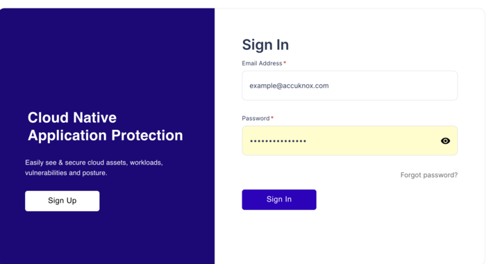
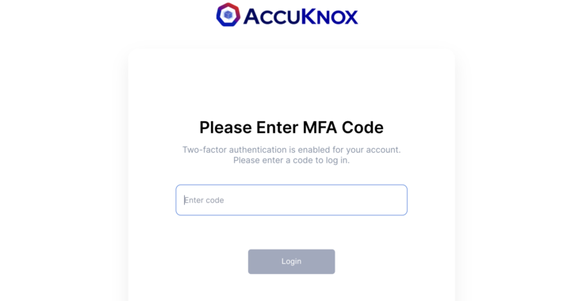
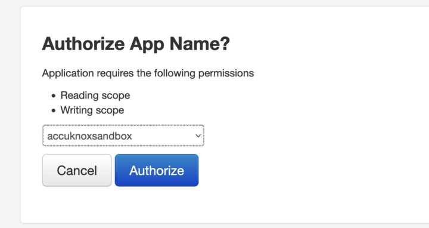

The OAuth integration with AccuKnox encompasses authorization (token generation, validation, and expiry) as well as third-party app integration. Our implementation adheres to industry standards and best practices for OAuth. It also ensures seamless integration of AccuKnox APIs.

AccuKnox provides Oauth flow that will enable the client to access the AccuKnox APIs securely. Accuknox APIs request an internal query and provide JWT tokens for the third-party apps without any hassle of MFA.

## **1. AccuKnox OAuth Features and Use-cases**

### **1.1** Role based authentication through OAuth

Verify users by their credentials and provide access according to their designated roles and permissions. This ensures that Third-Party Applications or Users gain access to specific functionalities based on the roles assigned within AccuKnox Saas. For instance, if a user's profile is configured with roles that limit them to viewing asset inventory, any authorization utilizing this user will also be restricted to the same access level..

### **1.2** AccuKnox Unified view

AccuKnox Insights, encompassing asset and registry vulnerability data, seamlessly become part of the unified view through integrated widgets. This integration enhances the overall experience by offering valuable information and analytics right at your fingertips.

Within this unified view, you can access the following insightful widgets:

1. **Top Vulnerable Cluster:** Gain instant visibility into the most critical vulnerabilities affecting your clusters. This widget displays the top 10 vulnerable applications, allowing you to prioritize your security efforts effectively and address high-risk areas promptly.

2. **Top Tickets:** Monitor the aging of vulnerabilities efficiently with the "Vulnerability Ageing" widget. This tool helps you stay on top of your security remediation efforts by tracking how long vulnerabilities have been present, ensuring timely action is taken to mitigate risks.

3. **Registry Insights:** Dive deeper into registry-related data with the dedicated "Registry Insights" widget. This feature empowers you to analyze and manage container images and their associated vulnerabilities, enhancing your ability to maintain a secure and compliant container environment.

### **1.3** Authorizing third party Apps

Leverage the OAuth 2.0 authorization flow to facilitate third-party applications in accessing AccuKnox APIs seamlessly. This robust authentication mechanism ensures the security and integrity of the API access.

**More detailed explanation here:**

**1.3.1 Utilize the OAuth 2.0 Authorization Flow for Third-Party Application Integration with AccuKnox APIs**

AccuKnox adopts the OAuth 2.0 authorization flow to empower third-party applications with the ability to interact with our APIs effectively and securely. This authorization framework provides a structured and standardized approach to access control, safeguarding both the integrity of your data and the privacy of your users.

**1.3.2 Grant Access through Access and Refresh Tokens**

To ensure a robust layer of security, AccuKnox utilizes access and refresh tokens in the OAuth 2.0 flow. These tokens serve as the keys to access the protected resources within our system. Here's how they work:

- **Access Tokens:** These tokens are short-lived and provide immediate authorization for a specific set of operations or resources. They grant third-party apps temporary access to the AccuKnox APIs, allowing them to perform authorized actions on behalf of the user or organization.

- **Refresh Tokens:** While access tokens have a limited lifespan, refresh tokens are long-lived and serve as a means to obtain new access tokens when the old ones expire. This process maintains a continuous and secure connection between third-party apps and AccuKnox APIs without requiring users to repeatedly log in or grant permissions.

## **2. OAuth Integration Process for Third-Party Applications**

**1. User Onboarding and Account Creation:**

- Users begin by setting up AccuKnox accounts and connecting their clusters and cloud accounts.

**2. Third-Party App Authorization Request:**

- Third-party applications initiate the OAuth process by seeking permission from AccuKnox.

**3. User Authorization:**

- Users grant permission to third-party apps, which redirects them to AccuKnox for authentication and authorization.

   

- Enter the MFA code

    

- Select the Tenant you want to authorize to the Third Party Application

   

**4.Token Issuance:**

- Upon successful authorization, third-party apps receive an OAuth code as a query params (code) to the redirect uri, which the client needs to verify using the <https://cspm.dev.accuknox.com/api/v1/o/token/> endpoint.

- Upon successful verification an access and refresh token will be issued

**5.Token Usage:**

- Access tokens enable third-party apps to interact with AccuKnox APIs, while refresh tokens can be used to obtain new access tokens when the old ones expire.

**6.Access Token Verification:**

- AccuKnox APIs validate incoming access tokens to ensure authorization before serving the requested data.

## **3. Third-Party Applications (For Developers)**

To begin the development of a third-party application utilizing AccuKnox OAuth, users are required to initiate the process by registering an AccuKnox OAuth Application. During this registration, they will need to specify the redirection URIs.

After the AccuKnox team completes the configuration of the OAuth application on the backend, we will provide you with the following details: Client ID and Client Secret. These credentials can be employed by the user to perform a POST request to the Token endpoint, enabling them to obtain both an Access Token and a Refresh Token.

With these tokens in hand, users can securely make API calls to AccuKnox, thereby accessing data on the platform for which they have been authenticated.

**Here are the AccuKnox endpoints available:**

**3.1 User Authentication Endpoints:**

- Sign-up: <https://app.dev.accuknox.com/sign-up>
- Login: <https://app.dev.accuknox.com/login>

**3.2 OAuth Implementation Endpoints:**

- Authorization endpoint: <https://cspm.dev.accuknox.com/api/v1/o/authorize/>
- Token endpoint: <https://cspm.dev.accuknox.com/api/v1/o/token/> (Note: Token revocation is not currently supported through an endpoint.)

**3.3 Widgets Data Access Endpoints:**

- For CSPM: <https://cspm.dev.accuknox.com/api/swagger/>

---
[SCHEDULE DEMO](https://www.accuknox.com/contact-us){ .md-button .md-button--primary }
