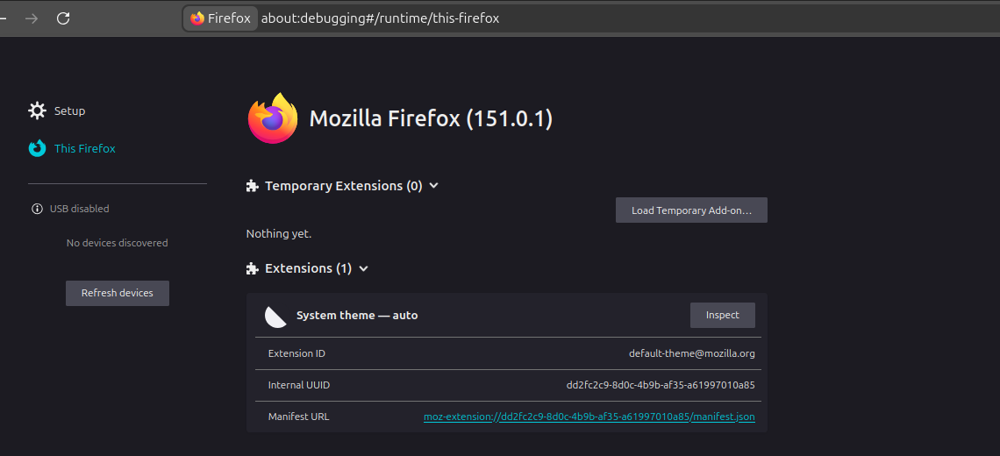
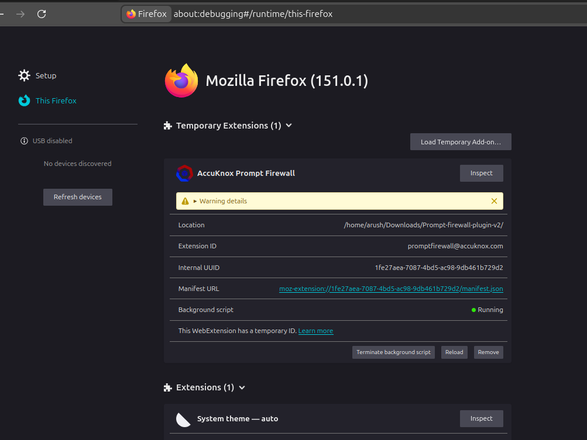

# Gen AI Browser Integration for Prompt Security (Firefox)

The AccuKnox Prompt Firewall browser plugin intercepts prompts and responses directly in ChatGPT before they leave your browser session. Blocked prompts show a red banner. Allowed ones pass through silently.

This guide covers installation for **Mozilla Firefox**. For Chromium-based browsers (Chrome, Brave, Edge), see the [Chrome integration guide](openai-browser-integration.md).

## Prerequisites

- An active AccuKnox account with AI Security enabled
- Access to the Integrations section (to generate a token)
- Mozilla Firefox browser

## Step 1: Create a new integration

Go to **AI Security > Integrations** and click **New Integration**.

Fill in the following fields:

| Field | Value |
|---|---|
| Integration Name | Any descriptive name (e.g. `openai-browser-prod`) |
| Tags | Add relevant tags (e.g. `llmguard`) |

Click **Add** to save.

## Step 2: Copy your token

After saving, the token is displayed once in a confirmation modal.

!!! warning "Save your token now"
    This token will not be shown again after you close the modal. Copy it immediately and store it in a secure location such as a password manager.

## Step 3: Download and install the browser plugin

[Download Firefox plugin](https://drive.google.com/file/d/1Sn4LoZDT-q8vyF9vMsNkL7WvQpb9GHg7/view?usp=sharing), download the ZIP file from Google Drive, and extract it to a folder on your machine.

To install in Firefox:

1. Open Firefox and enter `about:debugging` in the address bar
2. Select **This Firefox** from the left sidebar
3. Click on **Load Temporary Add-on**

1. Navigate to the extracted plugin folder and select the `manifest.json` file
2. Click **Open** to load the add-on

The plugin is now connected and loaded in Firefox.

## Step 4: Configure the extension

{ align=right width="400" }

Click the AccuKnox icon in your Firefox toolbar and open **Settings**.

Fill in the following field:

| Field | Value |
|---|---|
| API Key | Paste the token from Step 2 |

Click **Save Settings**, then **Test Connection**.

## Step 5: Verify the connection

{ align=right width="360" }

Once connected, the extension popup shows a green status dot next to **AccuKnox Prompt Firewall** along with a running count of scanned, allowed, blocked, and warned prompts. Click **View Logs** to see the full request log.

Open ChatGPT and send a test prompt. Depending on your active policy, you will see one of the following:

## Request log

All intercepted prompts and responses are visible under **AI Security > Request Log**.

Each entry shows:

- Timestamp
- Direction (PROMPT or RESPONSE)
- Verdict (ALLOW or BLOCK)
- Content preview
- Latency

You can filter by verdict or direction, search by content or reason, and export the full log as JSON.

## Important notes for Firefox

!!! note "Temporary vs Permanent installation"
    The steps above load the add-on as a **temporary installation**, which means it will be unloaded when you restart Firefox. For a permanent installation, you can package the add-on or contact AccuKnox support for options to deploy the extension permanently.

!!! info "Developer mode"
    Unlike Chrome, Firefox does not require explicitly enabling developer mode to load temporary add-ons. Simply navigate to `about:debugging` to begin.
