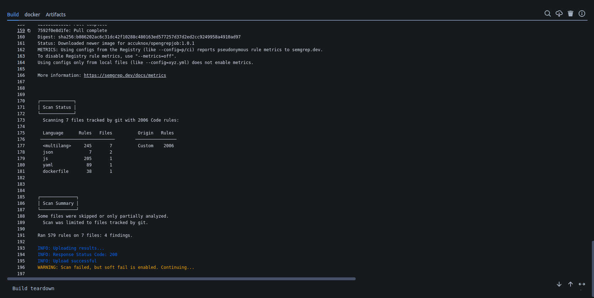
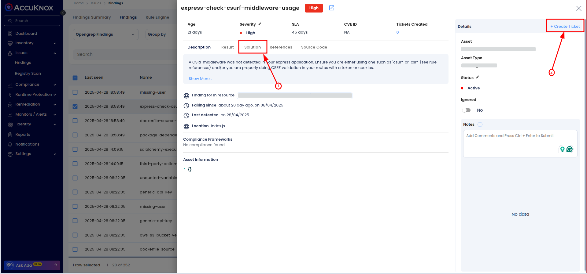

# Integrating Opengrep SAST with AccuKnox in Bitbucket Pipelines

This guide shows how to integrate Opengrep SAST scanning into a Bitbucket Pipeline and automatically forward results to AccuKnox for analysis and mitigation.

## Prerequisites

- **Bitbucket Access**: Access to your Bitbucket repository where the pipeline will be implemented.

- **An active AccuKnox account**.

## Integration Steps

### Step 1: Generate AccuKnox API Token

- Log in to the AccuKnox platform.

- Go to **Settings > Tokens** and create a new token.

- Copy the Token and Tenant ID and save it for later use. For guidance on creating tokens, refer to [**Creating Tokens in AccuKnox**.](https://help.accuknox.com/how-to/how-to-create-tokens/?h=token "https://help.accuknox.com/how-to/how-to-create-tokens/?h=token")

### Step 2: Configure Bitbucket Pipeline Variables

- Navigate to your Bitbucket repository.

- Go to **Repository Settings > Repository Variables** and click **Add Variable**. Refer to [**How to Create CI/CD Variables in Bitbucket**](https://support.atlassian.com/bitbucket-cloud/docs/variables-and-secrets/ "https://support.atlassian.com/bitbucket-cloud/docs/variables-and-secrets/").

Add the following variables:

| Name                 | Description                                                                                                                                                       |
| -------------------- | ----------------------------------------------------------------------------------------------------------------------------------------------------------------- |
| `ACCUKNOX_ENDPOINT`  | The URL of the CSPM panel to push the scan results to (e.g., `cspm.demo.accuknox.com`)                                                                            |
| `ACCUKNOX_TENANT_ID` | The ID of the tenant associated with the CSPM panel                                                                                                               |
| `ACCUKNOX_TOKEN`     | Token for authenticating with the AccuKnox CSPM panel                                                                                                             |
| `ACCUKNOX_LABEL`     | The label used to categorize and identify scan results in AccuKnox. [Create a new label](https://help.accuknox.com/how-to/how-to-create-labels/) if not available |

### Step 3: Define Bitbucket Pipeline

In your repository, create or update your pipeline YAML (`bitbucket-pipelines.yml`) and add the following steps:

```yaml
pipelines:
  branches:
    main:
      - step:
          name: AccuKnox Scan Test 14
          script:
            - pipe: accu-knox/scan:1.1.0
              variables:
                SCAN_TYPE: OPENGREP_SAST
                INPUT_SOFT_FAIL: "true"
                ACCUKNOX_TOKEN: ${ACCUKNOX_TOKEN}
                ACCUKNOX_TENANT: ${ACCUKNOX_TENANT}
                ACCUKNOX_ENDPOINT: ${ACCUKNOX_ENDPOINT}
                ACCUKNOX_LABEL: ${ACCUKNOX_LABEL}
```

## Inputs for AccuKnox Opengrep SAST Task

| Name                 | Description                     | Required | Default                  |
| -------------------- | ------------------------------- | -------- | ------------------------ |
| `ACCUKNOX_ENDPOINT`  | AccuKnox CSPM panel URL         | Yes      | `cspm.demo.accuknox.com` |
| `ACCUKNOX_TENANT_ID` | AccuKnox Tenant ID              | Yes      |                          |
| `ACCUKNOX_TOKEN`     | AccuKnox API Token              | Yes      |                          |
| `ACCUKNOX_LABEL`     | Label for scan results          | Yes      |                          |
| `INPUT_SOFT_FAIL`    | Continue even if the scan fails | No       | `true`                   |

## Workflow Execution Without AccuKnox

Initially, Opengrep scans the code for vulnerabilities but does not forward results to AccuKnox, requiring manual review.

## Workflow Execution With AccuKnox

With AccuKnox integrated, Opengrep scan results are automatically sent to AccuKnox for further risk assessment and remediation.


## Viewing Results in AccuKnox

After the pipeline run:

- Log in to **AccuKnox**.

- Go to **Issues > Findings** and select **Opengrep Findings**.
  

- Inspect vulnerabilities, apply fixes, and create tracking tickets if necessary.
  

## Conclusion

Integrating **Opengrep SAST** with **Bitbucket Pipelines** enables automated vulnerability detection and centralized security management. It ensures early detection of issues, risk assessment, and provides actionable insights to maintain code security and quality.
