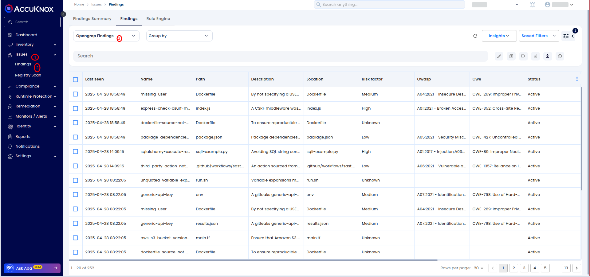

# Integrating SAST with AccuKnox in Bitbucket Pipelines

This guide shows how to integrate SAST scanning into a Bitbucket Pipeline and automatically forward results to AccuKnox for analysis and mitigation.

## Prerequisites

- **Bitbucket Access**: Access to your Bitbucket repository where the pipeline will be implemented.

- **An active AccuKnox account**.

## Integration Steps

### Step 1: Generate AccuKnox API Token

- Log in to the AccuKnox platform.

- Go to **Settings > Tokens** and create a new token.

- Copy the Token and Tenant ID and save it for later use. For guidance on creating tokens, refer to [**Creating Tokens in AccuKnox**.](https://help.accuknox.com/how-to/how-to-create-tokens/?h=token "https://help.accuknox.com/how-to/how-to-create-tokens/?h=token")

### Step 2: Configure Bitbucket Pipeline Variables

- Navigate to your Bitbucket repository.

- Go to **Repository Settings > Repository Variables** and click **Add Variable**. Refer to [**How to Create CI/CD Variables in Bitbucket**](https://support.atlassian.com/bitbucket-cloud/docs/variables-and-secrets/ "https://support.atlassian.com/bitbucket-cloud/docs/variables-and-secrets/").

## Inputs for AccuKnox SAST Task

| **Input Value**       | **Description**                                                   | **Default Value**  |
|------------------------|-------------------------------------------------------------------|--------------------|
| `SOFT_FAIL`            | Do not return an error code if secrets are found.                | `true`             |
| `ACCUKNOX_TOKEN`       | The token for authenticating with the CSPM panel.                | N/A (Required)     |
| `ACCUKNOX_TENANT`      | The ID of the tenant associated with the CSPM panel.             | N/A (Required)     |
| `ACCUKNOX_ENDPOINT`    | The URL of the CSPM panel to push the scan results to.           | N/A (Required)     |
| `ACCUKNOX_LABEL`       | The label created in AccuKnox SaaS for associating scan results. | N/A (Required)     |

### Step 3: Define Bitbucket Pipeline

In your repository, create or update your pipeline YAML (`bitbucket-pipelines.yml`) and add the following steps:

```yaml
pipelines:
  branches:
    main:
    - step:
        name: Accuknox SAST
        script:
          - pipe: accu-knox/scan:2.0.0
            variables:
              SCAN_TYPE: SAST
              SOFT_FAIL: "true"
              ACCUKNOX_TOKEN: ${ACCUKNOX_TOKEN}
              ACCUKNOX_TENANT: ${ACCUKNOX_TENANT}
              ACCUKNOX_ENDPOINT: ${ACCUKNOX_ENDPOINT}
              ACCUKNOX_LABEL: ${ACCUKNOX_LABEL}
```

## Workflow Execution Without AccuKnox

Initially, Opengrep scans the code for vulnerabilities but does not forward results to AccuKnox, requiring manual review.

## Workflow Execution With AccuKnox

With AccuKnox integrated, Opengrep scan results are automatically sent to AccuKnox for further risk assessment and remediation.


## Viewing Results in AccuKnox

After the pipeline run:

- Log in to **AccuKnox**.

- Go to **Issues > Findings** and select **Opengrep Findings**.
  

- Inspect vulnerabilities, apply fixes, and create tracking tickets if necessary.
  

## Conclusion

Integrating **SAST** with **Bitbucket Pipelines** enables automated vulnerability detection and centralized security management. It ensures early detection of issues, risk assessment, and provides actionable insights to maintain code security and quality.
