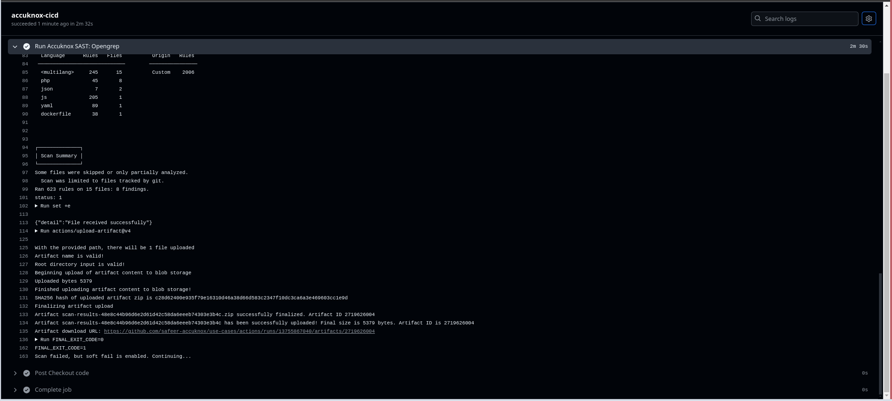
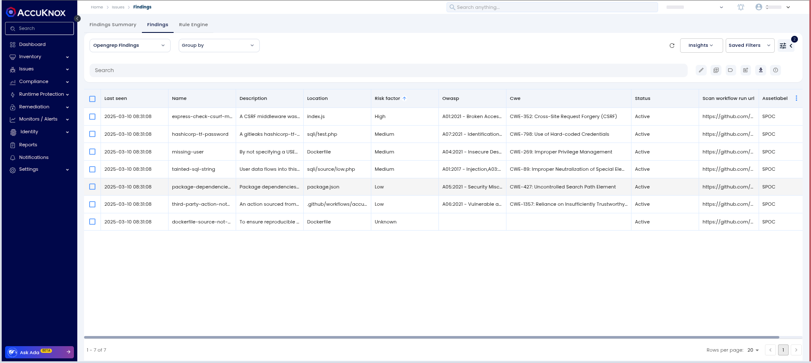
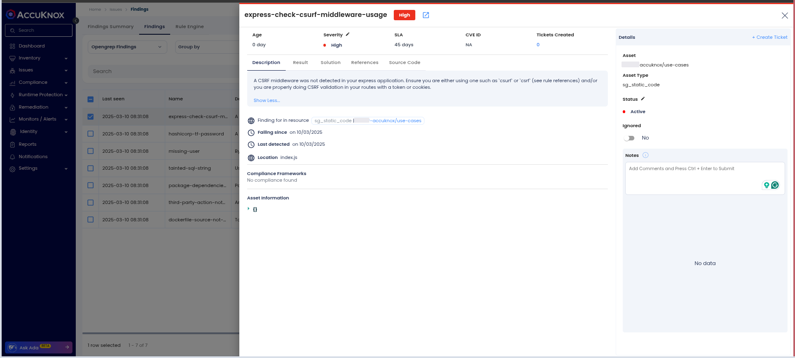
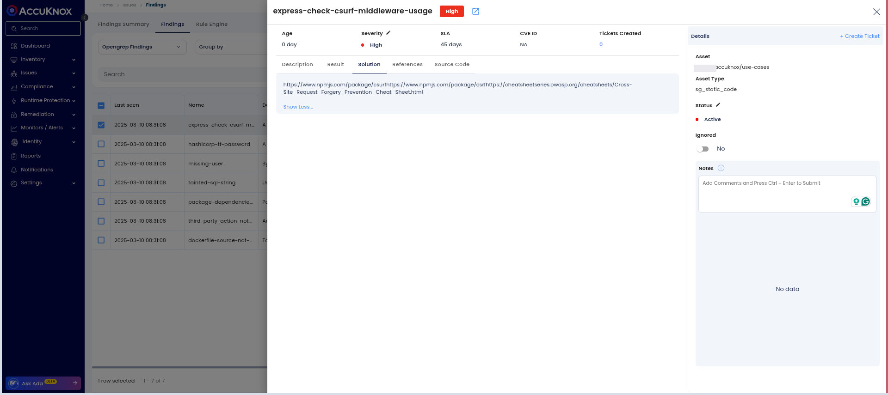
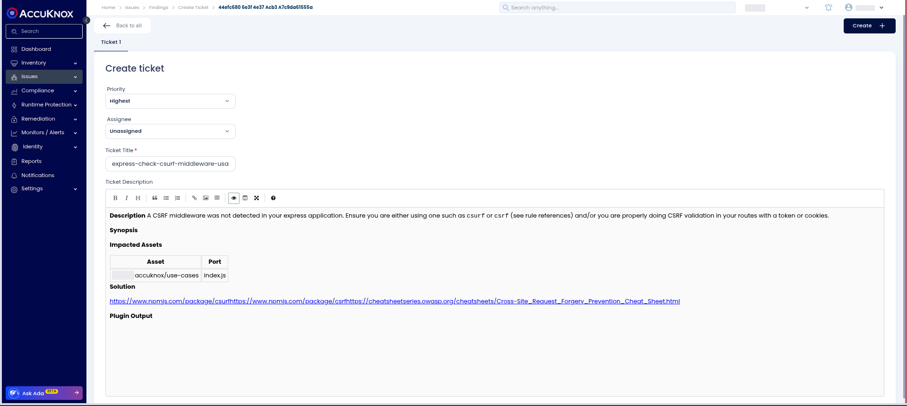

# Integrating SAST with AccuKnox in GitHub Actions

This guide outlines integrating SAST scanning into a GitHub Actions workflow and forwarding the results to AccuKnox for analysis and mitigation.

### Prerequisites

- GitHub repository with Actions enabled

- AccuKnox SaaS account

### Integration Steps

#### Step 1: Generate AccuKnox API Token

Log in to AccuKnox. Navigate to Settings and select Tokens to create an AccuKnox token to forward scan results to SaaS. For details on generating tokens, refer to [How to Create Tokens](https://help.accuknox.com/how-to/how-to-create-tokens/?h=token "https://help.accuknox.com/how-to/how-to-create-tokens/?h=token").

#### Step 2: Configure GitHub Secrets

Define the following secrets in GitHub, for details on configuring the secrets/variables, refer to [Using secrets in GitHub Actions](https://docs.github.com/en/actions/security-for-github-actions/security-guides/using-secrets-in-github-actions "https://docs.github.com/en/actions/security-for-github-actions/security-guides/using-secrets-in-github-actions").

- **ACCUKNOX_TOKEN**: AccuKnox API token for authorization.

- **ACCUKNOX_TENANT**: Your AccuKnox tenant ID.F

- **ACCUKNOX_ENDPOINT**: The AccuKnox API URL (e.g., [cspm.demo.accuknox.com](http://cspm.demo.accuknox.com/ "http://cspm.demo.accuknox.com/")).

- **ACCUKNOX_LABEL**: The label for your scan.

#### Step 3: Define GitHub Actions Workflow

Create a new GitHub Actions workflow file `.github/workflows/accuknox-opengrep.yml` with the following configuration:


```yaml
name: AccuKnox Opengrep SAST

on:
  push:
    branches:
      - opengrep
  pull_request:
    branches:
      - opengrep

jobs:
  accuknox-cicd:
    runs-on: ubuntu-latest
    steps:
      - name: Checkout code
        uses: actions/checkout@v3

      - name: "Run AccuKnox SAST: Opengrep"
        uses: accuknox/sast-scan-opengrep-action@1.0.0
        with:
          accuknox_endpoint: "${{ secrets.ACCUKNOX_ENDPOINT }}"
          accuknox_tenant: "${{ secrets.ACCUKNOX_TENANT }}"
          accuknox_token: "${{ secrets.ACCUKNOX_TOKEN }}"
          accuknox_label: "${{ secrets.ACCUKNOX_LABEL }}"
          input_soft_fail: true
          upload_artifact: true
```


### Inputs for AccuKnox SAST Action

| **Name**              | **Description**                 | **Required** | **Default**              |
| --------------------- | ------------------------------- | ------------ | ------------------------ |
| **pipeline_id**       | GitHub Run ID                   | No           | `Github RunId`           |
| **job_url**           | GitHub Job URL                  | No           | `Github Run URL`         |
| **accuknox_endpoint** | CSPM panel URL                  | Yes          | `cspm.demo.accuknox.com` |
| **accuknox_tenant**   | AccuKnox Tenant ID              | Yes          |                          |
| **accuknox_token**    | AccuKnox API Token              | Yes          |                          |
| **accuknox_label**    | Label for scan results          | Yes          |                          |
| **input_soft_fail**   | Continue even if scan fails     | No           | `false`                  |
| **upload_artifact**   | Upload scan results as artifact | No           | `true`                   |

### Workflow Execution Without AccuKnox

Initially, Opengrep scans the code for vulnerabilities but does not forward results to AccuKnox, requiring manual review.

### Workflow Execution With AccuKnox

With AccuKnox integrated, Opengrep scan results are automatically sent to AccuKnox for further risk assessment and remediation.



### Viewing Results in AccuKnox

1.  After execution, navigate to the AccuKnox dashboard.

2.  Open **Issues > Findings** and check **Opengrep Findings**.
    

3.  Select a vulnerability to inspect details.
    

4.  Apply fixes based on recommendations under the **Solutions** tab.
    

5.  Generate an issue ticket for tracking the fix.
    

6.  Review Updated Results

    - After fixing the vulnerability, rerun the workflow.

    - Navigate to the AccuKnox SaaS dashboard and verify that the vulnerability has been resolved.

### Conclusion

Integrating SAST with AccuKnox in GitHub Actions enables automated vulnerability detection and secure development workflows. It provides centralized monitoring, early issue detection, and actionable remediation insights, ensuring code quality. By leveraging AccuKnox's risk assessment capabilities, developers can seamlessly enhance security while maintaining efficiency in their CI/CD pipeline.
