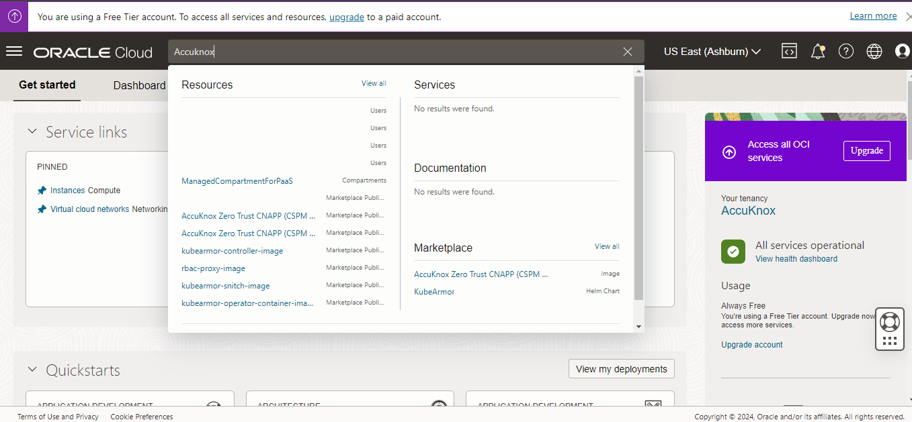
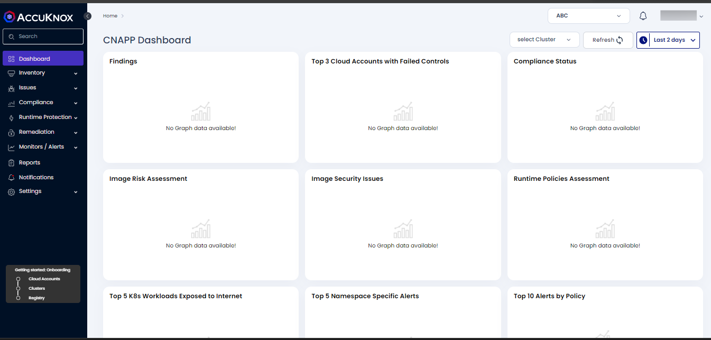

# Oracle Marketplace Installation Guide

A step-by-step process is needed to subscribe to AccuKnox via the Oracle Marketplace. It details the actions within the marketplace, the workflow for subscription and access, post-registration access acquisition, and the subsequent steps.

[Visit Marketplace](https://cloudmarketplace.oracle.com/marketplace/en_US/listing/164514321)

## User steps required on Oracle MarketPlace

### Overview

The following steps are designed for users interested in obtaining a free trial from the marketplace, subscribing to existing public offers, acquiring a private offer customized to their specific needs, or setting up a recurring plan for public offers.

## Case 1: User finds AccuKnox CNAPP on Oracle marketplace

**Step 1**: Access the Oracle Cloud Marketplace through the URL: [https://cloudmarketplace.oracle.com](https://cloudmarketplace.oracle.com). Once there, enter "AccuKnox" into the search bar and press Enter to find the relevant product.

**Step 2**: Select the "AccuKnox - Zero Trust CNAPP product from the search results to view more details.

**Step 3**: Carefully review the product information provided. To start the process of subscribing and onboarding, click on the "Subscribe" button.

**Step 4**: Following this, you will be redirected to the AccuKnox application, where you will be asked to provide the necessary details to complete your registration.

**Step 5**: After submitting your information, the AccuKnox support team will reach out to guide you through the remaining onboarding process steps and ensure a smooth setup via email.

!!! info "NOTE"
    **For users seeking a custom solution beyond the available offers, there is an option to reach out to AccuKnox support to explore alternative possibilities. Contact us at [support@accuknox.com.](mailto:support@accuknox.com)**

## Case 2: User finds AccuKnox CNAPP on the Oracle marketplace - 30 Days Free Trial

**Step 1**: Access the Oracle Cloud Marketplace at [https://cloudmarketplace.oracle.com/marketplace/en_US](https://cloudmarketplace.oracle.com/marketplace/en_US/listing/164514321) by navigating to the search bar and pressing Enter to find the relevant product.

**Step 2:** Select the **"AccuKnox - Build to Runtime"** product from the search results to view more details.

**Step 3**: Review the product information and click on the **"Get App"** button to initiate the signup/onboarding process

**Step 4**: Carefully read the terms and conditions provided by the Oracle marketplace and click on next to be redirected to the onboarding process.

**Step 5**: You will be redirected to the AccuKnox app, where you'll be prompted to provide the necessary details.

**Step 6**: After you complete the details, you will be redirected to a page confirming your successful registration.

**Step 7**: You will receive an email verification to the provided email, click on the" verify email address"  to go forward.

**Step 8**: After verifying your email address, you will be redirected to the "signup" page of AccuKnox. Once you sign up, you will be taken to the [app.accuknox.com](http://app.accuknox.com) page.

**Step 9**: At this juncture, we strongly recommend scheduling a [DEMO](https://www.accuknox.com/demo) with AccuKnox to assist the customer with the onboarding steps and gain a deeper understanding of our features.

The AccuKnox support team will follow up to guide you through the onboarding process.

!!! info "NOTE"
    **The free trial subscription on the marketplace is only available to the user for a month. After one month, access shall be revoked. Before the end of the monthly subscription, we will notify the user. If the user still wants to continue using the platform they can opt for a paid subscription or reach out to us via <support@accuknox.com> (or) [Contact us](http://accuknox.com/contact-us&sa=D&source=editors&ust=1721804357692072&usg=AOvVaw3PvrZFucn4Ri3cop5b4b42) for custom pricing.**