??? "**AccuKnox KubeArmor**"

    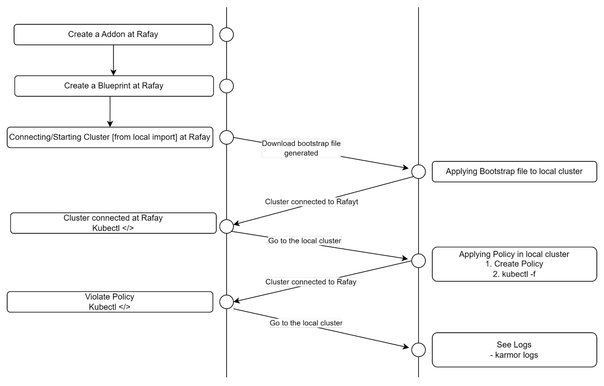

    **Step 1:** Creating Addon

    To integrate with the Rafay platform first we have created an addon using KubeArmor <a href="https://github.com/kubearmor/KubeArmor/blob/main/deployments/helm/values.yaml" target="_blank">helm</a> repository

    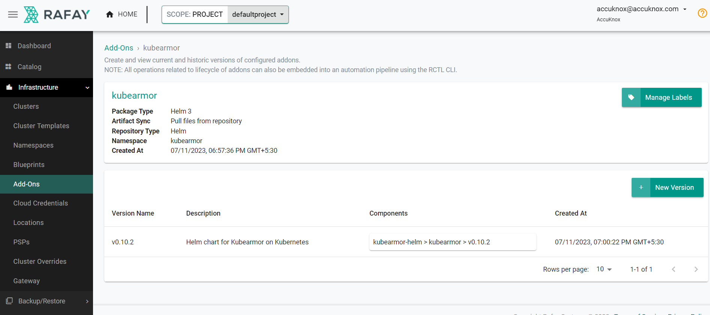

    **Step 2:** Creating Blue Print

    After creating the Add on to apply that in cluster we have created the Blueprint using the KubeArmor addon

    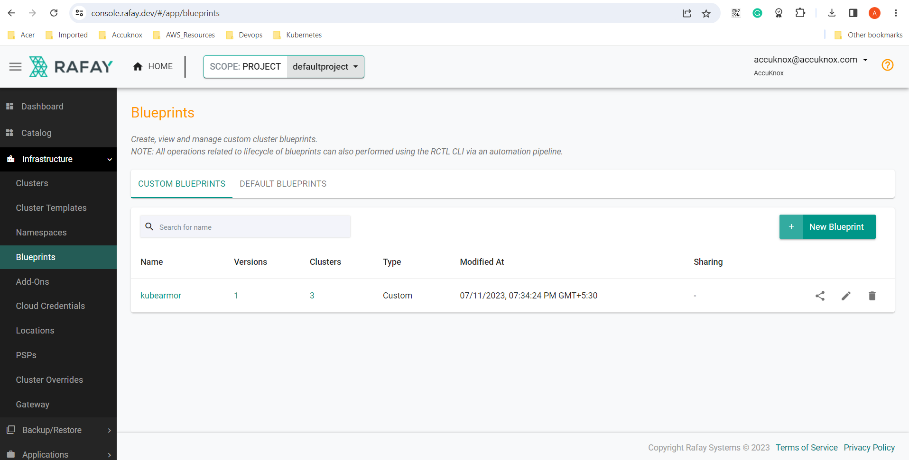

    **Step 3:** Connecting Cluster with Rafay

    **3.1** Importing existing Cluster option

    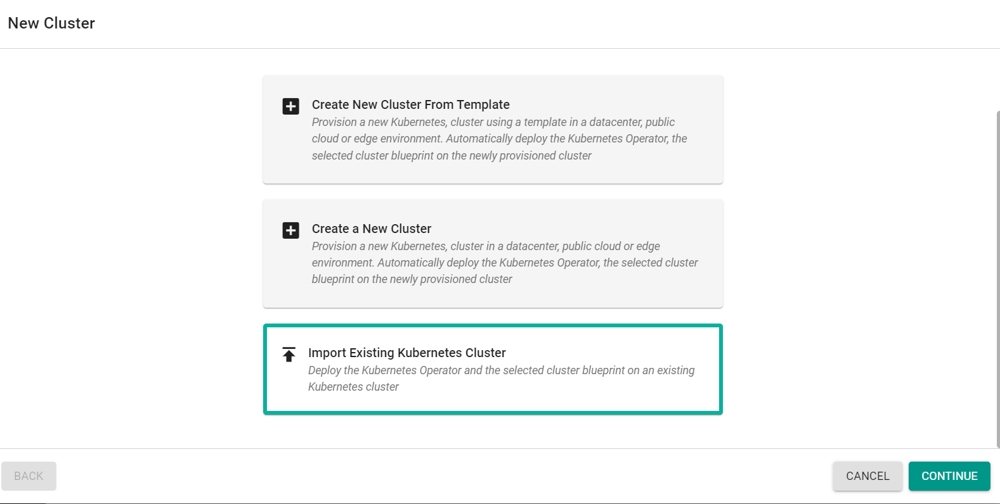

    **3.2** Selecting the Cluster Platform

    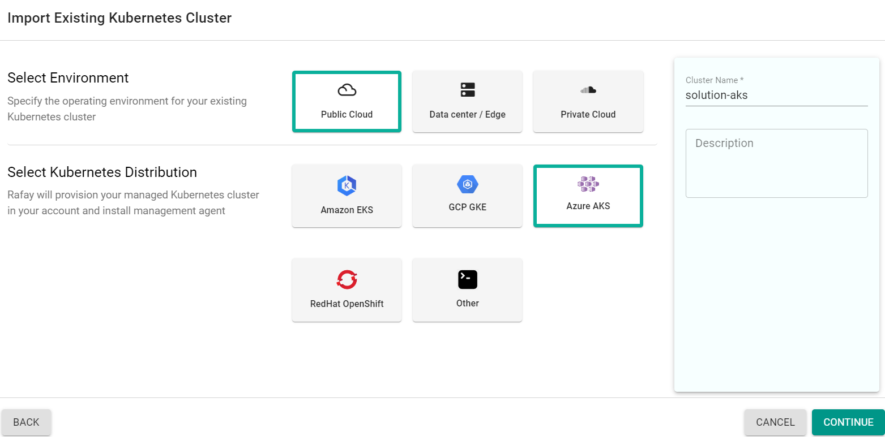

    **3.3** Applying KubeArmor Blue Print to the Cluster

    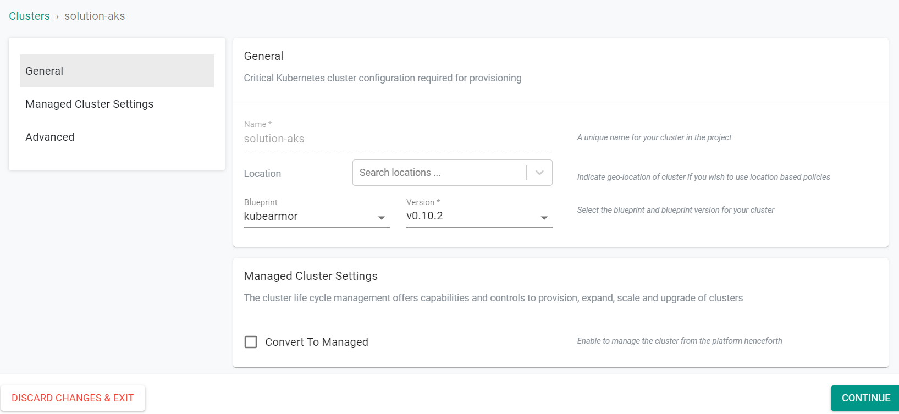

    **3.4** Connecting the Cluster to Rafay Platform

    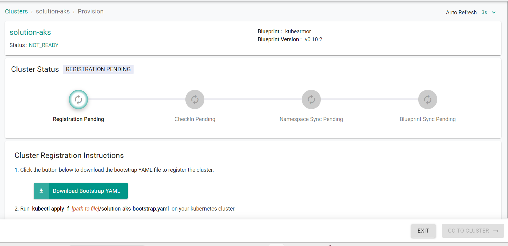

    **3.5** Applying the Bootstrap.yaml file to the Cluster

    ```sh
    ➜  ~ kubectl apply -f solutions-aks-bootstrap.yaml
    namespace/rafay-system created
    serviceaccount/system-sa created
    clusterrole.rbac.authorization.k8s.io/rafay:manager unchanged
    clusterrolebinding.rbac.authorization.k8s.io/rafay:rafay-system:manager-rolebinding unchanged
    clusterrole.rbac.authorization.k8s.io/rafay:proxy-role unchanged
    clusterrolebinding.rbac.authorization.k8s.io/rafay:rafay-system:proxy-rolebinding unchanged
    priorityclass.scheduling.k8s.io/rafay-cluster-critical-v3 unchanged
    priorityclass.scheduling.k8s.io/rafay-cluster-critical unchanged
    role.rbac.authorization.k8s.io/rafay:leader-election-role created
    rolebinding.rbac.authorization.k8s.io/rafay:leader-election-rolebinding created
    customresourcedefinition.apiextensions.k8s.io/namespaces.cluster.rafay.dev created
    customresourcedefinition.apiextensions.k8s.io/tasklets.cluster.rafay.dev configured
    customresourcedefinition.apiextensions.k8s.io/tasks.cluster.rafay.dev configured
    configmap/proxy-config-v3 created
    configmap/v2-relay-agent-config created
    deployment.apps/v2-relay-agent created
    service/controller-manager-metrics-service-v4 created
    deployment.apps/controller-manager-v3 created
    customresourcedefinition.apiextensions.k8s.io/projects.system.k8smgmt.io configured
    configmap/connector-config-v3 created
    deployment.apps/rafay-connector-v3 created
    service/rafay-drift-v3 created
    validatingwebhookconfiguration.admissionregistration.k8s.io/rafay-drift-validate-v3 unchanged
    ```

    **3.6** Rafay and KubeArmor is deployed in the Cluster using the Blueprint

    ```sh
    ~ kubectl get po -A
    NAMESPACE         NAME                           READY    STATUS             RESTARTS           AGE
    kube-system       ama-logs-4nzhr                  2/2     Running            11 (71s ago)       6h23m
    kube-system       ama-logs-rs-776d765f6-wztpq     1/1     Running            0                  6h23m
    kube-system       azure-ip-masq-agent-hkkxl       1/1     Running            0                  37d
    kube-system       cloud-node-manager-8mxdn        1/1     Running            0                  49d
    kube-system       coredns-785fcf7bdd-8pbmz        1/1     Running            0                  58d
    kube-system       coredns-785fcf7bdd-qmt2x        1/1     Running            0                  58d
    kube-system       coredns-autoscaler-85bfd6cbd5-z 1/1     Running            0                  16d
    kube-system       csi-azuredisk-node-bswjb        3/3     Running            0                  37d
    kube-system       csi-azurefile-node-csvsg        3/3     Running            0                  21d
    kube-system       konnectivity-agent-6f76b87957-  1/1     Running            0                  58d
    kube-system       konnectivity-agent-6f76b87950   1/1     Running            0                  58d
    kube-system       kube-proxy-k5bxm                1/1     Running            0                  21d
    kube-system       metrics-server-6f8bd495cc-rmh7n 2/2     Running            0                  16d
    kube-system       metrics-server-6f8bd495cc-wlspn 2/2     Running            0                  16d
    kubearmor         kubearmor-controller-9989b6d8f  2/2     Running            0                  36s
    kubearmor         kubearmor-lb9db                 1/1     Running            0                  37s
    kubearmor         kubearmor-relay-6444b56c5-2lm6r 1/1     Running            0                  36s
    loki-stack-1      loki-0                          1/1     Running            0                  15h
    loki-stack-1      loki-promtail-rmjdp             1/1     Running            0                  15h
    rafay-system      controller-manager-v3-5545-45rm 1/1     Running            0                  45s
    rafay-system      edge-client-784bdd8496-bw6ms    1/1     Running            0                  52s
    rafay-system      rafay-connector-v3-5d7c7-7dwt8  1/1     Running            0                  46s
    rafay-system      v2-relay-agent-698b6fb5d6-r5k9t 1/1     Running            0                  115s
    ```

    **3.7** After applying the yaml file the cluster is connected to the Rafay System

    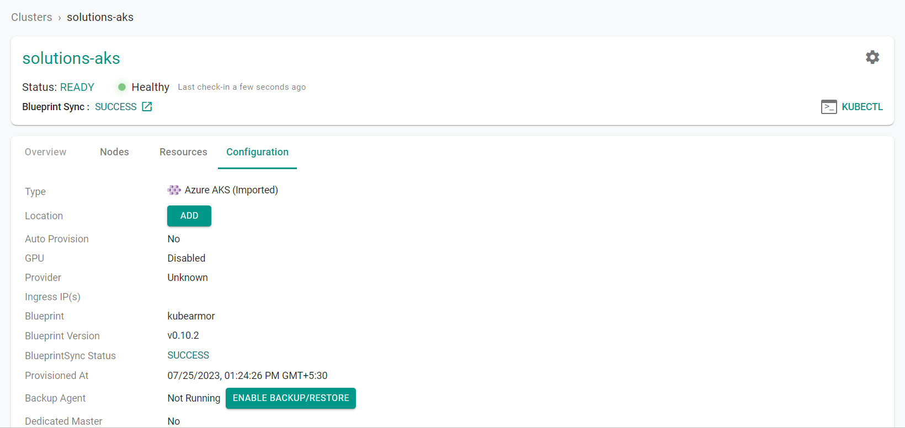

    **Step 4:** Applying KubeArmor Policy

    **4.1** User needs to go the Cluster to apply the following KubeArmor policy.

    ```sh
    apiVersion: security.kubearmor.com/v1
    kind: KubeArmorPolicy
    metadata:
    name: wordpress-block-policy
    namespace: wordpress-mysql
    spec:
    severity: 3
    selector:
    matchLabels:
    app: wordpress
    process:
    matchPaths:
    - path: /usr/bin/apt-get
    action: Block
    ```

    Save the policy as a .yaml file.

    **4.2** Applying the policy from the cluster:

    ```sh
    ~ kubectl apply -f wordpress-block.yaml
    kubearmorpolicy.security.kubearmor.com/wordpress-block-policy created
    ```

    **Step 5:** Violating the Policy

    For Violating the Above policy users need to navigate to the Rafay kubectl Utility

    ```sh
    kubectl exec -it -n wordpress-mysql wordpress-23423-hajfg -- bash
    apt-get update
    ```

    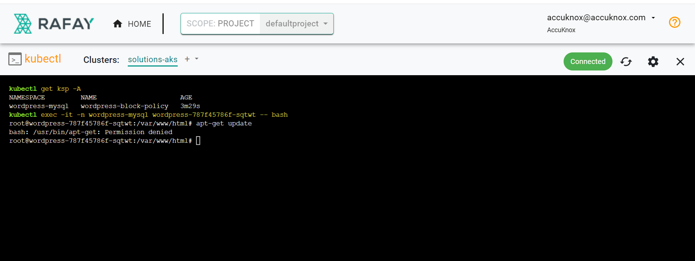

    **Step 6:** Policy logs

    To see the Policy Logs the users must navigate to the Cluster CLI and give the following command and then violate the policy from Rafay Kubectl utility

    ```sh
    karmor logs
    ```

    Sample output:

    ```sh
    ➜  ~ karmor logs
    local port to be used for port forwarding kubearmor-relay-6444b56c5-2lm6r: 32866
    Created a gRPC client (localhost:32866)
    Checked the liveness of the gRPC server
    Started to watch alerts
    == Alert / 2023-08-17 09:24:25.288081 ==
    ClusterName: default
    HostName: aks-agentpool-24991050-vmss000000
    NamespaceName: wordpress-mysql
    PodName: wordpress-84dbf54bb8-6xpf7
    Labels: app=wordpress
    ContainerName: wordpress
    ContainerID: 7c0f7042110a76fd5b64d0f55aa133a1ef459b72c12517e4f13baf067c36c826
    ContainerImage: docker.io/library/wordpress:4.8-apache@sha256:6216f64ab88fc51d311e38c7f69ca3f9aaba621492b4f1fa93ddf63093768845
    Type: MatchedPolicy
    PolicyName: wordpress-block-policy
    Severity: 3
    Source: /bin/bash
    Resource: /usr/bin/apt-get update
    Operation: Process
    Action: Block
    Data: syscall=SYS_EXECVE
    Enforcer: AppArmor
    Result: Permission denied
    HostPID: 117393
    HostPPID: 112113
    Owner: map[Name:wordpress Namespace:wordpress-mysql Ref:Deployment]
    PID: 214
    PPID: 208
    ParentProcessName: /bin/bash
    ProcessName: /usr/bin/apt-get
    ```


??? "**AccuKnox Enterprise**"

    AccuKnox runtime security for Kubernetes helps you to discover the application behavior of your workload and provide the ability to enforce security policies. AccuKnox auto-detects and recommends Behavioral Policies based on app observability i.e. File system access for processes Processes that are getting network access for certain processes.

    AccuKnox utilizes KubeArmor to enforce runtime security policies, employing eBPF and LSMs(SELinux, BPF LSM, AppArmor). Based on the policies that are applied, LSMs will act as a checkpoint and check all the events and system calls against these policies before they reach the kernel Objects. KubeArmor ensures that any event that is not compliant with the policies doesn’t get executed in the userspace, hence maintaining a secure space for your application to run.

    AccuKnox offers the subsequent enterprise functionalities to enhance runtime security:

    - Auto-Discovered Behavioural Policies
    - Recommendation of Hardening Policies based on compliance framework - MITRE, NIST, PCI-DSS, CIS
    - Inventory View of Application
    - Network Graph View of the Application
    - Network Microsegmentation in the application
    - Hardening of the Secrets Managers like Hashicorp Vault, CyberArk Conjur
    - GitOps based Version Control for Policy Lifecycle Management
    - Rollback of recently changed Policy governing App Behavior
    - On-the-fly detection of change in App Behavior through Policies
    - Multi-Tenant, Multi-Cluster, RBAC for user-management
    - Comprehensive Dashboard across workloads running in Managed/Unmanaged Cluster, Containerized environment, VM or Baremetal
    - Integration with Registries for Container Image Vuln Scan
    - Telemetry aggregation (Process executed, File accessed, Network connections made) and Alerts events (Audit, Block)
    - Integration to SIEM for security events and Notification tool

    The utilization of following AccuKnox agents assists in delivering the enterprise features:

    1. **Agents operator:** It will detect the environment of the k8s that is installed and based on that, it will pull all the AccuKnox Agents for Installation.
    1. **Discovery Engine:** AccuKnox Discovery Engine leverages the pod visibility provided by KubeArmor to automatically generate System and Network Policies.
    1. **Feeder Service:** The feeder service sends information from the Client Cluster to the AccuKnox SaaS Control Plane. Feeder Service is an agent that runs on every node, collects telemetry/alert events from source systems and messages, and emits them to Messaging Cluster for Storage and Analysis.
    1. **Policy Enforcement Agent:** AccuKnox’s Policy Enforcement Agent enforces the policies by leveraging KubeArmor. The policy   not only keeps the track of the policies but is capable of doing tasks such as applying policies, denying policies, updating policies, and deleting the policies.
    1. **Shared Informer Agent:** Shared Informer Agent watches all the changes occurring in Kubernetes entities such as Pods, Nodes, Namespaces, Endpoints, and Services.

    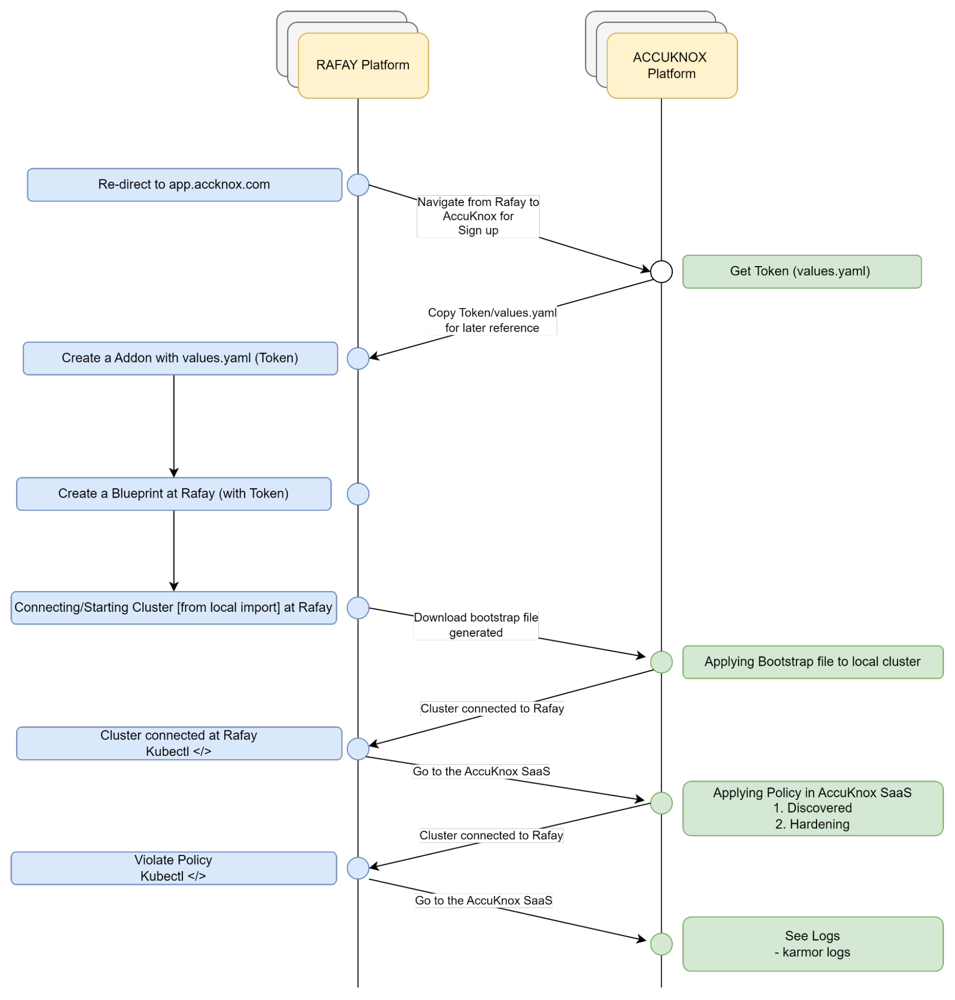

    ### **1.Create AccuKnox Agents Add-On**

    **Step 1:** Navigate to Add-Ons section in the Rafay console, Click on New Add on button and select Create New “Add-On from Catalog”.

    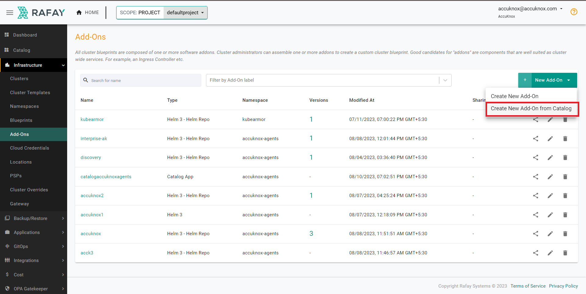

    **Step 2:** In the catalog search for Accuknox and select accuknox-agents.

    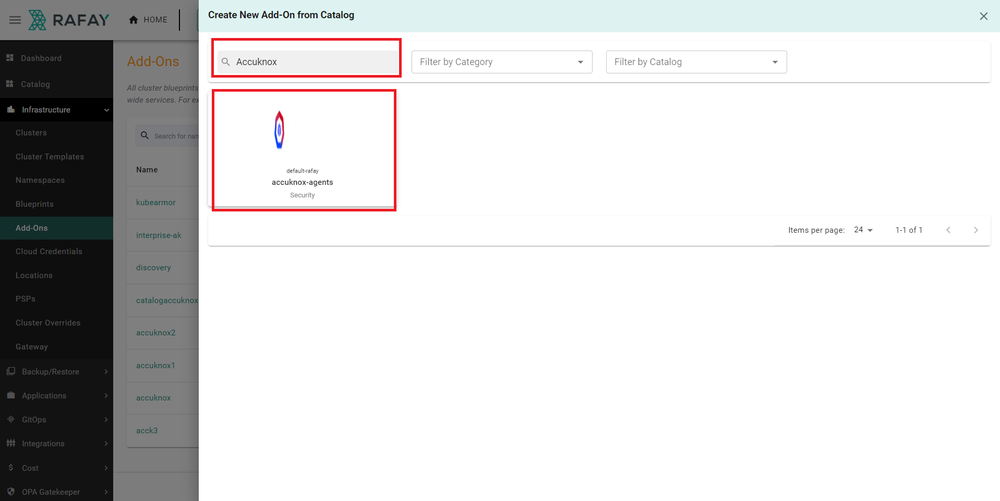

    **Step 3:** Go to VALUES.YAML tab and download the file, this file will be used later in the steps.

    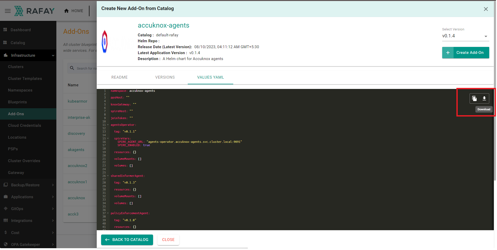

    **Step 4:** Click on Create Add-On.

    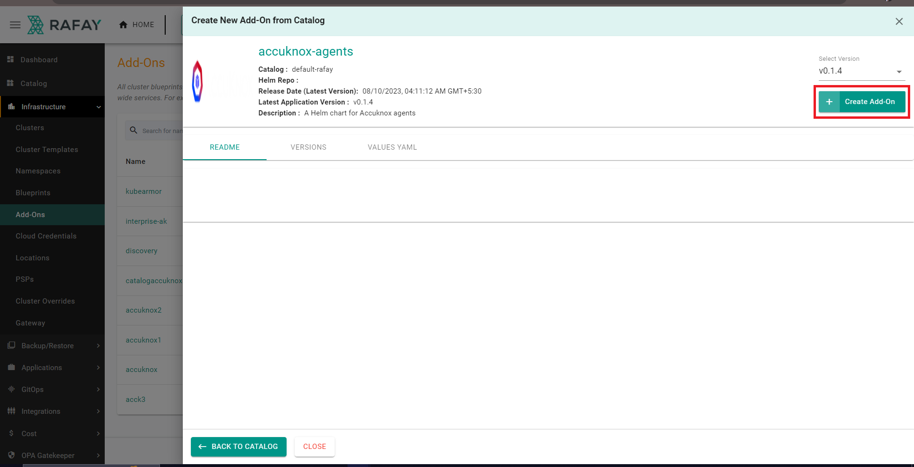

    **Step 5:** Give the Add-On a suitable Name and select “accuknox-agents” as namespace.

    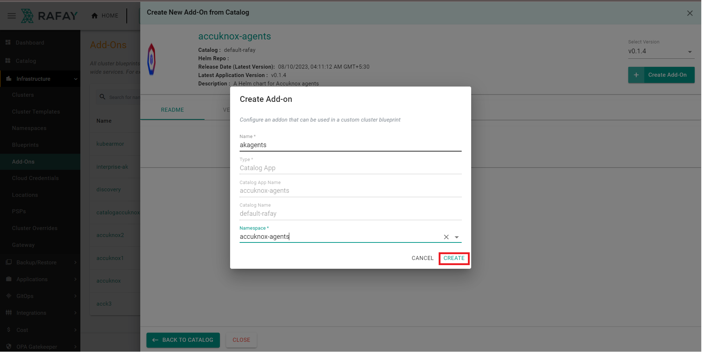

    **Step 6:** Upload the VALUES.YAML that was downloaded in step 3 and click on the edit button to change some fields.

    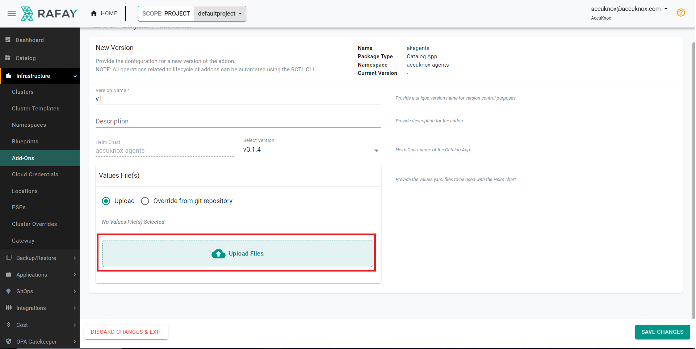

    **Step 7:** Change the following fields respectively:

    1. spireHost="spire.stage.accuknox.com"
    2. ppsHost="pps.stage.accuknox.com"
    3. knoxGateway="knox-gw.stage.accuknox.com:3000"
    4. joinToken= Get the token from AccuKnox Saas Platform

    (To see how to get joinToken refer to this guide : https://help.accuknox.com/getting-started/cluster-onboarding/)

    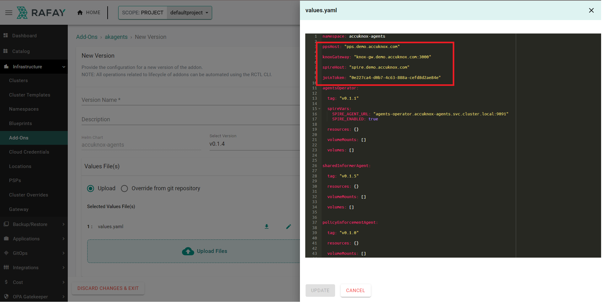

    **Step 8:** Save Changes to create a new version for the Add-On.

    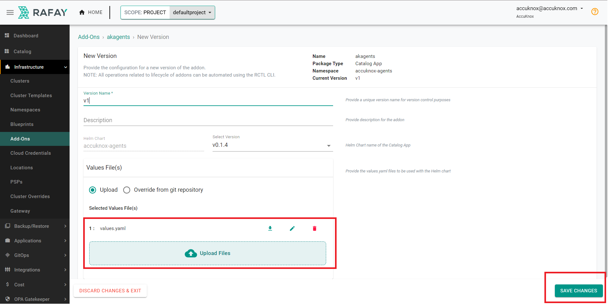

    ### **2.Creating Blueprint**

    After creating Add-on we need to create blue print with both KubeArmor and Accuknox-Agents.

    **Step 1:** To create a Blueprint user must navigate to the Infrastructure→Blueprint and select New Blueprint

    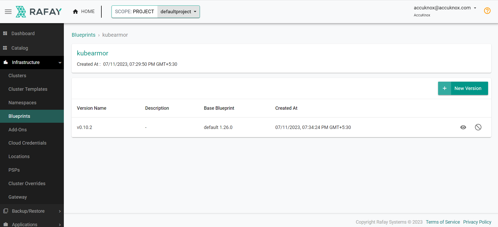

    **Step 2:** Now give the name for the blue print and save it

    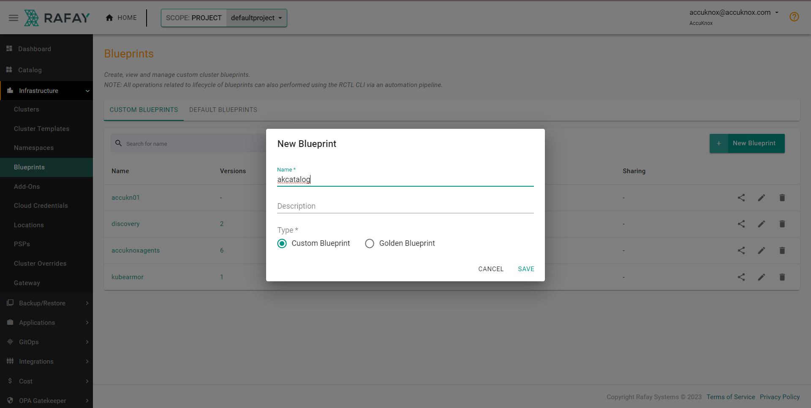

    **Step 3:** After that we need attach the kubearmor and AccuKnox- Agents add on that we created previously to the blueprint

    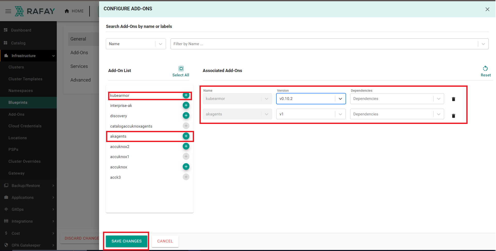

    ### **3.Deploying the Blueprint in Cluster**

    **Step 1:** Attaching the blueprint to the cluster by selecting the accuknox blueprint

    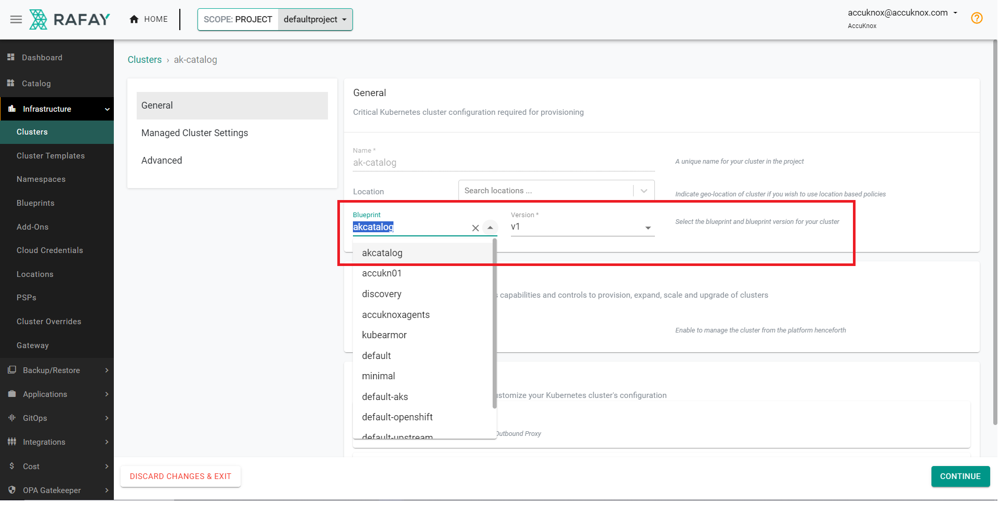

    **Step 2:** Download the bootstrap file from the Rafay interface and apply this to the cluster using CLI

    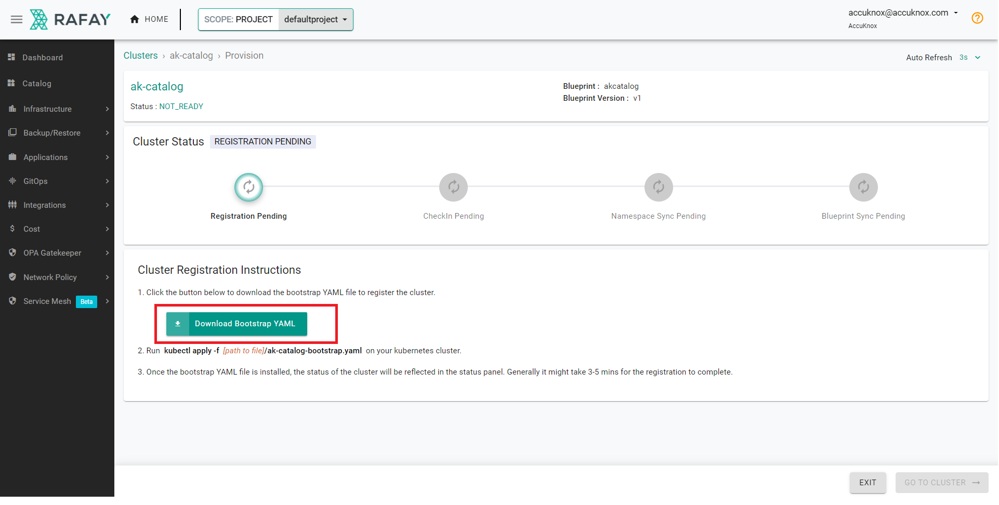

    **Step 3:** Applying the bootstrap.yaml in cluster

    ```sh
    @LAPTOP-9Q1ERBHE:~$ kubectl apply -f ak-catalog-bootstrap.yaml
    namespace/rafay-system created
    serviceaccount/system-sa created
    clusterrole.rbac.authorization.k8s.io/rafay:manager unchanged
    clusterrolebinding.rbac.authorization.k8s.io/rafay:rafay-system:manager-rolebinding created
    clusterrole.rbac.authorization.k8s.io/rafay:proxy-role unchanged
    clusterrolebinding.rbac.authorization.k8s.io/rafay:rafay-system:proxy-rolebinding unchanged
    priorityclass.scheduling.k8s.io/rafay-cluster-critical-v3 unchanged
    priorityclass.scheduling.k8s.io/rafay-cluster-critical created
    role.rbac.authorization.k8s.io/rafay:leader-election-role created
    rolebinding.rbac.authorization.k8s.io/rafay:leader-election-rolebinding created
    Warning: Detected changes to resource namespaces.cluster.rafay.dev which is currently being deleted.
    customresourcedefinition.apiextensions.k8s.io/namespaces.cluster.rafay.dev configured
    customresourcedefinition.apiextensions.k8s.io/tasklets.cluster.rafay.dev created
    customresourcedefinition.apiextensions.k8s.io/tasks.cluster.rafay.dev created
    configmap/proxy-config-v3 created
    configmap/v2-relay-agent-config created
    deployment.apps/v2-relay-agent created
    service/controller-manager-metrics-service-v4 created
    deployment.apps/controller-manager-v3 created
    customresourcedefinition.apiextensions.k8s.io/projects.system.k8smgmt.io created
    configmap/connector-config-v3 created
    deployment.apps/rafay-connector-v3 created
    service/rafay-drift-v3 created
    validatingwebhookconfiguration.admissionregistration.k8s.io/rafay-drift-validate-v3 created
    ```

    **Step 4:** Wait for KubeArmor and AccuKnox to complete deployment

    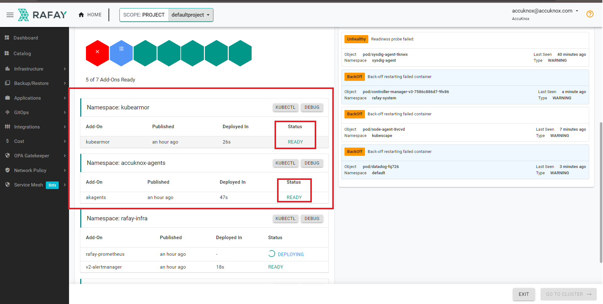

    **Step 5:** Check if the cluster is onboarded on AccuKnox SaaS platform in the Cloud Workload section.

    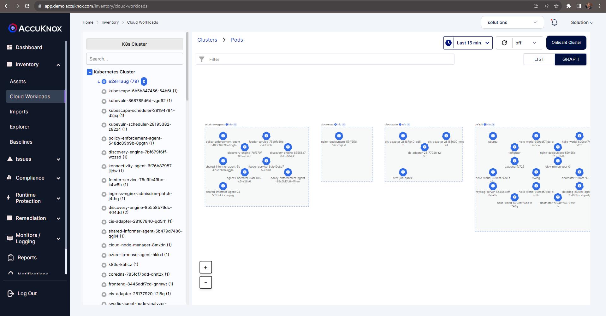

    ## **Expected Outcome**

    After Onboarding Process is complete user can utilize the following features of AccuKnox SaaS to protect their cloud workload at the runtime:

    ### **Application Behavior**

    Cluster workload behavior in AccuKnox SaaS is monitored using KubeArmor and AccuKnox Agents, installed as DaemonSets. Information is gathered at pod-level granularity, enabling users to access details for each pod in different namespaces. Workload behavior is presented through both list and graphical views.

    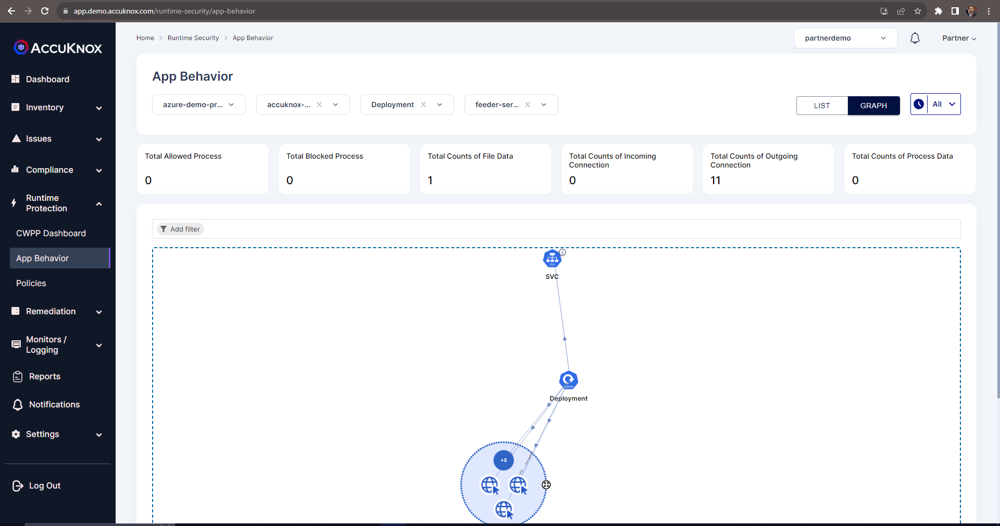

    **List View:**
    In the list view users can get the selected pod’s application behavior in 3 types of list namely:
    - **File Observability:**
    It provides the information about the file access that are happening inside the pod.
    It gives information like which process is accessing which file in the pod.
    Along with the file information it gives status of the access either allow, audit or deny.
    - **Process Observability:**
    It shows what are all the process that are executing in the pod and which pods or container are executing that process.
    It also gives information about the process that are blocked from execution in the pod.
    - **Network Observability:**
    Network Observability shows the ingress and egress connection that are coming to and going out of the pod.It gives the information regarding Port number, source from where the ingress connection is coming and Destination to which egress connection is destined to go.

    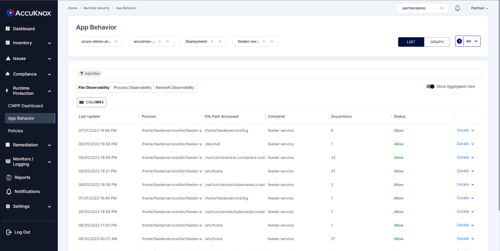

    ### **Policy Dashboard**

    The AccuKnox CWPP Dashboard offers a comprehensive overview of runtime protection for clusters through various informative widgets. These widgets include:

    - **Alerts Summary:** Provides a summarized count of alerts generated in the cluster or a specific namespace. Details include total alerts, blocked alerts (from system block policies), and audited alerts (from audit policies).
    - **Compliance Summary:** Displays the compliance benchmarks applied to the cluster/namespace through KubeArmor's hardening policies. Presents information about MITRE, NIST, CIS, PCI-DSS benchmarks.
    - **Compliance Alerts:** Graphically represents compliance alerts generated in the cluster/namespace, using distinct color coding for various compliance benchmarks like MITRE, NIST, PCI-DSS, etc.
    - **Namespace Severity:** Offers a summary of attack severity attempted in the different namespaces within the cluster.
    - **Top 10 Policies by Alerts Count:** Presents a graphical representation of the top 10 policies for which alerts are generated in the cluster/namespace. Useful for identifying high-alert generating policies.
    - **Namespace Alerts:** Displays alerts specific to the selected namespace within the cluster, providing detailed information about the alerts.
    - **Pod Alerts:** Offers insights into alerts originating from the pods running within the cluster/namespace.
    - **Alert based Operations:** Graphically represents alert-triggering operations such as file access, process blocks, and audits, giving users an overview of the types of alerts generated.
    - **Alerts based on Severity:** Provides information on attack severity levels that were mitigated by the runtime protection policies within the chosen cluster/namespace.

    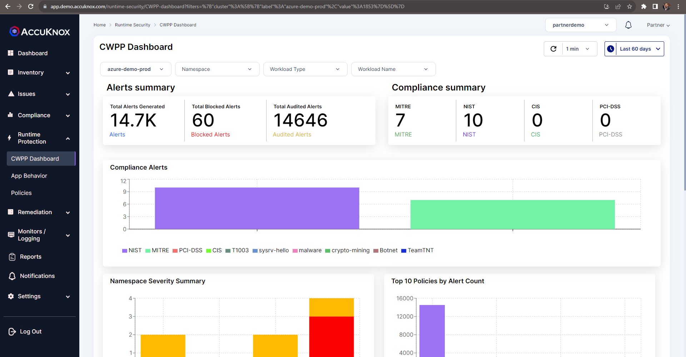

    ### **Policy Enforcement**

    Policies section gives the user information about the runtime protection policies that are applied in the cluster. Policies are classified as Discovered, Active, inactive, Pending, Hardening and so on. We can see the policies based on the cluster, Namespace and policy type that we select in the filters shown in the page. AccuKnox has the option to see the policies related to a particular namespace and workload. Along with the discovered and Hardening policies users can also create custom policies by using the policy editor tool.

    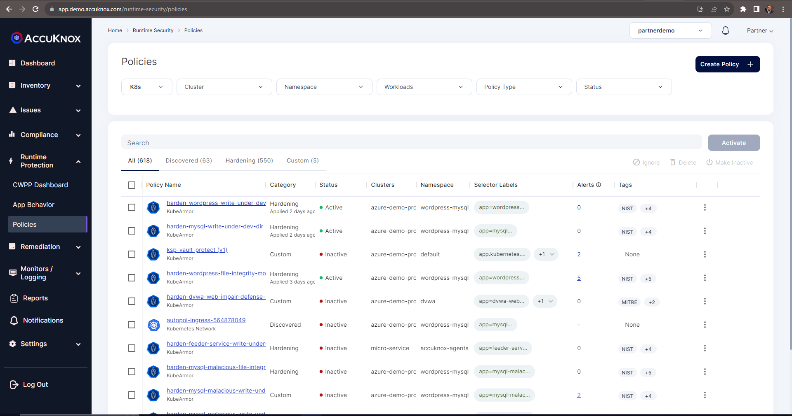

    ### **Monitoring Logs**

    AccuKnox CNAPP Solution provides comprehensive visibility of the cloud assets with the help of Dashboards and logs/alerts. AccuKnox’s open source KubeArmor can forward policy related logs/alerts to the SaaS. Also it can forward the container logs that is present in the workloads. Logs are generated in real-time based on certain conditions/rules you configure on the security policies. You will get logs from four different components.

    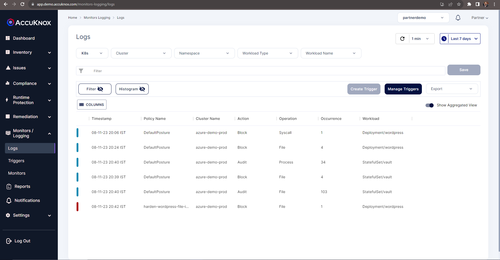

    The Log Detail contents vary depending on the selected component type of the log event.

    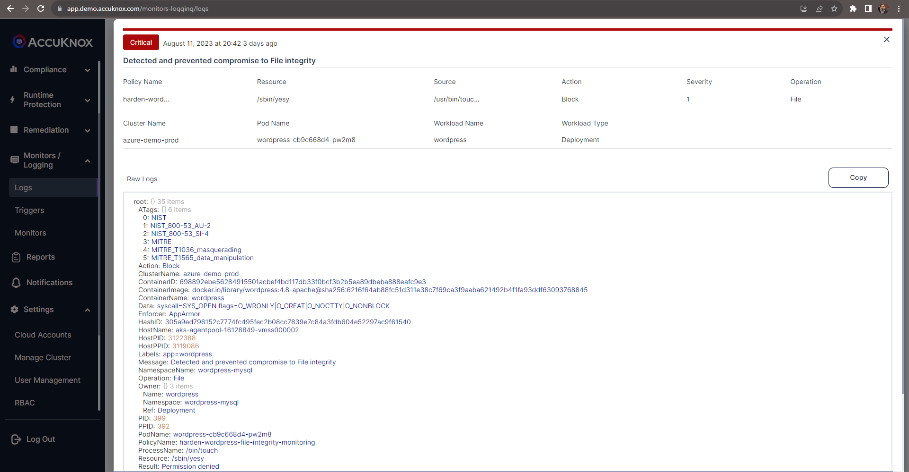

    ### **SIEM/Notification Integration**

    Users can use Feeder service agent to pass the logs to other SIEM tools like Splunk, ELK, Rsyslog, etc.., Users can also forward the logs from AccuKnox SaaS using the channel integration option to these SIEM tools. User can integrate with various SIEM and ticketing tools like [Splunk](https://help.accuknox.com/integrations/splunk/), [Rsyslog](https://help.accuknox.com/integrations/rsyslog/), [AWS CloudWatch](https://help.accuknox.com/integrations/aws-cloudwatch/), Elastic Search, [Slack](https://help.accuknox.com/saas/slack/) and [Jira](https://help.accuknox.com/integrations/jira-cloud).

    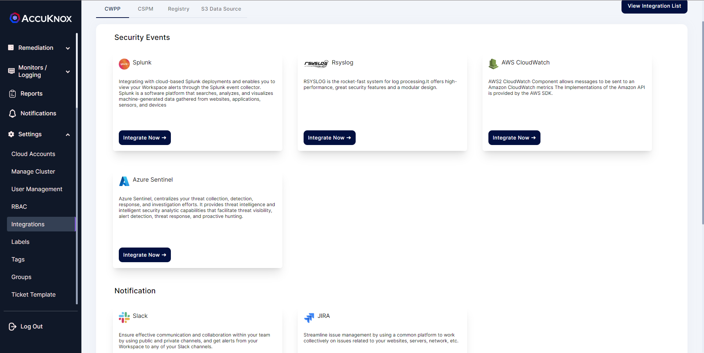

- - -
[SCHEDULE DEMO](https://www.accuknox.com/contact-us){ .md-button .md-button--primary }