# RedHat Marketplace Installation Guide

This document illustrates the process of subscribing to AccuKnox via RedHat Marketplace, encompassing the necessary actions within the marketplace, the subscription and access workflow, the post-registration access acquisition, and the subsequent steps following access attainment.

<!-- [Visit Marketplace](https://catalog.redhat.com/software/containers/kubearmor/k9v9d5v2/65c71e9607005e9c8304f237) -->

## User Cases

1. **Try a 1-month free trial**
2. **Purchase for production use**
3. **Onboard workloads to Accuknox**

## Case 1: Try a 1-month free trial

**Step 1**: Start by searching for AccuKnox CNAPP on the [RedHat marketplace](https://swc.saas.ibm.com/en-us/redhat-marketplace).

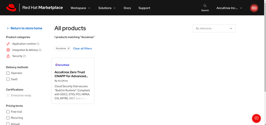

**Step 2**: After reviewing our offerings, choose "Free Trial".

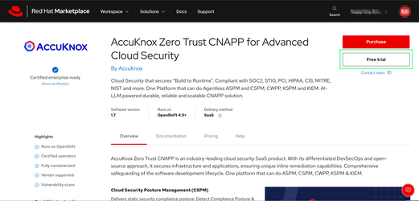

!!! info "NOTE"
    **The free trial lasts 30 days and cannot be renewed. If the user hasn't logged in yet, they can log in with the credentials they want to use for the subscription.**

**Step 3:** Click on "Start Trial".

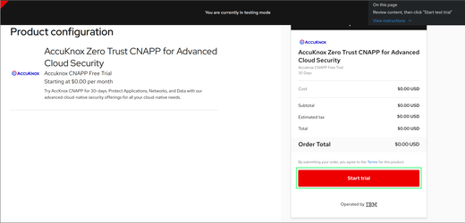

**Step 4:** Once the product is ready, view it by clicking on "View Software".

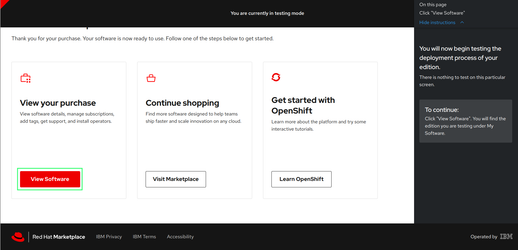

You will get an email confirmation with the product details. By clicking on "My Software", you may also view the product details to get started.

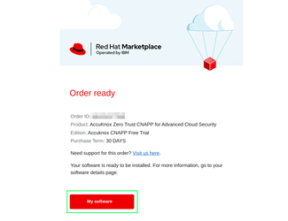

**Step 5:** At this point, we strongly recommend [Scheduling a DEMO](https://www.accuknox.com/demo) with AccuKnox to assist you with the onboarding steps and gain a deeper understanding of our features.

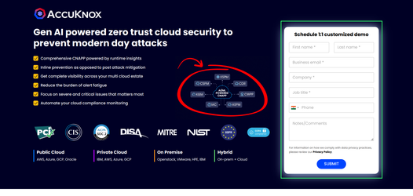

**Step 6:** Shortly after configuring a tenant for the customer, you will recieve an invitation to access the SaaS platform and leverage its security features.

!!! info "NOTE"
    **The free trial is available for 30 days. To continue using our product make sure to subscribe before the trial ends.**

## Case 2: Purchase for Production use case

**Step 1**: Begin by searching for AccuKnox CNAPP on the marketplace

**Step 2**: After reviewing our offerings, click on the "Purchase" button.

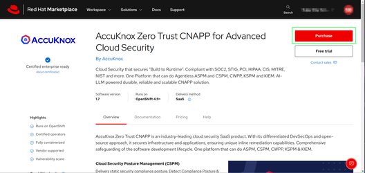

**Step 3**: Then click on "Request Quote".

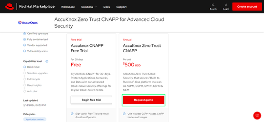

**Step 4**: A new window will pop up. By default your login email will be populated and cannot be changed. After filling in the other details, click "Submit".

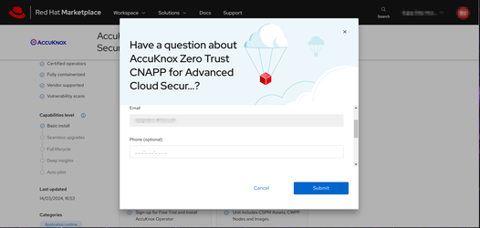

This will redirect to the below screen that confirms that the request has been sent to the RedHat team.

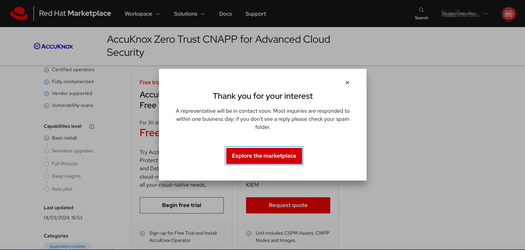

As a next step, you can expect an email from the support team and can further schedule a demo call to understand and try the platform.

## Case 3: Onboard Openshift clusters to the Accuknox platform

**Step 1**: Go to [https://catalog.redhat.com](https://catalog.redhat.com/). From the drop-down select "Software" and search "Accuknox". From the search results, select the below one.

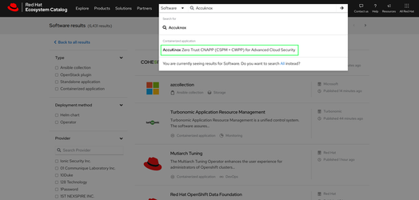

**Step 2**: Click "Deploy and use" after learning about the offerings.

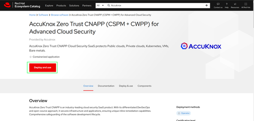

!!! info "NOTE"
    **You are expected to have an Openshift cluster where operators can be deployed.**

**Step 3**: Click on "Quick start and configuration". This will show the steps to get the necessary credentials to install the operators.

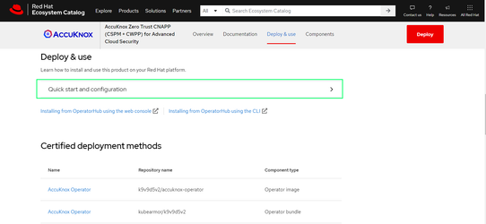

**Step 4**: From the below two options, click on the preferred one to see operator installation instructions. Replace Accuknox and Kubearmor operator names wherever needed.

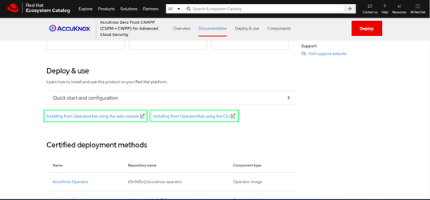
