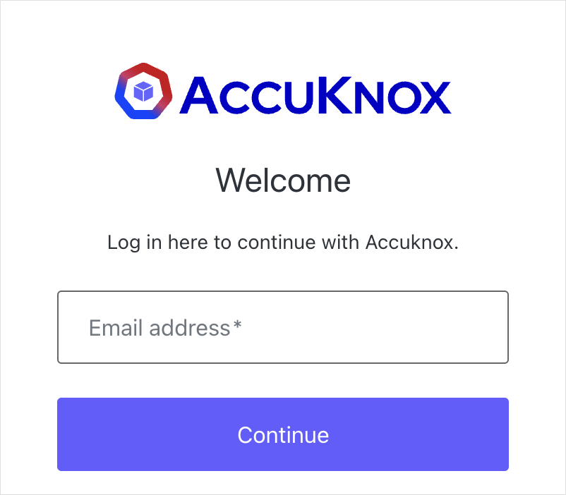

# Enterprise SSO (SAML) with AccuKnox

AccuKnox supports SAML 2.0 Single Sign-On with any identity provider. This guide uses standard SAML terminology, so the steps apply whether your organization runs Microsoft Entra ID, Okta, CAS, PingFederate, OneLogin, ADFS, Google Workspace, JumpCloud, or something else.

Setup is a two-way exchange of configuration values. There is no code or integration work on your side beyond your IdP's standard SAML app setup screens.

## 1. How SSO login works

AccuKnox uses an identifier-first login flow. Your users type only their work email address on the AccuKnox login screen, then get redirected to your identity provider to authenticate. They never enter a password on the AccuKnox side.

| Step | What happens |
|---|---|
| 1 | User enters their email address on the AccuKnox login screen |
| 2 | AccuKnox matches the email domain and routes to your IdP |
| 3 | User authenticates on your organization's IdP and lands in AccuKnox |

The match is driven by your organization's email domain, such as `yourcompany.com`, plus a one-time SAML trust configured between AccuKnox's identity platform and your IdP.

The login screen shows one email field. AccuKnox detects your domain and redirects to your IdP automatically.

## 2. What AccuKnox provides you

Before you configure anything, AccuKnox creates a dedicated SAML connection for your organization and sends you the values below. These identify AccuKnox as a trusted Service Provider (SP) to your IdP.

| Value AccuKnox provides | Example format |
|---|---|
| Entity ID / Identifier | `urn:auth0:accuknox:<tenant_identifier>` |
| Reply URL (ACS URL) | `https://accuknoxdev.us.auth0.com/login/callback?connection=<tenant_identifier>` |
| Sign-on URL (optional) | `https://accuknoxdev.us.auth0.com/` |

!!! note
    The examples above are illustrative only. Your actual values are unique to your tenant connection and come to you directly from your AccuKnox contact.

## 3. Configure SAML SSO on your identity provider

### 3.1 Create a new SAML application

In your IdP's admin console, create a new SAML 2.0 application. AccuKnox acts as the Service Provider (SP) and your IdP acts as the Identity Provider (IdP).

### 3.2 Enter the AccuKnox service provider details

Field names differ between identity providers. Match them by the standard SAML term in the left column and enter the values from Section 2.

| Standard SAML term, as your IdP may label it | Enter |
|---|---|
| Entity ID / Issuer / Audience URI / SP Entity ID | AccuKnox's Entity ID |
| ACS URL / Reply URL / Recipient URL / Destination URL / Single Sign-On URL | AccuKnox's Reply URL |
| Login URL / Default Relay State / Start URL (optional) | AccuKnox's Sign-on URL |
| Name ID Format | Email address, `urn:oasis:names:tc:SAML:1.1:nameid-format:emailAddress` |
| Name ID Value | The user's email address |
| Binding | HTTP-POST recommended, HTTP-Redirect also works |

### 3.3 Sign the SAML assertion or response

Configure your IdP to digitally sign the SAML assertion, or the full response, using an X.509 certificate. AccuKnox uses that certificate to verify authentication responses genuinely came from your IdP. Use SHA-256 signing.

## 4. What to send back to AccuKnox

Once your IdP application is configured, send us your federation metadata URL. A live URL is preferred because AccuKnox fetches it automatically and picks up certificate rotations. If your IdP does not publish one, send the sign-in URL, entity ID, and signing certificate instead.

| What we need | Details |
|---|---|
| Federation Metadata URL | A live URL your IdP publishes, usually under the SAML app's certificate or endpoints section |
| Sign-in URL, if no metadata URL | Your IdP's SAML SSO endpoint |
| Signing certificate, if no metadata URL | X.509 certificate in Base64 or PEM format |
| Email domains | For example `yourcompany.com`, used to route your users to your IdP automatically |

## 5. Test the connection

AccuKnox confirms the connection is active, then asks you to test with a real user.

1. Go to the AccuKnox login page and enter a work email address on your registered domain.
2. Confirm you get redirected to your IdP's sign-in page.
3. Authenticate. You land back in AccuKnox, signed in.

!!! warning "If sign-in does not work"
    Three causes account for most failures. The user has not been assigned to the SSO application on your IdP. The Identifier or Reply URL was not saved on your IdP's side. Or the signing certificate expired or was rotated without AccuKnox being notified.

    Contact your AccuKnox representative with the error message shown on screen and we will diagnose it with you.

## Related pages

Already know which identity provider you run? These guides cover provider-specific setup:

- [Azure Entra ID SSO](azure-entra-sso.md)
- [Okta SSO](okta-sso.md), which uses OIDC rather than SAML
- [Auth0 SSO](auth0-sso.md)
- [SSO Login Guide](../how-to/sso.md) covers inviting users and the Google login option
