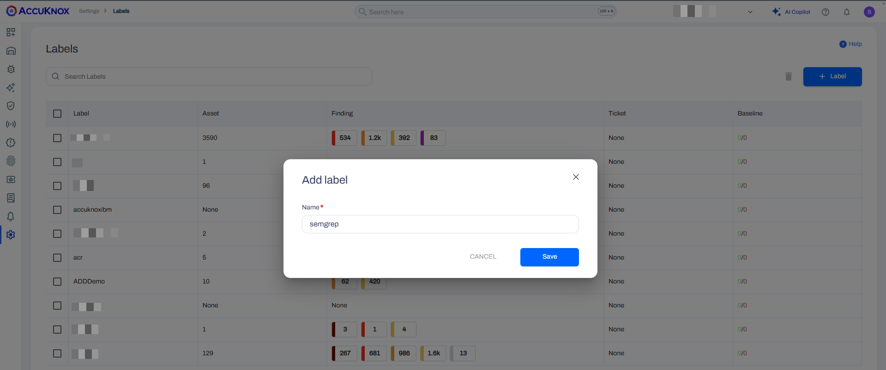
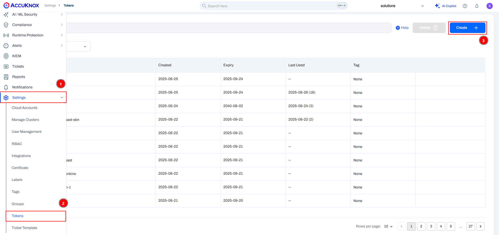
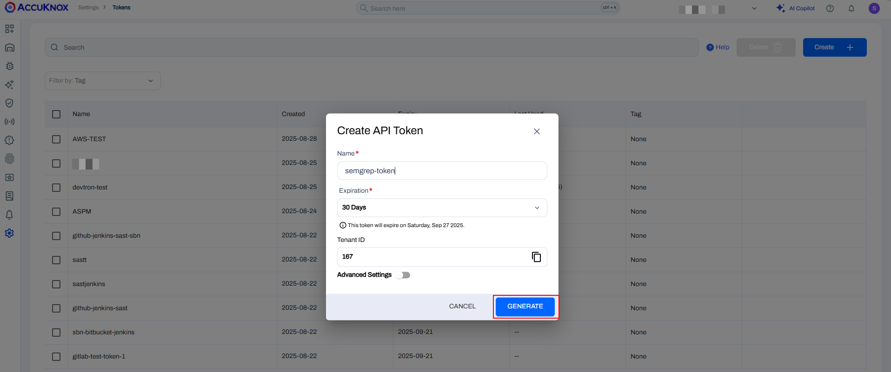
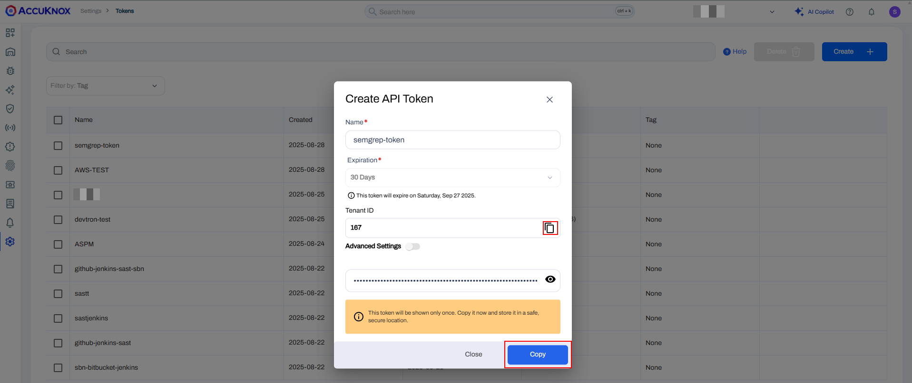

# Semgrep Integration with GitHub Actions

This document is a step by step guide for integrating Semgrep with AccuKnox. Semgrep can be used for SAST, SCA and secrets scanning for your source code repositories.

## Pre-requisites

- Access to AccuKnox
- Access to Semgrep
- A GitHub repository that you want to scan

### Step 1: Create a GitHub workflow

Add the following workflow file in the GitHub repository under the `.github/workflows/semgrep.yaml`.



```yaml
on:
  workflow_dispatch: {}
  push:
    branches:
      - main
name: Semgrep Findings
jobs:
  semgrep-sast:
    name: Semgrep-SAST
    runs-on: ubuntu-20.04
    container:
      image: semgrep/semgrep
    steps:
      - uses: actions/checkout@v4
      - name: Semgrep scan
        run: |
          # Run Semgrep scan and store the output in JSON
          semgrep scan --json --json-output /tmp/semgrep.json
        env:
          SEMGREP_APP_TOKEN: ${{ secrets.SEMGREP_APP_TOKEN }}

      - name: Upload report to AccuKnox
        run: |
          curl --location --request POST \
          "https://cspm.stage.accuknox.com/api/v1/artifact/?tenant_id=${{ secrets.ACCUKNOX_TENANT_ID }}&data_type=SG&save_to_s3=true&label_id=${{ secrets.ACCUKNOX_LABEL }}" \
          --header "Tenant-Id: ${{ secrets.ACCUKNOX_TENANT_ID }}" \
          --header "Authorization: Bearer ${{ secrets.ACCUKNOX_TOKEN }}" \
          --form "file=@/tmp/semgrep.json"
```



### Step 2: Configure the secrets in GitHub repository

You need to configure the following secret in the GitHub repository:

- `SEMGREP_APP_TOKEN`

- `ACCUKNOX_LABEL`

- `ACCUKNOX_TENANT_ID`

- `ACCUKNOX_TOKEN`

For configuring `SEMGREP_APP_TOKEN` navigate to the Semgrep > Settings > Tokens and click on create new token button.


Copy that token and configure that in GitHub repostiory.

Now navigate to the AccuKnox > Settings > Labels and click on the create label button.


Give your label a name and click on the save button. Once the label is created configure it as a secret in GitHub.



For creating a token navigate to the Settings > Tokens page, and click on the create button.



Give your token a name and click on the generate button:



Copy the Tenant ID and token and configure those as secretes in GitHub.



### Step 3: Trigger the pipeline

Once you have added the workflow and configured the secrets you can push the commit to the GitHub for triggering the pipeline.


Once the pipeline is completed successfully you can see the results in the AccuKnox. Navigate to the AccuKnox > Issues > Findings and select the Semgrep Findings.


