# ServiceDesk Plus (SDP) Integration

This guide provides step-by-step instructions to integrate **ManageEngine ServiceDesk Plus (SDP) Cloud** with the **AccuKnox Control Plane**. Once configured, AccuKnox can automatically create, update, and manage tickets in SDP based on CSPM (Cloud Security Posture Management) alerts.

## 1. Configure ServiceDesk Plus in AccuKnox Control Plane

### Step 1: Register Application on Zoho

To enable API access for SDP Cloud, you first need to register an application on Zoho:

1. Go to [Zoho API Console](https://api-console.zoho.in/).
2. Create a new client with the following details:
   - **Client Type:** Server-based or Web-based
   - **Homepage URL:** `https://app.accuknox.com/`
   - **Redirect URL:** (copy this from the AccuKnox Control Plane, you'll get it in Step #2, point 3 below)
3. Save the **Client ID** and **Client Secret**. You will use these in the AccuKnox platform.

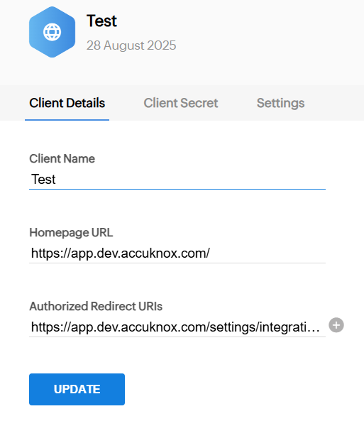
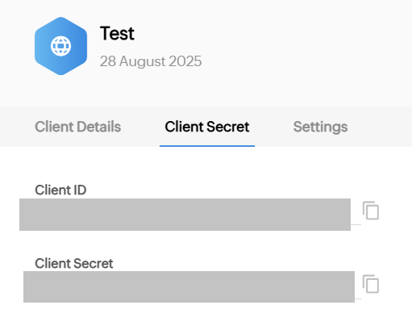

!!! tip
    Always copy the Redirect URL directly from AccuKnox instead of typing manually to avoid authentication errors.

!!! warning
    If authentication fails, check that the Redirect URL in Zoho and AccuKnox match exactly, including trailing slashes.

### Step 2: Configure Integration in AccuKnox

1. Log in to **AccuKnox Control Plane**.
2. Navigate to: **Settings → Integrations → CSPM → ServiceDesk Plus**.
3. On the integration page, fill in:
   - **Integration Name**
   - **Client ID** (from Zoho)
   - **Client Secret** (from Zoho)
   - **Homepage URL →** `https://app.accuknox.com/`
   - **Redirect URL →** (to be pasted in Zoho)
4. Click **Test Connection**. Once validated, the integration is active.

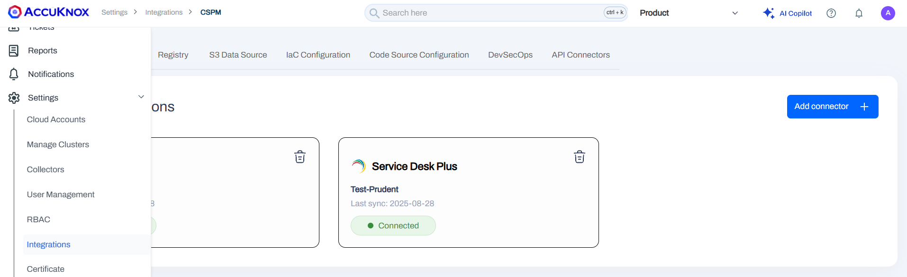
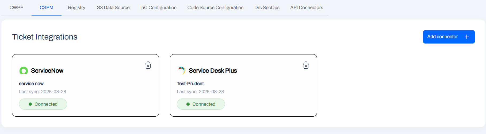
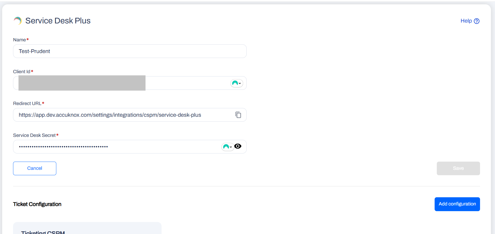

!!! tip
    Use a clear Integration Name (e.g., `SDP-Prod` or `SDP-Test`) to easily identify multiple environments.

## 2. Configure Ticket Creation & Syncing

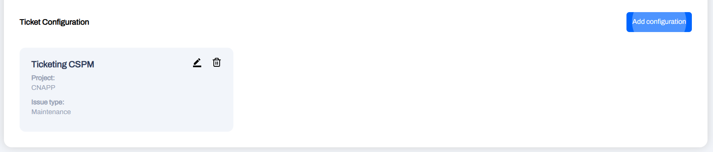

AccuKnox allows you to define rules for how CSPM alerts are turned into SDP tickets.

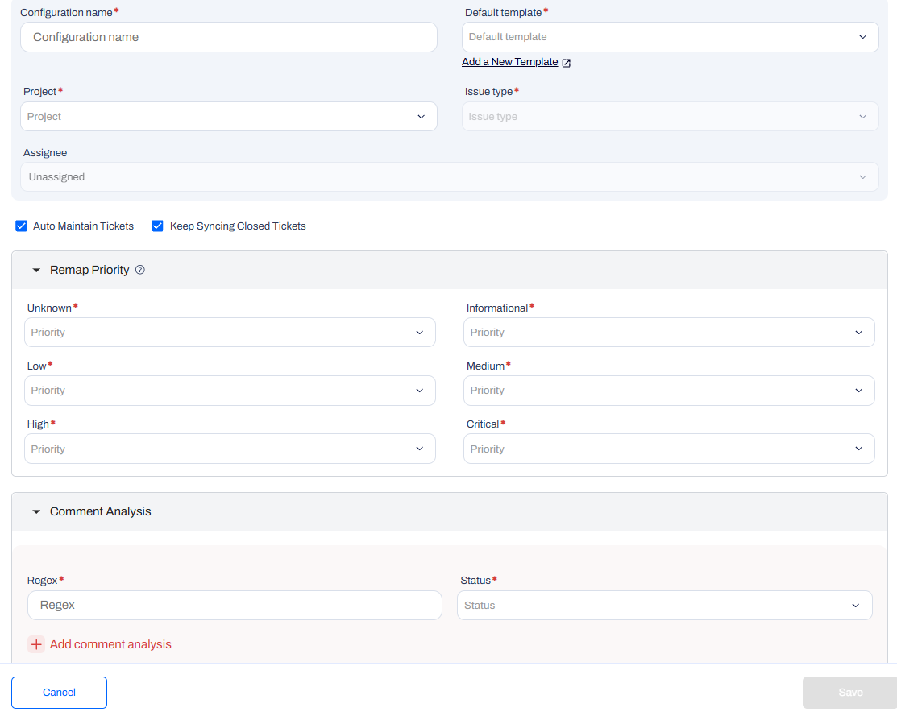

### Ticket Syncing Options

These options allow you to automate and customize ticket management:

- **Automate Ticket Creation**
  Automatically create a new ticket in the right project and assign it whenever a new CSPM alert is detected.

- **Set Priority Automatically**
  Map alert severity (Critical, High, Medium) to corresponding ticket priority (Highest, Medium). This ensures high-risk issues are always addressed first.

- **Update Alerts with Comments**
  Configure rules so that certain comments update alert status automatically. For example, if a ticket comment includes *false positive*, the alert can be auto-suppressed.

- **Build Reusable Templates**
  Save configurations as templates to apply consistent workflows across different types of alerts.

!!! tip
    Create separate templates for different alert categories (e.g., compliance violations vs. misconfigurations) to streamline triage.

!!! warning
    If tickets are not being created, verify that your SDP account has the required API access permissions.

### Additional Syncing Features

- **Auto Maintain Tickets**
  Keeps tickets updated whenever the underlying alert changes. If new findings are added to an alert in AccuKnox, the system updates the corresponding SDP ticket.

- **Keep Syncing Closed Tickets**
  Prevents duplication of tickets for recurring issues. If a closed ticket's alert reoccurs, the same ticket is reopened instead of creating a new one.

!!! tip
    Enable both *Auto Maintain Tickets* and *Keep Syncing Closed Tickets* to ensure long-running or recurring issues are tracked in one place.

!!! warning
    If tickets don't reopen as expected, verify that the SDP project settings allow reopening of closed tickets.

## 3. Create and Manage Tickets from AccuKnox

Once the integration is complete, you can start creating and managing SDP tickets directly from AccuKnox:

1. Go to the **Cloud Inventory Assets** page.
   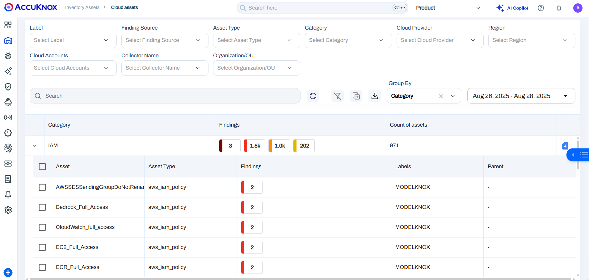

2. Select an asset to view its findings.
   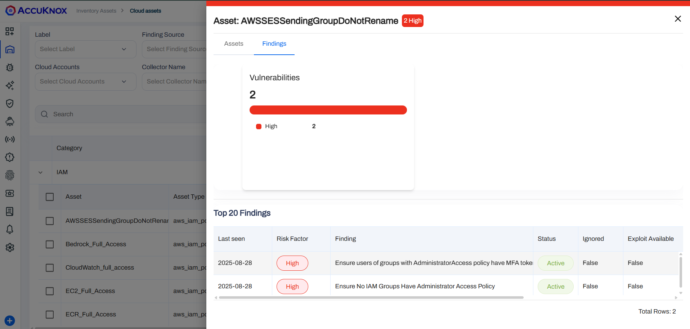

3. Choose a finding and click **Create Ticket**.
    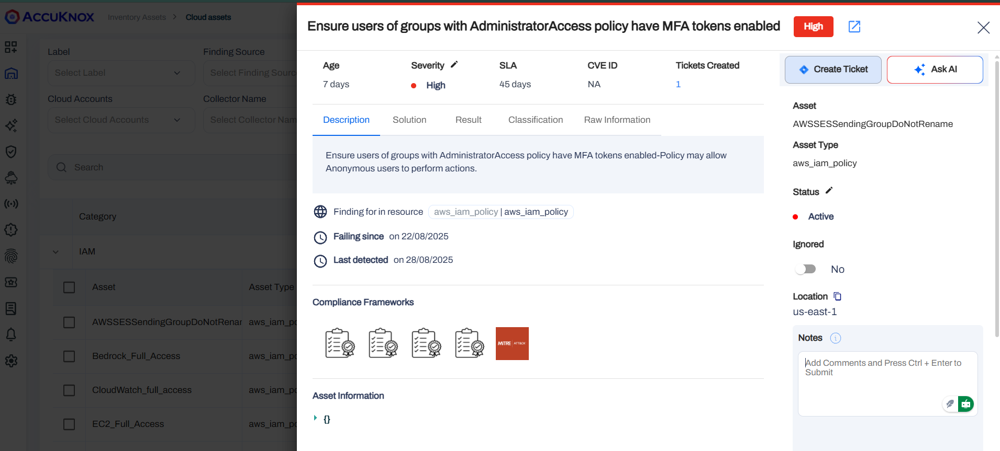

4. In the **Ticket Configuration Selection**, pick the template created during setup.
   Example: *Ticketing CSPM template*.
5. The template will automatically populate ticket fields with finding details. Review and adjust:
   - Assignee
   - Priority
   - Ticket description/mapping

6. Click **Create Ticket**.
   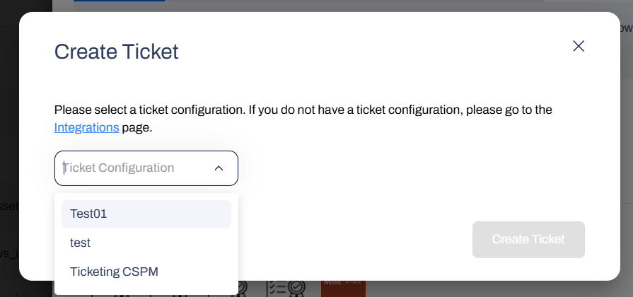

### After Ticket Creation

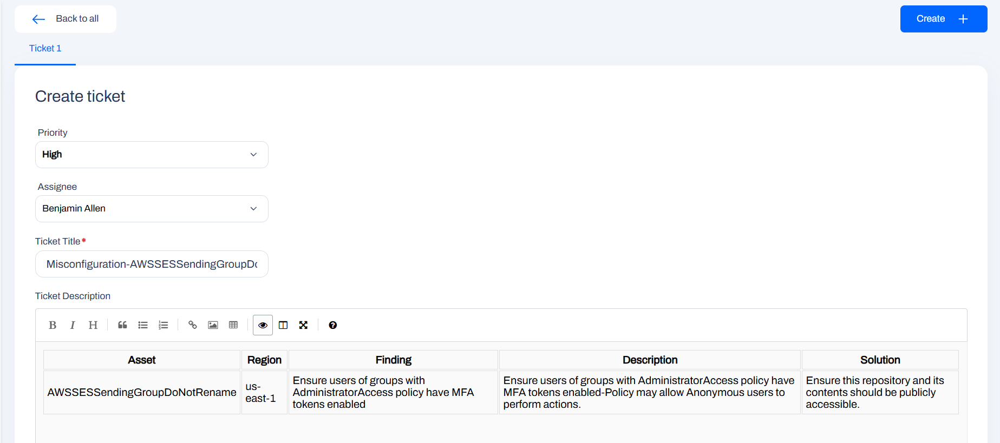

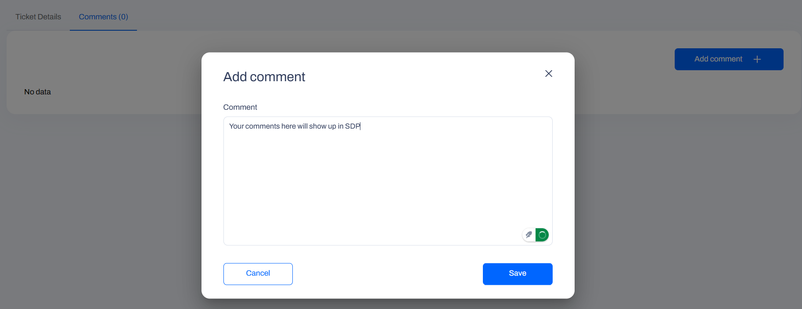

- Once the ticket is created, you will see full details (status, assignee, severity, etc.) directly in AccuKnox.
- If syncing options were enabled, editing status or comments in AccuKnox reflects in SDP.
- Comments made in AccuKnox appear in the corresponding SDP ticket.
- Closing a ticket in AccuKnox automatically marks it as resolved in SDP.

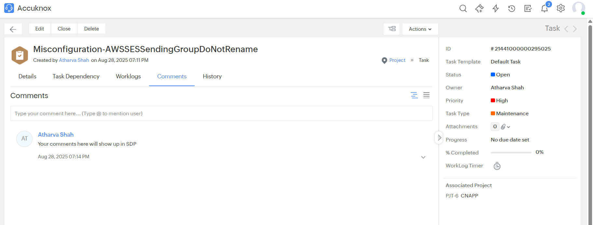

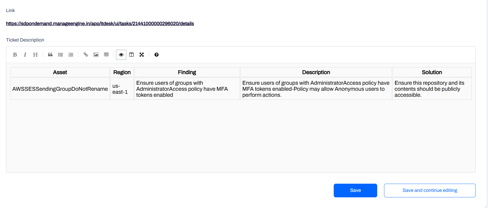

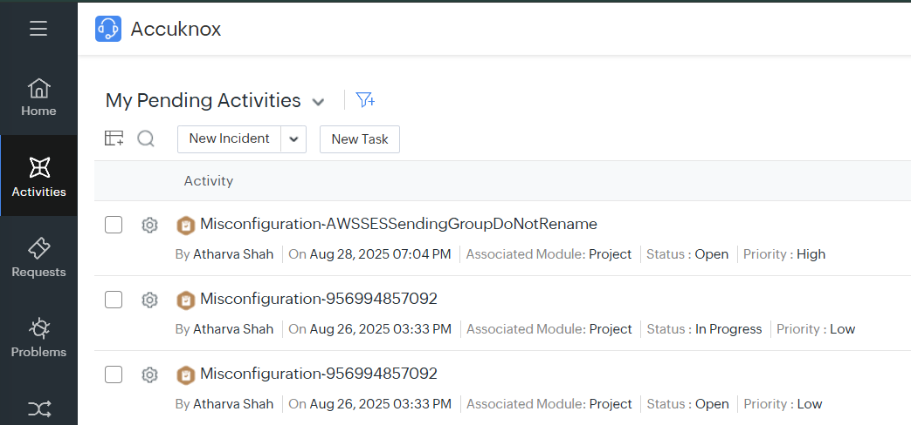

You can also view and manage all tickets centrally at:
[https://app.accuknox.com/tickets](https://app.accuknox.com/tickets)

!!! tip
    Use the AccuKnox Tickets page to track all tickets across projects in one place instead of checking each alert individually.

!!! warning
    If ticket comments are not syncing, verify that the **comment sync** checkbox is enabled in the ticket configuration.

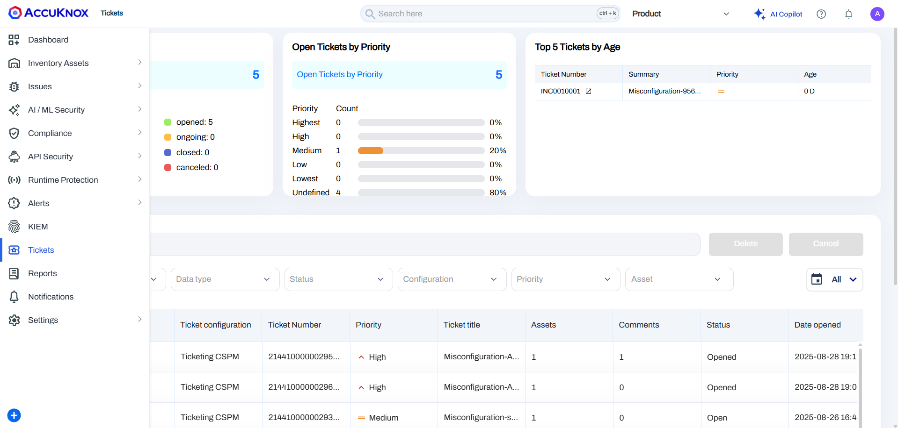

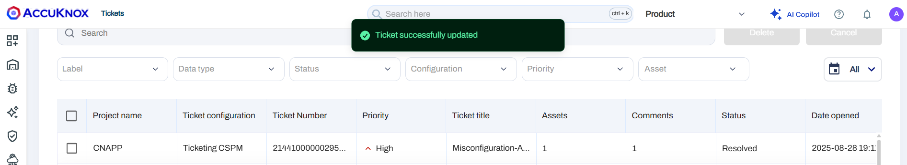

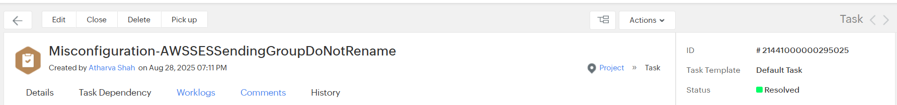

## Summary

By integrating SDP Cloud into AccuKnox, you:

- Automate the conversion of CSPM alerts into actionable tickets
- Maintain a single source of truth across AccuKnox and SDP
- Reduce manual work and ensure timely remediation of security issues
- Improve collaboration between Security and IT teams with synchronized workflows

!!! note
    This integration ensures your CSPM alerts are automatically tracked, prioritized, and resolved in ServiceDesk Plus without leaving the AccuKnox platform.
