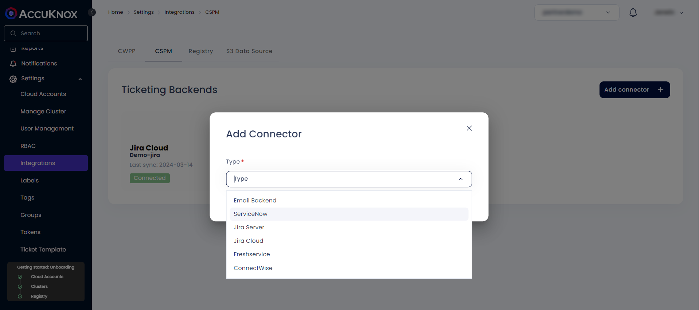
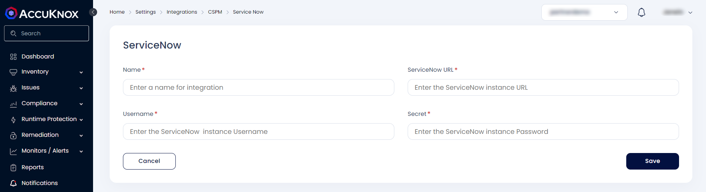
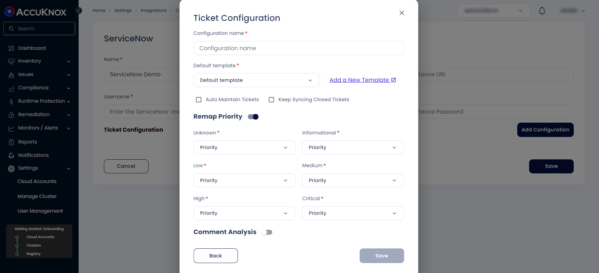

# ServiceNow Integration

Integrate AccuKnox with ServiceNow and receive AccuKnox alert notifications in your ServiceNow account. With this integration, you can automate the process of generating ServiceNow tickets with your existing security workflow.

To set up this integration, you need to coordinate with your ServiceNow administrator and gather the inputs needed to enable communication between AccuKnox and ServiceNow.

## Integration

### Prerequisites

- The ServiceNow Integration requires the following: Instance URL, Instance Username and Instance Password.

    - Please refer to the <a href="https://developer.servicenow.com/dev.do#!/learn/learning-plans/utah/new_to_servicenow/app_store_learnv2_buildmyfirstapp_utah_personal_developer_instances" target="_blank">ServiceNow Documentation</a> for how to create an instance and obtain the required credentials.

### Steps for integration

- Navigate to Settings → Integrations → CSPM tab

- Click on add connector and select ServiceNow



- Enter the following details to configure the ServiceNow Integration:

    - **Integration Name**: Enter the name for the integration. You can set any name. e.g.,```MyServiceNow```

    - **ServiceNow Instance URL**: The URL of the ServiceNow instance. e.g.,```https://my-instance.service-now.com```

    - **Instance Username**: The Username associated with the instance. e.g.,```admin```

    - **Secret**: The current password of the instance.



- Click on the ServiceNow ticketing backend

- Click on Add Configuration and enter the following details:

    - **Configuration name**: this name will be displayed under ticket configuration while creating tickets.

    - **Default template**: to specify the of data that this configuration will be used for making tickets.

    - **Issue Type**: You can choose from the dropdown.

    - Fill the priority mapping according to your choice and press **Save**.



You can now create tickets on ServiceNow through the ticketing configuration.
