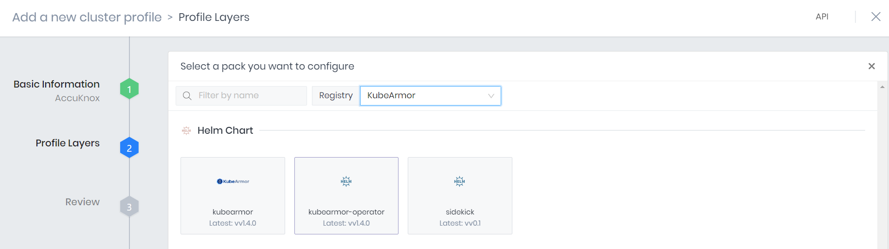

# Deploy AK agents via Spectrocloud / Palette

This document provides instructions on using Spectrocloud/Palette to onboard the clusters to AccuKnox via the use of Cluster Add On Profiles. Essentially simplifying the onboarding of clusters already connected to the Spectrocloud platform.

## Prerequisites

### Add Helm Charts

To add the helm charts to be deployed, navigate to Tenant Settings → Infrastructure → Registries and click on **Add New Helm Registry**

Enter the following:

- Name: KubeArmor

- Endpoint: `https://kubearmor.github.io/charts`

Click on **Confirm**

Follow the same steps as above and add another helm chart registry for the AccuKnox Enterprise Agents. The following details will be used to add the registry:

- Name: AccuKnox-Agents

- Endpoint: `http://agents.accuknox.com`

### Generate Access Key

On the AccuKnox platform, navigate to Settings → User Management. Click on the three dots to the right of your username and select **Get Access Key**

In the pop up,

- Enter a Name for the access key

- Set the Expiration time for the key's usage

- Select a sufficient role, for the purpose of onboarding cluster

- Enter the maximum number of clusters that can be onoarded using this access key

Click on **Generate** and copy the access key.

## Configuration

### Create a Cluster Profile

Navigate to Profiles and click on **Add Cluster Profile**

In the following screen, enter a Name for the profile, a version number and select Type as Add-On. Click on **Next**

Click on **Add Helm chart** and select **Public packs**

Select the KubeArmor Registry and click on KubeArmor Operator

In the values for the helm chart, enter the namespace to deploy the agent and set `autoDeploy` to `true`. Click on **Confirm & Create**

Select Add Helm Charts → Public packs again. This time, select the AccuKnox-Agents Registry and click on accuknox-agents

In the values file, enter the namespace and set the following variables with regards to the AccuKnox platform in use:

- `ppsHost`: `pps.<env-name>.accuknox.com`

- `knoxGateway`: `knox-gw.<env-name>.accuknox.com:3000`

- `spireHost`: `spire.<env-name>.accuknox.com`

**Note**: The values for the above variables can be fetched from the cluster onboarding screen in the AccuKnox platform. The accessKey should be replaced by the user token generated on AccuKnox to reuse this profile

- `clusterName`: A name to uniquely identify the cluster on AccuKnox

- `tokenURL:`Value will be `cwpp.<env-name>.accuknox.com` where <env name> could be demo or other depending on the AccuKnox platform URL.

- `accessKey`: The Access Key that was generated from AccuKnox

Click on **Confirm & Create**

Click on **Next** after creating the two layers

Click on **Finish Configuration** to finalize setting up the Cluster Profile

## Deploying Agents

Navigate to Profiles and select the Cluster Profile created for AccuKnox

Click on **Deploy**

Select the cluster and click on **Confirm**

Edit the `clusterName` and provide a unique name for identification in the AccuKnox platform. It can contain alphanumeric characters with an hyphen in between the characters.

Click on **Save** after confirming the details.

To onboard any clusters, the same profile can be reused by changing only the `clusterName` parameter.
