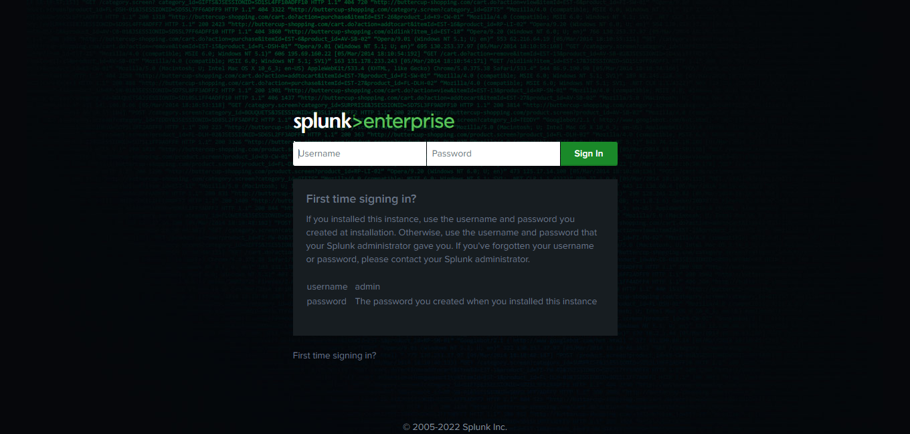

# Splunk Integration With KubeArmor
  


 

## **Introduction**
The AccuKnox Splunk App is designed to deliver operational reporting as well as a simplified and configurable dashboard.
Users can view the real-time alerts in form of logs and telemetries.

***Important features***

-  Dashboard to track the real time alerts generated from K8s cluster.

-  Data models with pivots for easy access to data and visualization.

-  Filter out the Alerts based on different namespaces, pods, operations, severity, tags and the actions of policies.

-  Drill-down ability to see how the alerts generated, what policy was violated and what was the result for the same.

## **Installation**
#### **Prerequisites :**
*1. K8s Cluster with Feeder-Service and KubeArmor.*

*2. An active Splunk Deployment and Access to the same.*

>  *To depoy Splunk on Kubernetes Cluster follow https://splunk.github.io/splunk-operator/*  *and for Linux follow https://docs.splunk.com/Documentation/Splunk/9.0.1/Installation/InstallonLinux*

## **Step1:Feeder Service Installation on Kubernetes Cluster**
1 . Assuming the user is inside their K8s Cluster, type the following command pull the Feeder Service Helm Chart.
```bash  
helm pull oci://public.ecr.aws/k9v9d5v2/accuknox-agents --version 0.1.0 --untar
```
2 . Now change directory to accuknox-agents
```bash  
cd accuknox-agents
```
3. Edit the yaml file **install-feeder-only.yaml** to add the Splunk variables required to forward the events. 
```bash  
vi install-feeder-only.yaml
```
4. Update the following fields in the YAML file and save it. 

| Fields           | Values                                                                                                             |
|------------------------|--------------------------------------------------------------------------------------------------------------------|
| `clusterName`                            | Add `clustername` from which data will be forwarded.                                                               |
| `SPLUNK_FEEDER_ENABLED`                  | Setting this to `true` forward the Policy Violated Alerts to Splunk                                                |
| `SPLUNK_FEEDER_URL`                      | Add`HEC URL` of your Splunk Deployment, e.g., `https://splunk-xxxxxxxxxx.com/services/collector`                   |
| `SPLUNK_FEEDER_TOKEN`                    | Enter your Splunk HEC Token here, created while adding a new HEC For example: `x000x0x0x-0xxx-0xxx-xxxx-xxxxx00000`                                                                                                                            |
| `SPLUNK_FEEDER_INDEX`                    | Enter your Splunk HEC Index here, created while adding a new HEC For example: `main`                                |
| `SPLUNK_FEEDER_SOURCE`                   | User can add any source, For example: `KubeArmor`                                                                   |
| `SPLUNK_FEEDER_SOURCE_TYPE`              | User needs to add source type as `json`                                                                             |
| `SPLUNK_ALERTS_ENABLED`                  | Setting this to `true` forward the Policy Violated Alerts to Splunk, To forward any alerts this needs to be true    |
| `SPLUNK_LOGS_ENABLED`                    |Setting this to `true` forward the Container Logs to Splunk.|

5. Now install Feeder Service using the below command
```bash  
helm install feeder-service oci://public.ecr.aws/k9v9d5v2/accuknox-agents --version 0.1.0 --values=install-feeder-only.yaml  -n accuknox-agents --create-namespace
```
```Note*: To edit the Splunk Variable anytime in future, User can edit the config-map named splunk-vars in accuknox-agents namespace, to edit use this command: kubectl edit cm splunk-vars -n accuknox-agents```
## **Step2: AccuKnox Splunk App Installation on Splunk Deployment**
### Where to install it?
Splunk App can be installed on Splunk Enterprise Deployment done on K8s or VM.
***User can install the App using three different ways.***
### Option 1: Install from File
**This App can be installed by Uploading the file to the Splunk UI.**
  1. Download the AccuKnox Splunk App file, by typing the following command. This file can be downloaded anywhere from where the user can upload the file to Splunk UI.
 ```bash
 git clone https://github.com/accuknox/splunk.git AccuKnox
 tar -czvf AccuKnox.tar.gz AccuKnox
 ```
2. Log in to your **Splunk Deployment.**
    
3. Click on the gear {:   style="height:15px;width:15px"} icon next to **Apps.**  
   
4. This will navigate you to the **Apps Dashboard.** On the top right, click on **Install app from file.**
   
5. This will navigate to **Upload App** Screen. Select **AccuKnox.tar.gz** file downloaded in the _first step_, and upload. In case you are updating the app and it’s already installed, mark the check box for Upgrade App.
 
6. Once Uploaded the App will be installed on the Splunk Deployment, with a confirmation message, **“**_**AccuKnox" was installed successfully.**_ Click on **Launch App** to view the App.

 
7. You can **Restart Splunk** for the App to work properly. Go to **Settings > Server Control > Restart Splunk,** Restarting the app will take approx. 1-2 minutes.

 
8. Wait for Splunk to Restart And you can log in back to see the **AccuKnox App** in the App section.

 
9. Click on the **AccuKnox App** to launch the App. This will navigate you to the App dashboard.

 

_*Note:*_

1.  *If Dashboards shows no data, you need to configure the HEC on Splunk and Forward the data first, check below how to configure and [create HEC](https://docs.splunk.com/Documentation/Splunk/9.0.1/Data/UsetheHTTPEventCollector) and [ forward the data]().*

2. *If data is not being pushed, Login to Splunk > Setting > Data Input > Select HTTP Event Collector > Global Settings > Disable SSL if Enabled by unchecking the box.*

3. *We recommend restarting the Splunk Deployment after App Installation.*

### Option 2: Install the App from SplunkBase

Install the AccuKnox App by downloading it from the App homepage.

 

### Option 3: Install from GitHub
This App is available on [SplunkBase](https://apps.splunk.com/apps/id/SplunkforAccuKnox "https://apps.splunk.com/apps/id/SplunkforAccuKnox") and [Github](https://github.com/accuknox/splunk "https://github.com/accuknox/splunk"). Optionally, you can clone the GitHub repository to install the App. Please feel free to submit contributions to the App using pull requests on GitHub.

1. Locate the Splunk Deployment done in your environment.

2. Navigate to the Splunk App directory. For Linux users `/opt/splunk/etc/apps` and windows users `\Program Files\Splunk\etc\apps`

From the directory `$SPLUNK_HOME/etc/apps/`, type the following command:
```bash

git clone https://github.com/accuknox/splunk.git AccuKnox

```

- - - 
[SCHEDULE DEMO](https://www.accuknox.com/contact-us){ .md-button .md-button--primary }
