# Sumo Logic Syslog Integration

AccuKnox supports integration with Sumo Logic using Rsyslog. In this method, AccuKnox sends runtime security events to a self-hosted Rsyslog server, and the Rsyslog server forwards those events to Sumo Logic Cloud Syslog over TCP/TLS.

The integration flow is:

```
AccuKnox Runtime Alerts → Self-hosted Rsyslog VM → Sumo Logic Cloud Syslog
```

This guide explains how to configure the Sumo Logic Cloud Syslog source, set up the Rsyslog relay VM, configure the Rsyslog channel in AccuKnox, and validate that events are received in Sumo Logic.

## Prerequisites

Before starting the configuration, make sure you have:

- Access to the AccuKnox Platform
- Access to the Sumo Logic console
- A Linux VM where Rsyslog can be installed and configured

The VM must be reachable from AccuKnox on port 514, and it must have outbound connectivity to the Sumo Logic Cloud Syslog endpoint on port 6514.

## Steps to be followed

**Step 1: Create a Cloud Syslog Source in Sumo Logic**

- Log in to Sumo Logic and navigate to **Manage Data → Collection**.
- Open the collector named AccuKnox-Test.
- Click **Add Source**.

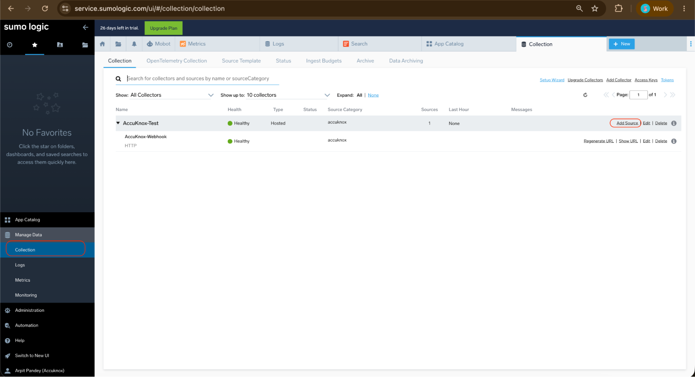

**Step 2:** Search for `syslog`.

- Select **Cloud Syslog** from the available source types.

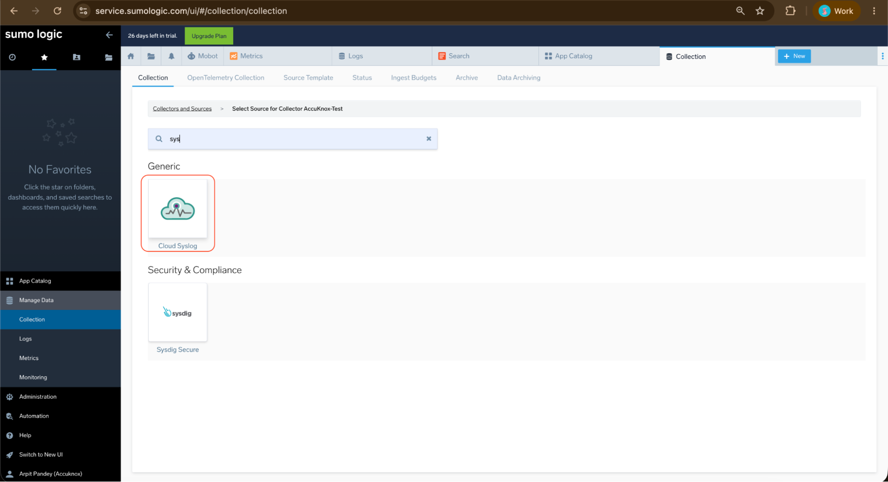

**Step 3: Configure the Cloud Syslog Source**

On the Cloud Syslog source configuration page, enter the following details:

| Field | Value |
| -- | -- |
| Name | AccuKnox-CloudSyslog |
| Description | AccuKnox Runtime Alerts via Syslog |
| Source Category | accuknox/syslog or accuknox |

Click **Save**. After saving, the Cloud Syslog source is created under the AccuKnox-Test collector.

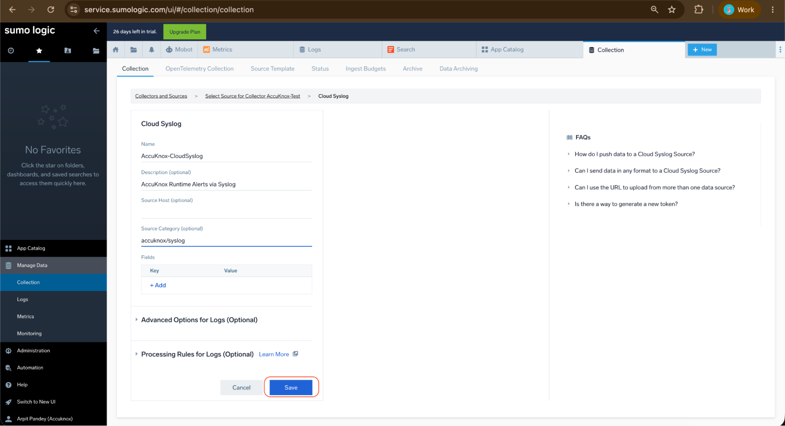

**Step 4: Copy the Cloud Syslog Token Details**

- From the Sumo Logic Collection page, open the AccuKnox-CloudSyslog source.
- Click **Show Token**.
- Note the following details:

| Field | Value |
| -- | -- |
| Host | syslog.collection.us1.sumologic.com |
| TCP TLS Port | 6514 |
| Token | Sumo-generated Cloud Syslog token |

These values are required to configure the Rsyslog forwarding rule on the VM.

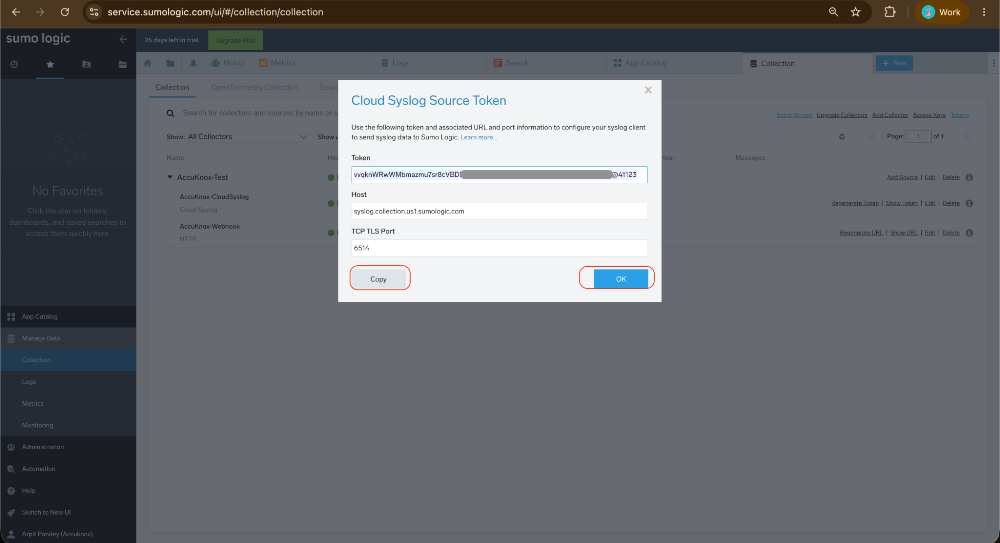

**Step 5: Open the Rsyslog Integration in AccuKnox**

- Navigate to **Settings → Integrations** in the AccuKnox Platform.
- Select the **Logging** tab.
- Locate the **Rsyslog** integration card.
- Click **New Channel** to create a new Rsyslog integration.

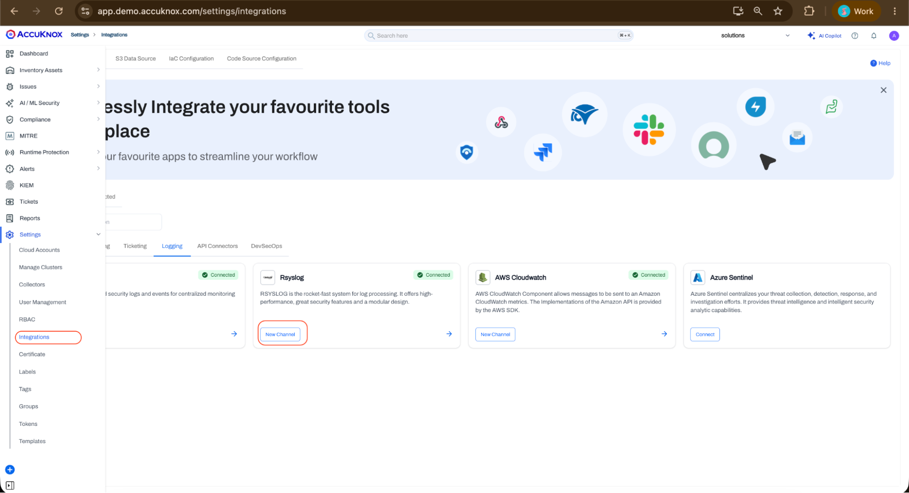

**Step 6: Configure the Rsyslog Channel in AccuKnox**

In the Rsyslog integration form, enter the following details:

| Field | Value |
| -- | -- |
| Integration Name | Sumo-Rsyslog |
| Server Address | IP address |
| Port | 514 |
| Transport | UDP |

Click **Test** to validate the configuration. After the test succeeds, save the integration.

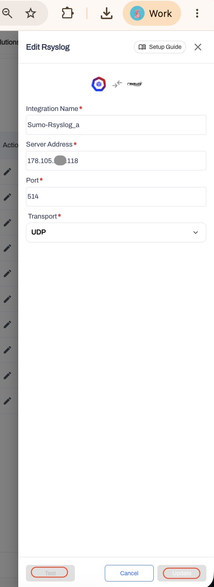

The Rsyslog integration should appear as **Active** in the Rsyslog integration list. Click **Start Testing**.

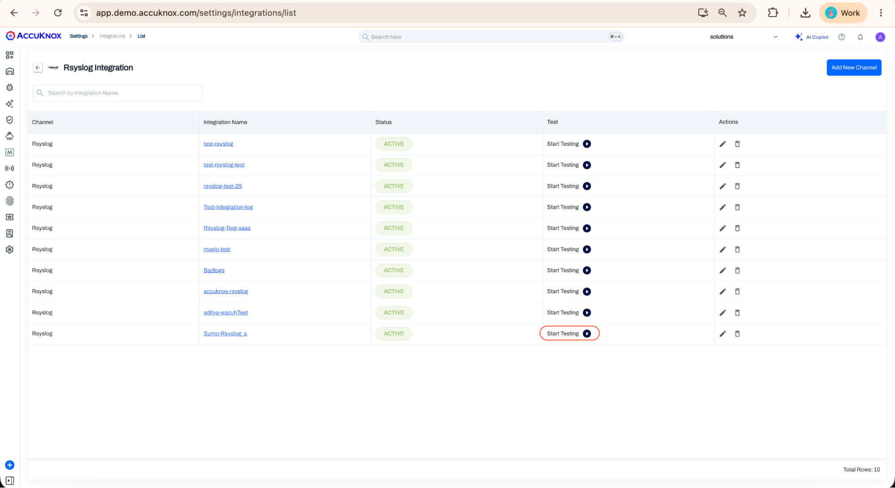

**Step 7: Verify the Rsyslog VM Listener**

- Connect to the Rsyslog VM.
- Verify the public IP address of the VM:

```sh
curl -4 ifconfig.me
```

- Verify that Rsyslog is listening on port 514:

```sh
ss -tulpn | grep 514
```

The output should show Rsyslog listening on UDP and TCP port 514.

- Validate AccuKnox to VM syslog traffic by running a packet capture on the VM:

```sh
tcpdump -i any udp port 514
```

- From AccuKnox, click **Start Testing** on the Rsyslog integration. The VM should receive syslog packets from AccuKnox.

This confirms that AccuKnox is successfully sending syslog events to the self-hosted Rsyslog VM.

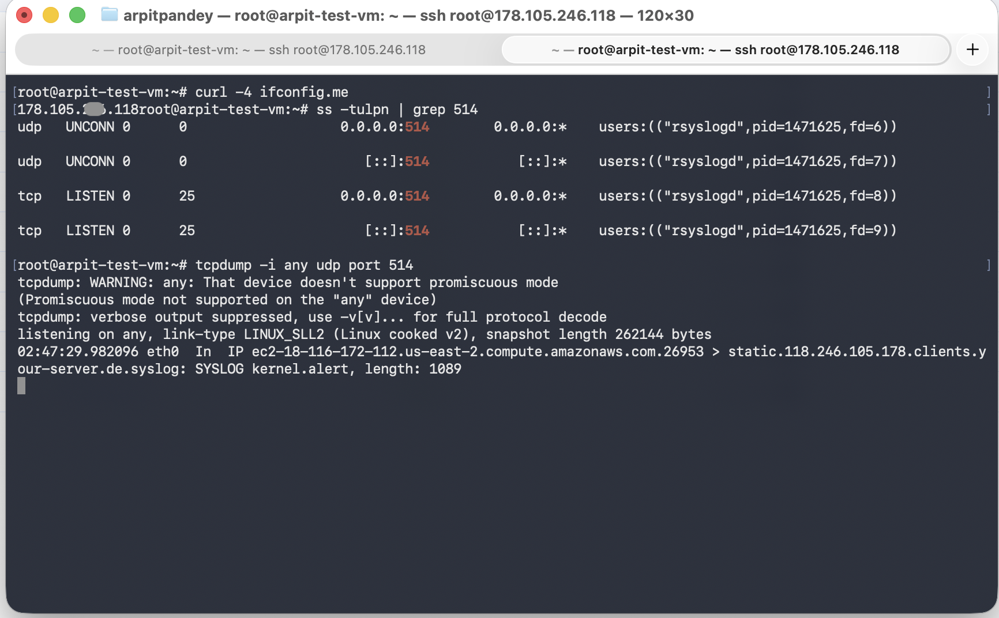

**Step 8: Configure Rsyslog Forwarding to Sumo Logic**

Create the forwarding configuration on the VM:

```sh
cat /etc/rsyslog.d/40-sumo-forward.conf
```

The forwarding configuration should include:

- Sumo Logic Cloud Syslog host
- TCP TLS port 6514
- Sumo Cloud Syslog token
- TLS forwarding using `gtls`
- Permitted peer: `syslog.collection.*.sumologic.com`

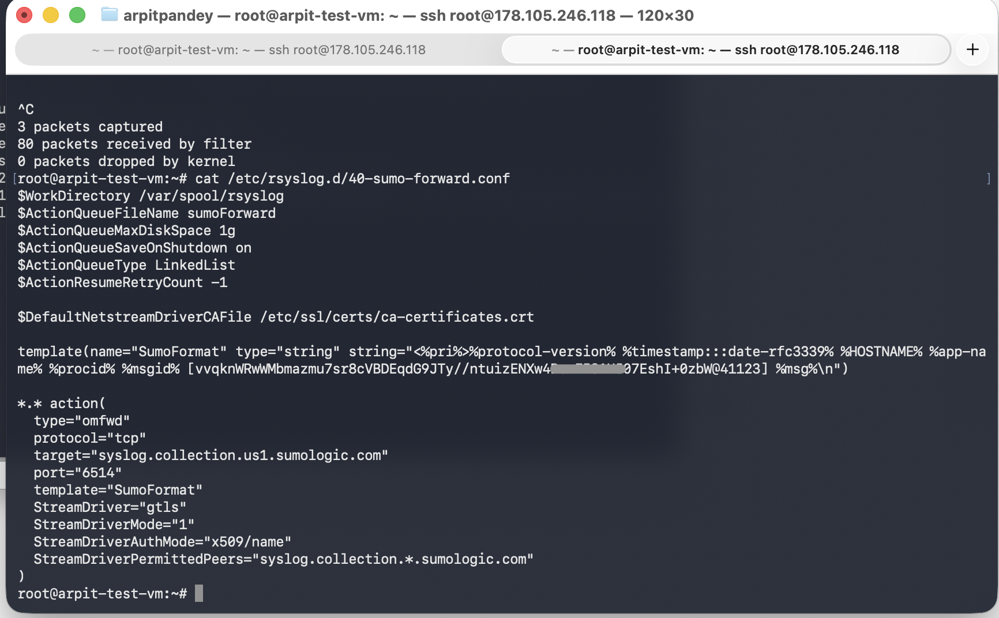

**Step 9:** Validate the Rsyslog configuration:

```sh
rsyslogd -N1
```

Expected output: `End of config validation run. Bye.`

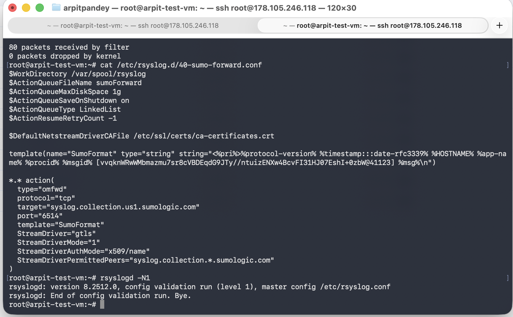

**Step 10: Verify Rsyslog Service Status**

Check the Rsyslog service status:

```sh
systemctl status rsyslog --no-pager
```

The service should show `Active: active (running)`. This confirms that Rsyslog is running successfully with the updated configuration.

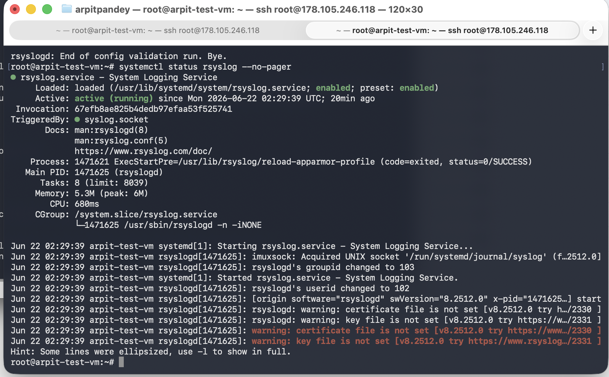

**Step 11: Validate VM to Sumo Logic Connectivity**

Run the following command from the VM:

```sh
nc -vz syslog.collection.us1.sumologic.com 6514
```

Expected result: `Connection to syslog.collection.us1.sumologic.com 6514 port succeeded`. This confirms that the VM can reach the Sumo Logic Cloud Syslog endpoint over TCP/TLS.

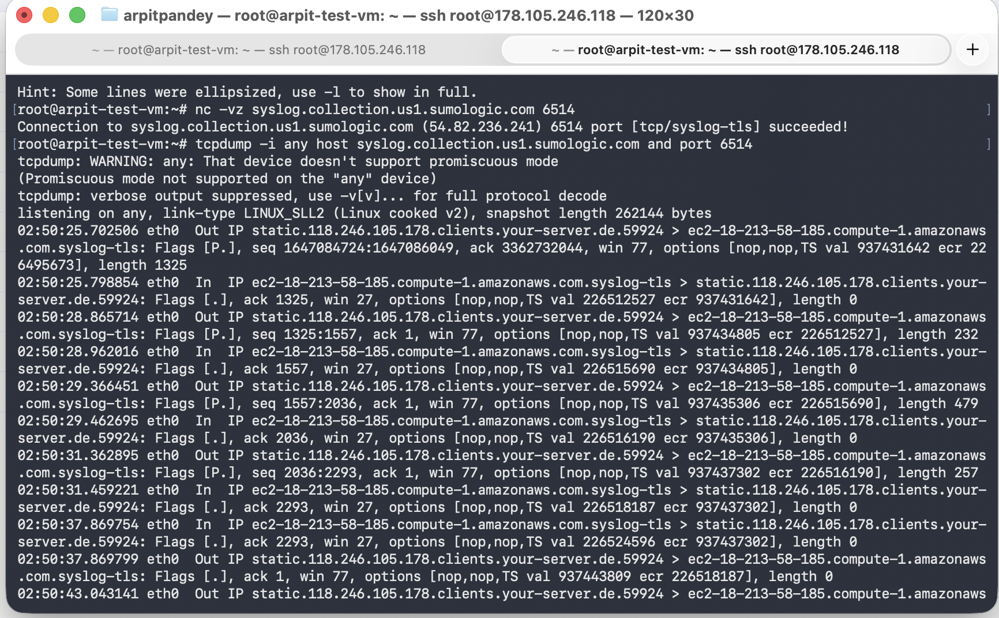

**Step 12: Verify Logs in Sumo Logic**

- In Sumo Logic, open **Search**.
- Search for the test message: `"AK-SUMO-SYSLOG-FINAL-123456789"`
- Set the time range to **Last 24 Hours**. The test message should appear in the search results with:

| Field | Expected Value |
| -- | -- |
| Host | arpit-test-vm |
| Category | accuknox |
| Index | sumologic_default |

This confirms that logs from the Rsyslog VM are successfully received in Sumo Logic.

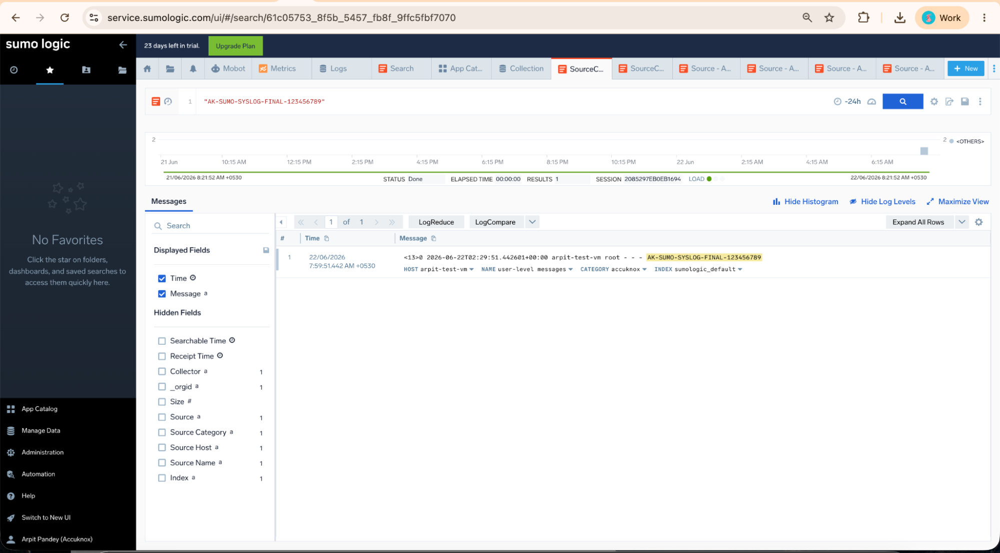

**Step 13:** Return to Sumo Logic. Navigate to **Manage Data**, then **Collection**. Expand the AccuKnox-Test collector and locate the AccuKnox-CloudSyslog source. Hover over the source name and click **Open in Log Search**.

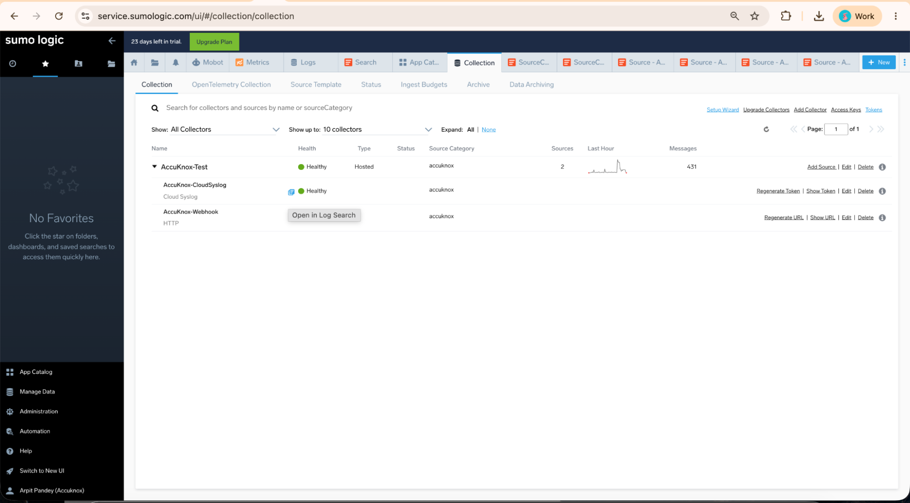

**Step 14: Verify AccuKnox Cloud Syslog Events**

Search in Sumo Logic using:

```sh
_source="AccuKnox-CloudSyslog" and _collector="AccuKnox-Test"
```

The search results should show logs received through the Cloud Syslog source. This confirms the complete Rsyslog flow: AccuKnox → Rsyslog VM on UDP 514 → Sumo Logic Cloud Syslog on TCP/TLS 6514.

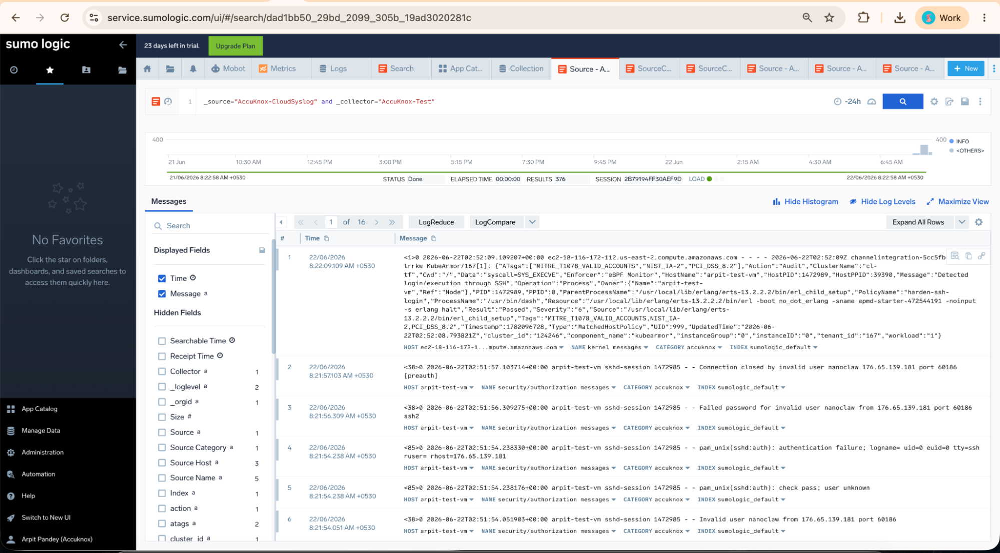

- - -
[SCHEDULE DEMO](https://www.accuknox.com/contact-us){ .md-button .md-button--primary }
