# Sumo Logic Webhook Integration

This guide walks you through configuring AccuKnox to deliver runtime security events to Sumo Logic using the webhook integration. You create a hosted HTTP source in Sumo Logic, then configure the webhook channel in AccuKnox to post events to it.

## Prerequisites

Before starting, confirm the following are in place:

- An AccuKnox account with administrative access
- A Sumo Logic account (trial or paid)

**Note:** All steps assume you have admin-level access to both AccuKnox and Sumo Logic. Read-only access is not sufficient to create collectors, sources, or webhook integrations.

## Steps to be followed

**Step 1:** Log in to your Sumo Logic account. In the left navigation, click **Manage Data**, then click **Collection**. The page that loads shows all existing collectors.

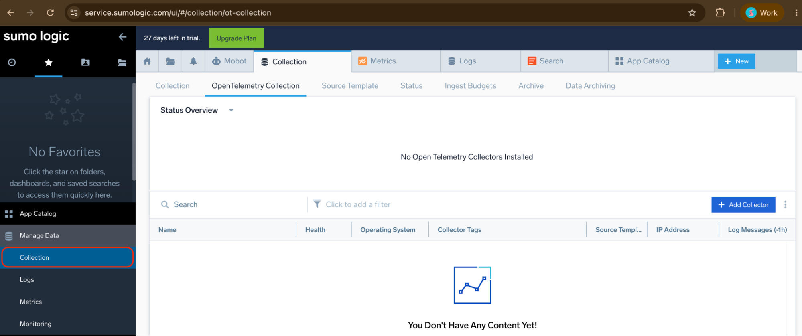

If you land on the OpenTelemetry Collection tab by default, click the **Collection** tab on the left side of the tab bar to switch to the standard collector view.

**Step 2:** Click **Add Collector** in the top right. Sumo Logic prompts you to select a collector type. Three options appear:

- Installed Collector
- Hosted Collector
- OpenTelemetry Collector

Select **Hosted Collector**. This creates a cloud-side collector that receives data over HTTP without requiring any agent deployment.

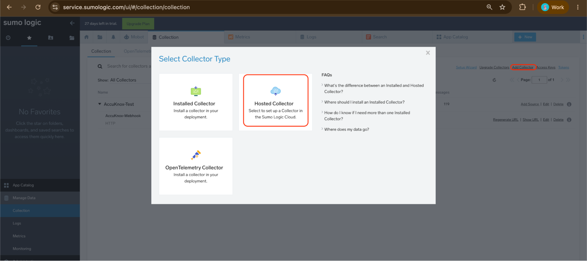

**Step 3:** Fill in the collector form with the following values:

| Field | Value |
| -- | -- |
| Name | AccuKnox-Test |
| Description | AccuKnox Sumo Logic Integration Testing |
| Category | accuknox |
| Time Zone | (UTC) Etc/UTC |

Click **Save**. The collector now appears in the list with a Healthy status and a Hosted type indicator.

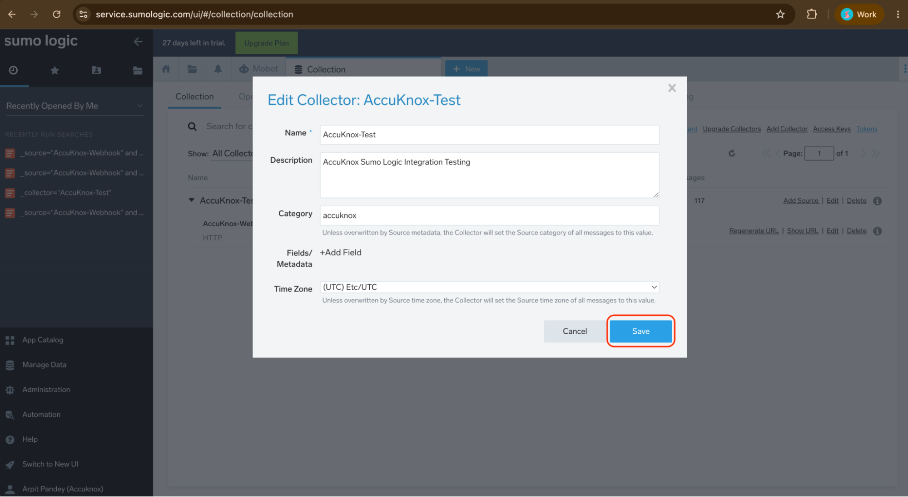

**Step 4:** Locate the AccuKnox-Test collector in the list and click **Add Source** on the right side of that row. The source selection page opens.

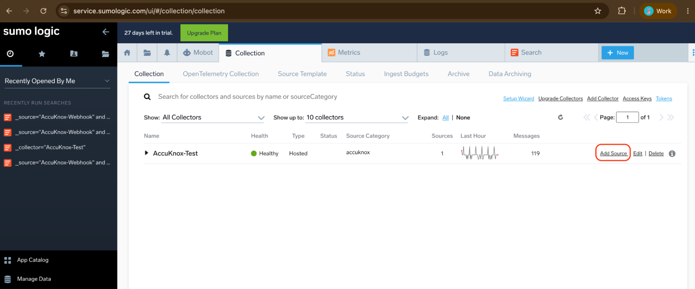

**Step 5:** In the search box, type `HTTP`. The results filter to show HTTP source types. Select **HTTP Logs and Metrics** from the Generic section.

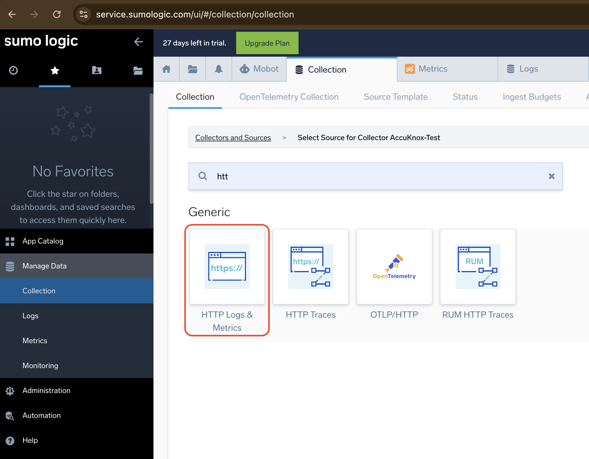

**Step 6:** Configure the source with the following values:

| Field | Value |
| -- | -- |
| Source Name | AccuKnox-Webhook |
| Source Category | accuknox |
| Description | (optional) |
| Source Host | (leave blank) |

Click **Save**. Sumo Logic creates the source and immediately displays the HTTP Source Address screen.

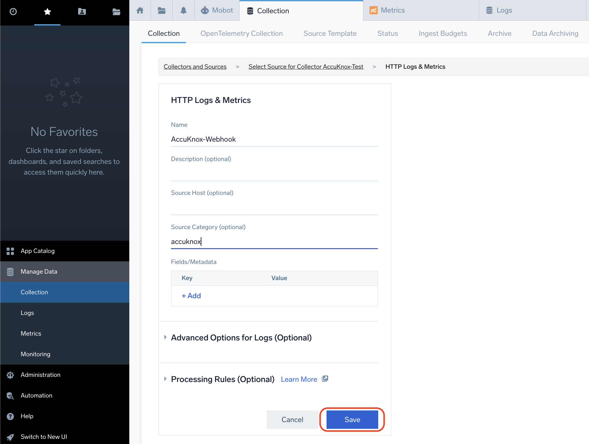

**Step 7:** After saving, Sumo Logic shows a modal with the endpoint URL. The **Presigned URL** option is selected by default. This embeds authentication credentials directly in the URL, so no separate header is required.

The URL follows this format:

```sh
https://endpoint4.collection.sumologic.com/receiver/v1/http/<token>
```

Click **Copy** to copy the URL to your clipboard. Store it securely. You will paste this into AccuKnox in the next section.

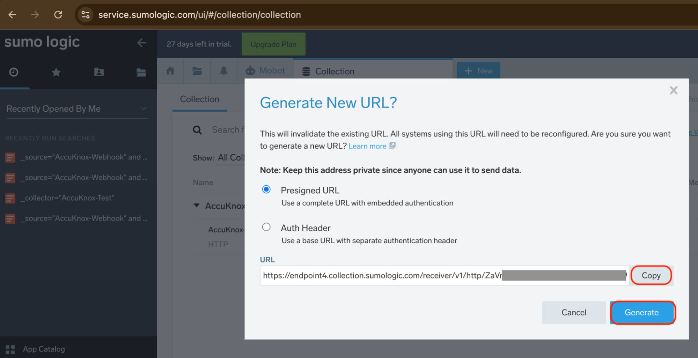

**Step 8:** In the AccuKnox console, click **Settings** in the left navigation, then click **Integrations**. The Integrations page shows all available connector types including Webhook, Email, Jira Cloud, PagerDuty, and others.

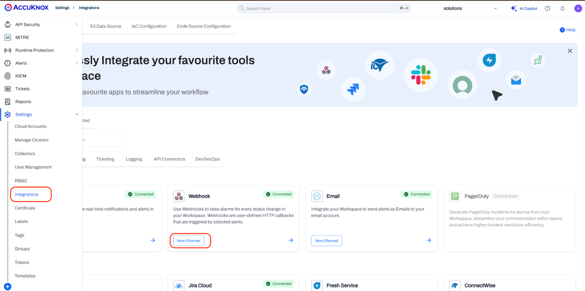

Locate the **Webhook** card. Click **New Channel** on the Webhook card to open the integration creation form.

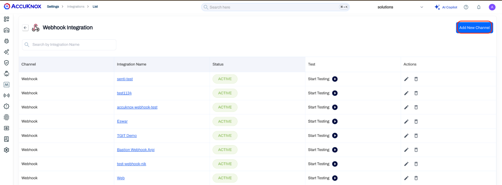

**Step 9:** The Create Webhook form opens. Fill in the following fields:

| Field | Value |
| -- | -- |
| Integration Name | SumoLogic-Integration |
| Method | POST |
| WebHook URL | Paste the Sumo Logic HTTP Source URL copied in Step 7 |
| Success Codes | 200 |
| Description | SumoLogic-Integration (optional) |
| Headers | Leave empty (the Presigned URL includes authentication) |

The Method must be set to **POST**. Sumo Logic does not accept GET requests on the HTTP source endpoint.

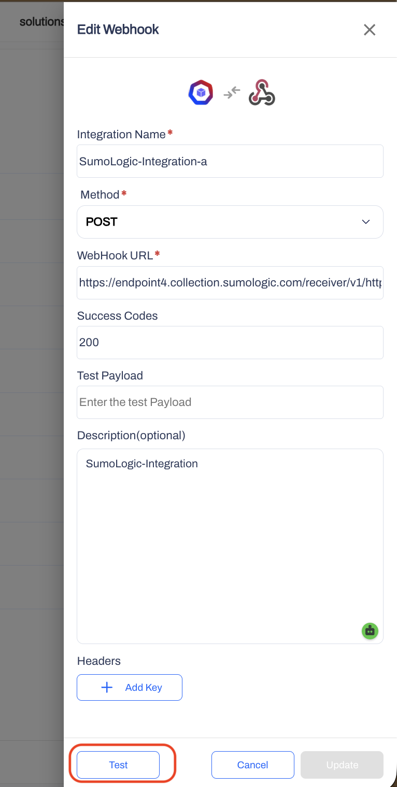

Before saving, click the **Test** button at the bottom of the form. AccuKnox immediately sends a sample payload to the configured Sumo Logic endpoint. A success response (HTTP 200) confirms that AccuKnox can reach the Sumo Logic endpoint and that the URL is valid. Click **Save** (or **Update** if editing an existing webhook) to store the integration.

**Step 10:** The integration now appears in the Webhook Integration list with an **ACTIVE** status. You can click **Start Testing** at any time to resend a test payload.

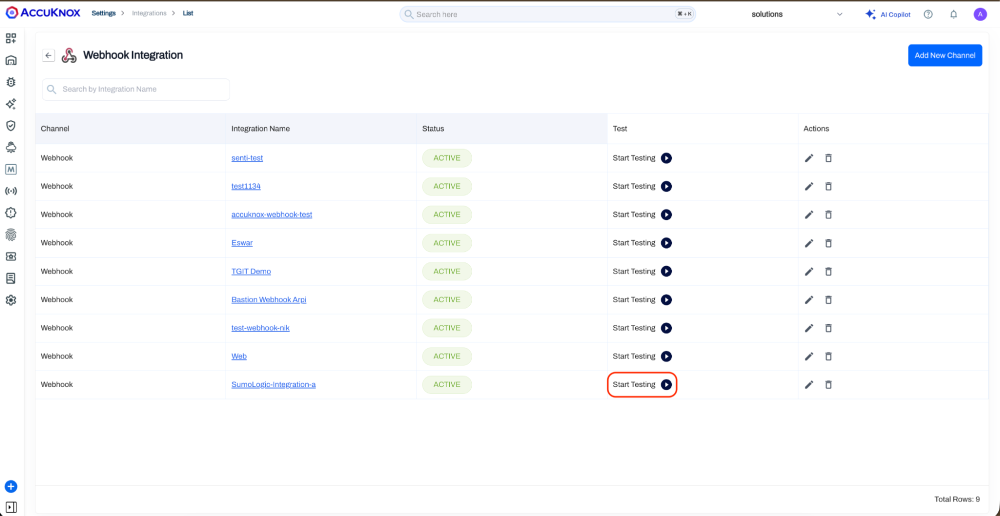

**Step 11:** In the AccuKnox console, click **Alerts** in the left navigation. The All Alerts page loads showing the live alert feed for your workspace.

Click the **Create Trigger** button in the toolbar. The Create Trigger modal opens. Fill in the trigger with the following values:

| Field | Value |
| -- | -- |
| Name | sumologic_KubeArmor_alert |
| Filter | ClusterName = `<your test cluster>` |
| Action | Notify |
| Notification Channel | Webhook (select the SumoLogic-Integration channel created in Step 9) |
| Custom Data (JSON) | (leave empty) |

Click **Test Filter** to confirm that the cluster filter returns results, then click **Save**. The trigger is now active and forwards matching alerts to Sumo Logic automatically.

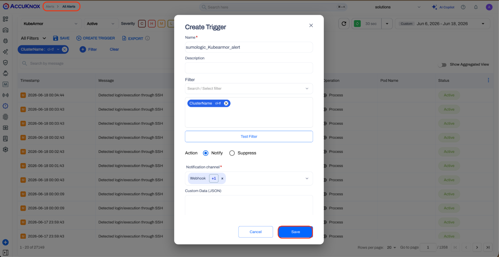

**Step 12:** Return to Sumo Logic. Navigate to **Manage Data**, then **Collection**. Expand the AccuKnox-Test collector and locate the AccuKnox-Webhook source. Hover over the source name and click **Open in Log Search**.

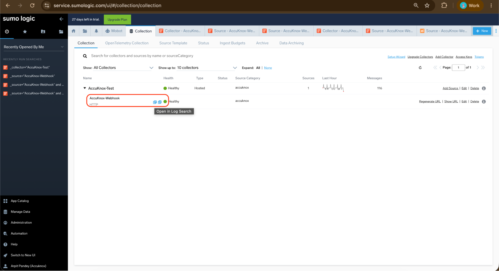

**Step 13:** In the log search bar, run the following query to filter for AccuKnox webhook events:

```sh
_source="AccuKnox-Webhook" and _collector="AccuKnox-Test"
```

The test payload sent by AccuKnox should appear in the results. Each result row shows a message with an `event_type` field set to `accuknox-webhook`. This confirms that network connectivity and webhook delivery are working correctly.

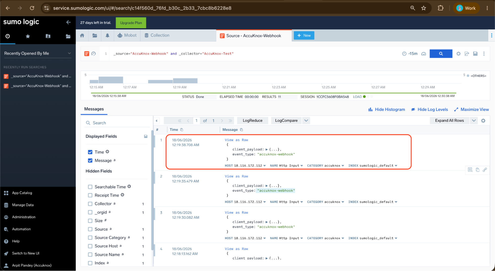

**Step 14:** In Sumo Logic Log Search, rerun the query and locate the most recent network tool events. Expand the payload and verify:

| Field | Expected Value |
| -- | -- |
| Action | Block |
| Result | Permission denied |
| PolicyName | harden-net-tools |
| ProcessName | /usr/bin/curl or /usr/bin/wget |
| Resource | /usr/bin/curl or /usr/bin/wget |
| Severity | 5 |
| Source | /usr/bin/bash |

These records confirm that AccuKnox enforcement events are delivered to Sumo Logic with full metadata including policy name, process details, enforcement action, and result.

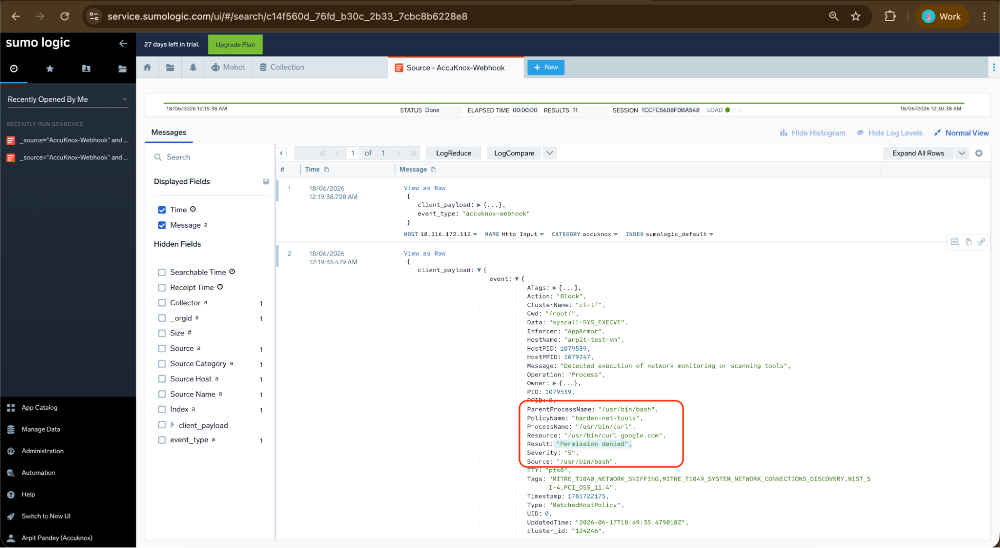

- - -
[SCHEDULE DEMO](https://www.accuknox.com/contact-us){ .md-button .md-button--primary }
