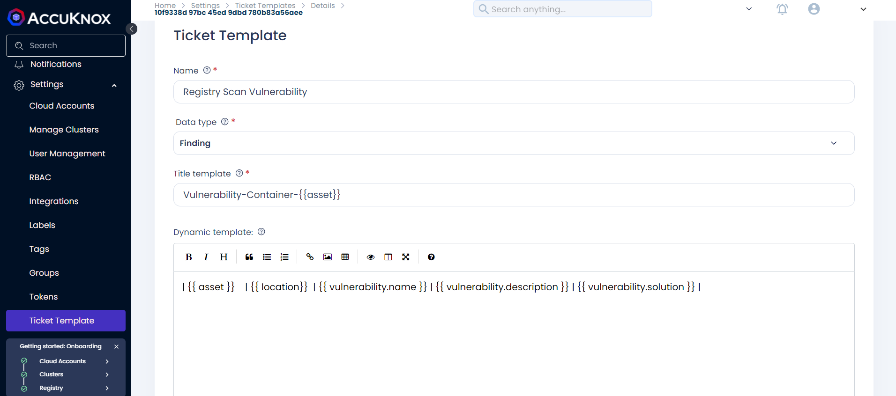
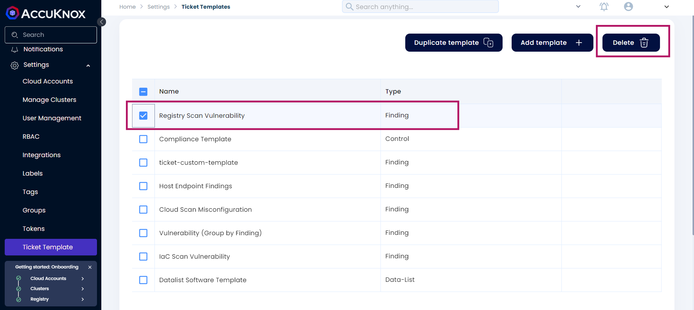
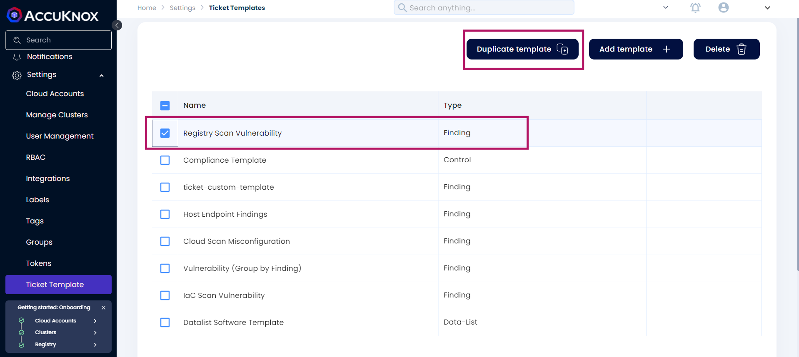
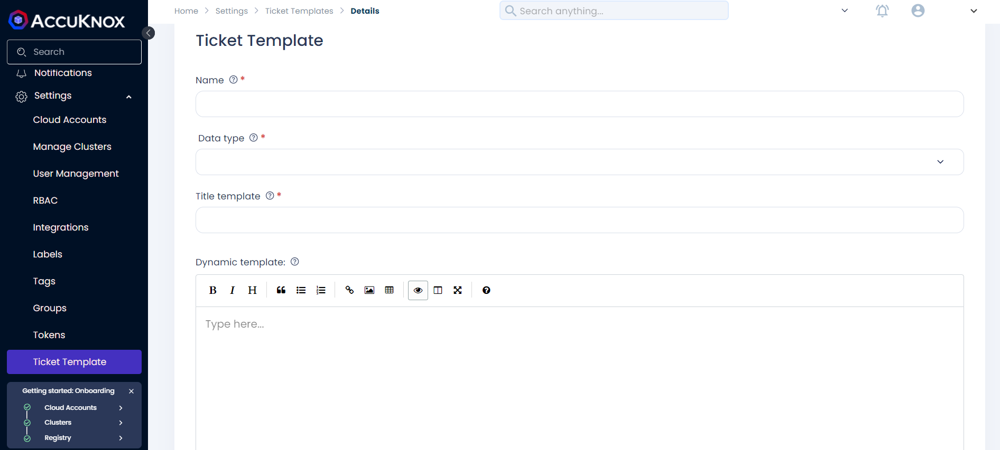

# Ticket Template System

A ticket template is a predefined structure used for creating tickets, typically integrated with third-party platforms. It serves as a standardized format for logging, tracking, and resolving issues, enabling teams to maintain consistency and efficiency in issue management.

You can leverage the default template or create custom templates based on specific requirements, such as findings, controls, data lists, or checks. This flexibility allows teams to address a variety of scenarios while maintaining structured and organized ticket management.

The ticket template system offers both dynamic and static templates, allowing for efficient ticket creation across different data types. Whether the ticket pertains to **Findings**, **Controls**, **Data Lists**, or **Checks**, the system enables users to generate precise ticket titles, dynamic descriptions, and consistent static information across multiple objects or groups.

## Managing Ticket Templates: View, Edit, or Create

+ **Go to Settings**. Click **Ticket Template**.
    

+ **Viewing a Template**:  
   Click the desired ticket template from the list to view its details.

+ **Editing a Template**:  
   Click on the ticket template to open its details. You can make edits directly from this screen.
       

+ **Deleting a Template**:  
   Select the template you wish to remove, then click **Delete**.
    

+ **Duplicating a Template**:  
   To create a copy of an existing template, select the template and click **Duplicate Template**.
    

+ **Creating a Custom Template**:  
    + Click on **Add Template** to create a new custom template.  
    + Fill in the required fields and save your changes.
    

## Template Fields


+ **Name**:  
   This field specifies the name of the ticket or the item being referenced. It is critical to identify the issue at a glance.  
   _Example_: "High-Risk Vulnerability"

+ **Data Type**:  
   Defines the type of data the ticket will address. The options include: Finding, Control, Data List, Check

+ **Title Template**:  
   This field is used to generate the ticket title in the ticketing system by inserting specific variables into a pre-defined format. After filling in the relevant variables with actual data, the title will provide clear identification of the issue being logged.  
   _Example Template_: `Vulnerability-Container-{asset}`  
   If the asset is "Web Server," the resulting title will be: `Vulnerability-Container-Web Server`

+ **Dynamic Template**:  
   The dynamic template is useful when the selected vulnerability or control affects multiple objects in a group. In this case, the template will loop through each object and dynamically generate the description for each one, combining all relevant data.  
   _Dynamic Template Example_: ```| { asset } | { location } | { vulnerability.name } | { vulnerability.description } | { vulnerability.solution } |```
    
    If you have three objects (assets), this template will dynamically generate a separate row for each object in the group:

    **Example:**

        - Asset: Web Server | Location: US-East | Name: SQL Injection | Description: SQLi vulnerability | Solution: Patch DB layer

        - Asset: DB Server | Location: US-West | Name: XSS | Description: Cross-site scripting | Solution: Apply filter

+ **Static Template**:
    Static templates are used when you have multiple objects sharing the same finding or issue. This template ensures that consistent information- such as the solution or description- applies across all grouped objects. Only the dynamic template will adjust for variations.
    _Static Template Example:_```| Asset | Library | Finding | Description | Solution |{ dynamic_template }```

    In this case, the same solution and description can be applied across multiple assets. The dynamic template can then fill in asset-specific information like asset names or library versions.


### Guide to Retrieving Fields for Ticket Templates

In security scanning workflows, various tools are used to detect vulnerabilities, compliance violations, misconfigurations, and infrastructure issues. Each of these tools produces reports containing specific fields such as the name, description, location, and remediation steps for the identified issues. These fields need to be correctly extracted and placed into ticket templates for further action.

#### A. Vulnerability Scan Data
Vulnerability scans detect asset security flaws (e.g., servers, applications, containers). The following fields should be retrieved from a vulnerability scan report:

| **Field**                 | **Data Type**            | **Description**                                                                 |
|---------------------------|--------------------------|---------------------------------------------------------------------------------|
| Vulnerability Name         | String                   | The title or name of the identified vulnerability (e.g., CVE-1234).             |
| Vulnerability Description  | String                   | A detailed description of the vulnerability, including its impact.              |
| Solution                   | String                   | The suggested remediation or mitigation strategy to fix the vulnerability.      |
| Location                   | String                   | The location or asset impacted by the vulnerability (e.g., IP address, hostname, image layer). |
| Miscellaneous (Synopsis)   | String                   | A brief summary or synopsis of the vulnerability.                               |
| Tool Output                | Raw Data                 | Output from the scanning tool, often including severity, detection method, and any associated evidence. |
| Risk Factor/Severity       | Enum (Low/Medium/High)    | The risk level or severity of the vulnerability as assigned by the scanning tool.|


#### B. Compliance Data
Compliance scans assess the adherence of systems to established security controls (e.g., CIS Benchmarks, NIST, ISO). The following fields should be retrieved from a compliance scan report:

| **Field**         | **Data Type**  | **Description**                                                                 |
|-------------------|----------------|---------------------------------------------------------------------------------|
| Control ID        | String         | Unique identifier for the compliance control (e.g., CIS 1.1).                   |
| Control Description | String       | Detailed description of the compliance control or rule.                         |
| Tags              | Array of Strings | Tags or categories associated with the control (e.g., "Network Security", "IAM").|
| Expected Result   | String         | Expected outcome for passing compliance (e.g., "Ensure logging is enabled").    |
| Comments          | String         | Any additional notes or comments regarding the control.                         |


#### C. Registry and Cloud Misconfiguration Data
Registry scans (for container images) and cloud misconfiguration scans (for cloud services) identify issues such as insecure configurations or vulnerable image layers. The following fields should be retrieved:

| **Field**         | **Data Type**  | **Description**                                                                 |
|-------------------|----------------|---------------------------------------------------------------------------------|
| Asset Name        | String         | Name of the affected asset (e.g., container image or cloud resource).           |
| Location          | String         | Location of the misconfiguration (e.g., image layer, cloud service, region).    |
| Vulnerability Name | String        | Name or title of the issue (e.g., "Insecure S3 Bucket").                        |
| Description       | String         | Detailed description of the misconfiguration or vulnerability.                  |
| Solution          | String         | Recommended steps to remediate or mitigate the misconfiguration.                |


### Ticket Creation and Population
Once the fields are extracted, follow these steps to populate the ticket template:

+ **Open the Template**: Select the appropriate template for the type of scan (e.g., vulnerability, compliance, cloud).
+ **Insert Extracted Data**: For each placeholder in the template, insert the corresponding data extracted from the scan report.
+ **Submit Ticket**: Once the template is fully populated, submit the ticket into your issue tracking system (e.g., Jira, Slack).


