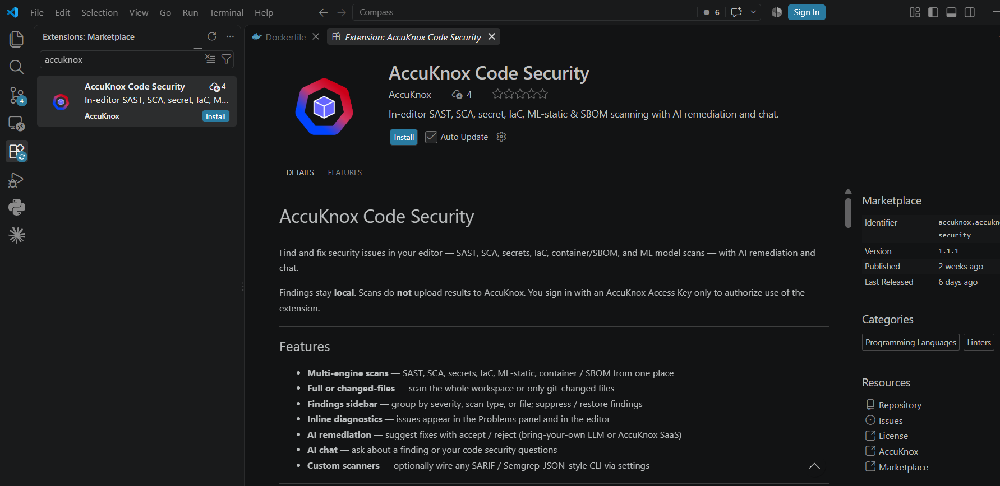
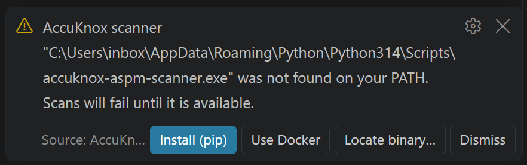
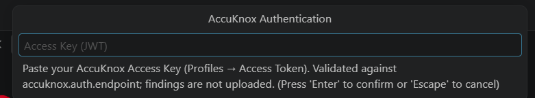
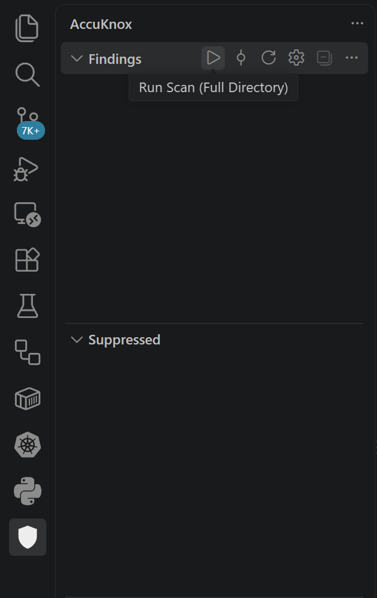
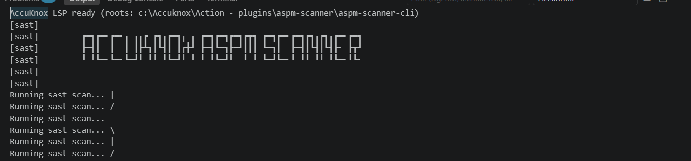
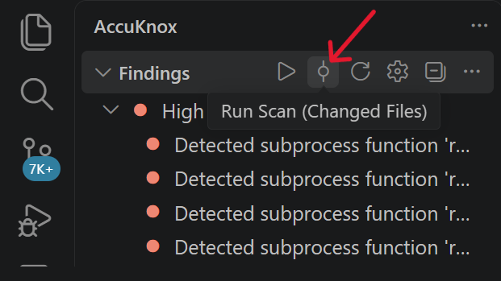

# AccuKnox Code Security for VS Code and Cursor

AccuKnox Code Security runs the AccuKnox ASPM Scanner CLI on your machine and shows the findings inside the editor. You fix issues before you commit, without leaving VS Code.

!!! info "Your code stays on your machine"
    The extension runs the scanner locally. Your Access Key only proves who you are before a scan starts. Neither your source code nor your scan results are uploaded to AccuKnox by this extension.

What you get:

- **Multi-engine scans.** SAST, SCA, secrets, IaC, ML-static, and container or SBOM engines, over the whole workspace or only your git-changed files.
- **Findings sidebar.** Group by severity, scan type, or file, and suppress or restore individual findings.
- **Inline diagnostics.** Issues appear in the Problems panel and inline in the editor.
- **AI remediation.** Accept or reject AI-suggested fixes, using your own LLM key or the AccuKnox SaaS route.
- **AI chat.** Ask about one finding, or about code security in general.

## Prerequisites

| Requirement | Details |
|---|---|
| Editor | VS Code 1.85 or newer. Cursor works the same way, because it is a VS Code fork |
| Python | Python 3.9 or newer, needed to install the scanner CLI |
| AccuKnox account | An Access Key generated from the AccuKnox console |

## Step 1. Install the extension

Open the Extensions panel, search for `accuknox`, select **AccuKnox Code Security** from AccuKnox, and click **Install**.



To install from a `.vsix` file instead, run this in a terminal. It works the same in VS Code and Cursor, and it is more reliable than the GUI path.

```bash
code --install-extension accuknox-security.vsix
```

!!! tip "The GUI install is spinning forever"
    Use the CLI command above. If the Extensions panel still shows *Installing…* after that, run **Developer: Restart Extension Host** from the Command Palette.

## Step 2. Install the scanner CLI

The extension prompts you when `accuknox-aspm-scanner` is missing from your PATH.



| Option | What it does |
|---|---|
| **Install (pip)** | Installs the scanner with pip. Recommended |
| **Use Docker** | Runs the scanner in a Docker container |
| **Locate binary** | Points the extension at a scanner binary you already have |

!!! failure "The pip install fails"
    A `pydantic` version error means pip picked the wrong interpreter. Use `python3 -m pip install ...` instead of a bare `pip install ...`. An `externally-managed-environment` error on Debian, Ubuntu, or WSL needs `--break-system-packages`.

## Step 3. Generate an Access Key

Scans stay blocked until a valid Access Key is set. In the AccuKnox console, go to **Settings > User Management**. Open the three-dot menu next to your user, select **Get Access Key**, and copy the key.

For the full walkthrough with screenshots, see [How to Create Access Keys](../how-to/create-access-keys.md).

!!! danger "An Access Key carries your permissions"
    An Access Key inherits the permissions of the user who created it. An administrator's key can perform nearly any operation in the CNAPP from the CLI. Keep it private and never share it.

## Step 4. Sign in

1. Open the Command Palette and run **AccuKnox: Log In / Set Access Token**.
2. Paste the Access Key from Step 3 and press Enter.



The extension validates the key against `accuknox.auth.endpoint` and stores it in your operating system's secret store, never in `settings.json`.

The default auth host is `https://cspm.demo.accuknox.com`. Change `accuknox.auth.endpoint` to point at your stage, production, or on-premises console.

Two more commands help here: **AccuKnox: Show Authentication Status** and **AccuKnox: Log Out**.

## Step 5. Run a scan

Open a project folder, then run **AccuKnox: Run Scan (Full Directory)** from the Command Palette. You can also click the play button on the **AccuKnox > Findings** view.



Watch progress in **View > Output**, then pick **AccuKnox** from the panel's dropdown.



Findings land in the AccuKnox activity bar under **Findings**, **Suppressed**, and **AI Chat**.

After you edit code, run **AccuKnox: Run Scan (Changed Files)** to rescan only what git says changed. It is much faster than a full scan.



## Commands

| Command | What it does |
|---|---|
| Run Scan (Full Directory) | Scan the whole workspace |
| Run Scan (Changed Files) | Scan git-changed files only |
| Cancel Scan | Stop the current run |
| Log In / Set Access Token | Save and validate your Access Key |
| Log Out | Clear the saved Access Key |
| Show Authentication Status | Check whether a valid key is stored |
| Open AI Chat | Open the chat panel |
| Set LLM API Key | Store your own LLM key for remediation and chat |
| Set AccuKnox SaaS Token | Store the token for the AccuKnox SaaS LLM route |
| Open Settings | Jump to the AccuKnox settings |

## Settings

Open Settings and search for `accuknox`, or edit `settings.json` directly.

```json
{
  "accuknox.scanner.command": "accuknox-aspm-scanner",
  "accuknox.scanner.executionMode": "local",
  "accuknox.auth.endpoint": "https://cspm.demo.accuknox.com",
  "accuknox.scan.types": {
    "sast": true,
    "sca": true,
    "secret": true,
    "iac": true,
    "ml-scan": false,
    "container": false
  }
}
```

| Setting | Purpose |
|---|---|
| `accuknox.scanner.command` | Path or name of the ASPM CLI |
| `accuknox.scanner.executionMode` | `local` or `docker` |
| `accuknox.auth.endpoint` | AccuKnox console base URL |
| `accuknox.scan.types` | Which scan types run |
| `accuknox.scan.secretEngine` | `trufflehog` or `gitleaks` |
| `accuknox.scan.timeoutMs` | Longest a single scanner may run before it is killed. Default `600000`, which is 10 minutes |
| `accuknox.llm.*` and `accuknox.saas.*` | AI remediation and chat routing |

!!! warning "Secrets never go in a settings file"
    Your Access Key, LLM key, and SaaS token are stored in the operating system secret store. Set the LLM key through the Command Palette with **AccuKnox: Set LLM API Key**, never in `settings.json`.

## Configure the AI model

`accuknox.llm.model` and `accuknox.llm.apiBase` are ordinary settings you can edit at any time. The API key is separate, and it goes through **AccuKnox: Set LLM API Key**.

| Provider | `accuknox.llm.model` | `accuknox.llm.apiBase` | API key |
|---|---|---|---|
| Anthropic | `anthropic/claude-opus-4` | Leave unset | An Anthropic Console key. A Claude Pro subscription does not work here |
| OpenAI | `openai/gpt-4o` | Leave unset | An OpenAI API key |
| Gemini | `gemini/gemini-2.0-flash` | Leave unset | A Google AI Studio key |
| Ollama or LM Studio, local | `ollama/llama3` or `lmstudio/my-model` | Leave unset | Not required |
| OpenRouter or another OpenAI-compatible provider | `openai-compatible/<the provider's model id>` | The provider's base URL | The provider's API key |

## Troubleshooting

| Problem | What to try |
|---|---|
| A scan asks you to sign in | Log in with a valid Access Key, then check **Show Authentication Status** |
| Authentication fails or AccuKnox is unreachable | Check the network, then set `accuknox.auth.endpoint` to your own console |
| Scanner not found | Install the CLI, or set `accuknox.scanner.command` to an absolute path |
| No findings, and nothing seems to happen | Open **View > Output** and pick **AccuKnox** from the dropdown to read the live scanner log |
| A scan on a large repository times out | Raise `accuknox.scan.timeoutMs` |
| `pip install` fails with a `pydantic` version error | Use `python3 -m pip install ...` rather than a bare `pip install ...` |
| `pip install` fails with `externally-managed-environment` | Add `--break-system-packages` on Debian, Ubuntu, or WSL |
| **Install from VSIX** spins forever with no error | Run `code --install-extension <path-to-vsix>` instead |
| The Extensions panel shows *Installing…* forever | The UI is stale. Run **Developer: Restart Extension Host**, or restart the editor |

## Related pages

- [How to Create Access Keys](../how-to/create-access-keys.md)
- [Unified code analysis with Azure DevOps](azure-unified-code-analysis.md)
- [CI/CD integration overview](cicd-overview.md)
