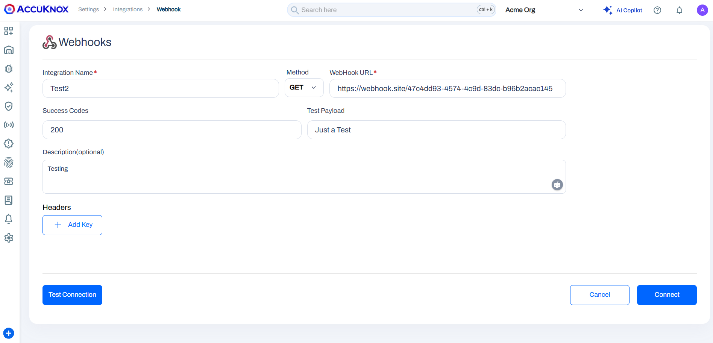
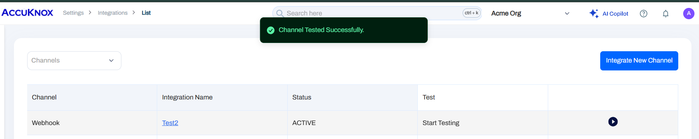
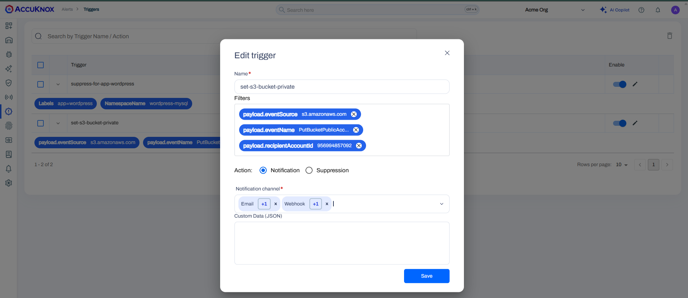
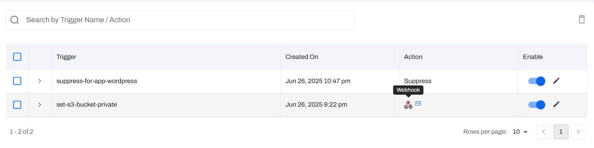
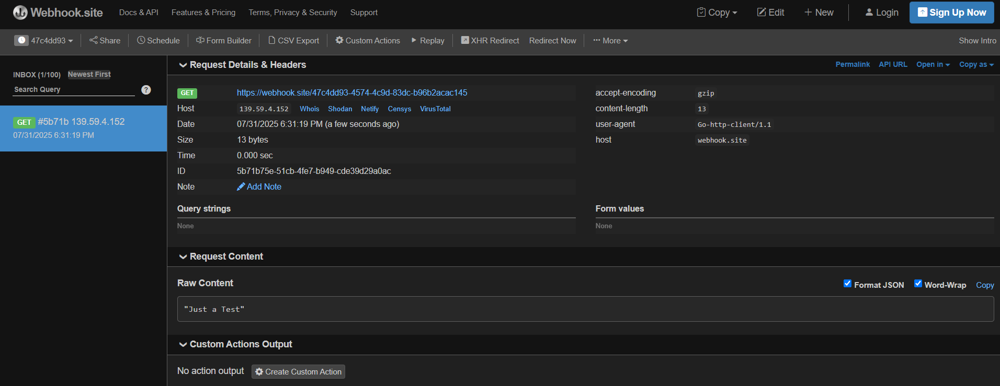
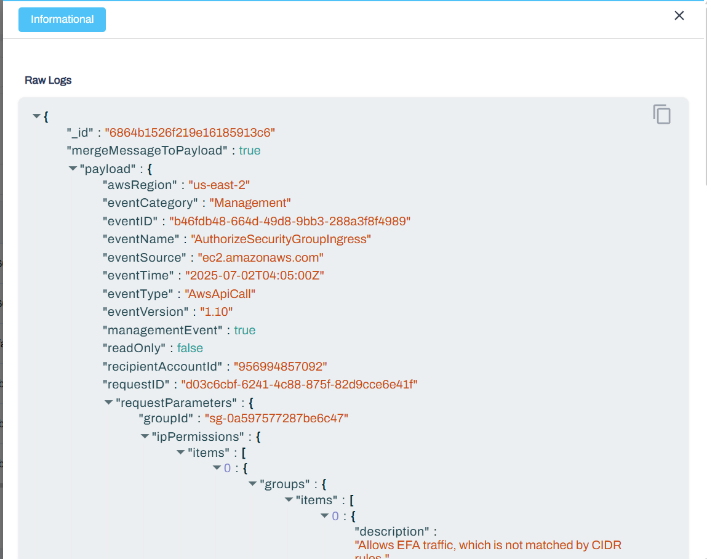

# Webhook Integration Guide

Webhooks let you automatically send real-time alerts from AccuKnox to your external systems. This is useful for integrating with ticketing tools, chat apps, SIEMs, or custom workflows—so you can automate responses or notifications when security events occur.

**Common use cases:**

- Forwarding alerts to Slack, Microsoft Teams, or email
- Triggering incident tickets in Jira or ServiceNow
- Sending events to SIEM or SOAR platforms

**This guide walks you through:**

- Setting up a webhook in the AccuKnox platform
- Understanding how event data is passed via the webhook

## Configuring a Webhook

### Step 1: Open Webhook Integration

1. Go to **Settings → Integration**
2. Under the **CWPP** tab, scroll to **Notification**
3. Click **Integrate Now** next to the Webhook option

### Step 2: Fill in Webhook Details

| Field                | Description                                                       |
| -------------------- | ----------------------------------------------------------------- |
| **Integration Name** | A label for your integration                                      |
| **Method**           | Choose `POST`, `PUT`, or `GET`                                    |
| **Webhook URL**      | Target URL (e.g., GitHub or [webhook.site](https://webhook.site)) |
| **Success Codes**    | Expected HTTP codes (e.g., `200`, `204`, `422`)                   |
| **Test Payload**     | Optional sample data                                              |
| **Description**      | Optional note                                                     |
| **Headers**          | Add necessary headers (e.g., `Authorization`)                     |



Click **Test Connection**. Once successful, click **Connect** to activate.



## Triggering Alerts via Webhook

### Step 1: Create a Trigger

1. Go to **Alerts → All Alerts**
2. Filter by alert type (e.g., Action = Block)
3. Click **Create Trigger**
4. Set a name and assign your webhook as the **Notification Channel**
5. Click **Test Filter**, then save





### Step 2: Simulate a Policy Violation

- Apply a runtime policy (e.g., file integrity block)
- Trigger a violation via CLI or app
- The alert will activate and send data via the webhook

## Viewing Webhook Data

Use [webhook.site](https://webhook.site) to view:

- Request Method (e.g., POST)
- Headers (auth, content-type, etc.)
- Payload (full JSON of the alert)



Example payload:

```json
{
  "Action": "Block",
  "Message": "Detected and prevented compromise to File integrity",
  "PolicyName": "harden-file-integrity-monitoring",
  "ProcessName": "/bin/touch",
  "Tags": "MITRE_T1036,MITRE_T1565"
}
```

You will get the raw log data, which is what you see in the alerts section of AccuKnox via this webhook integration. This allows you to capture all relevant details about the alert, including the action taken, message, policy name, process name, and associated tags.



## Managing Webhooks

### View & Test

- Go to **Settings → Integration**
- Use filter to view webhook entries
- Click **Start Testing** to verify

### Edit Webhook

- Click integration name, update fields
- Re-test connection, then **Save**

### Delete Webhook

- Open integration and click **Delete Channel**
- Confirm to remove it from the list

## Troubleshooting

- Confirm alert filters are correctly set
- Check for valid webhook URL and response codes
- Ensure headers (like Authorization) are included
- For GitHub, use:

  ```
  https://api.github.com/repos/<org>/<repo>/dispatches
  ```

  with `POST` method and `Authorization: token <token>`

- Use [https://webhook.site](https://webhook.site) to test and debug incoming webhook data
