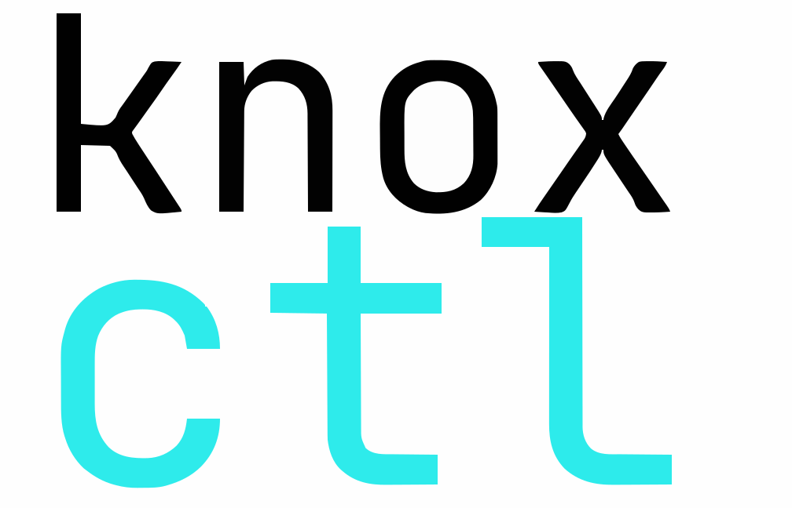

---
hide:
  - toc
---

<style>
  .knox-body {
    font-size: 0.95rem;
    text-align: center;
    margin: 0;
    padding: 0;
    background: #fff;
  }

  .knox-wrapper {
    max-width: 760px;
  }
  .knox-header {
    display: flex;
    justify-content: center;
    align-items:flex-start;
    max-height: 2.5rem;
  }
  .knox-logo {
    max-width: 40px;
    height: auto;
  }

  .knox-demo{
    min-width: 100%;
    height: auto;
    margin: 1.5rem auto;
    display: block;
  }

  .knox-heading {
   font-size: 1.4rem;
    color: #082C75;
    margin-top: 2rem;
  }

  .knox-footer {
    font-size: 0.85rem;
    color: #555;
    margin-top: 2rem;
    border-top: 1px solid #ddd;
    padding-top: 1rem;
  }

  .knox-footer a {
    color: #007ACC;
    text-decoration: none;
  }
</style>

<div class="knox-body">
  <div class="knox-wrapper">
  <div class="knox-header">
    
    <h1 class="knox-heading">Docs</h1>
  </div>

    <p class="knox-paragraph">
      knoxctl is a command-line tool designed to help AccuKnox customers securely and efficiently access the AccuKnox platform. It leverages the platform’s APIs to provide full access to CNAPP features directly from the terminal for streamlined automation and management.
    </p>

   <div style="background-color: #f5f5f5; color: #333333; font-family: monospace; padding: 1rem; border-radius: 6px; margin: 1.5rem 0; font-size: 0.95rem; overflow-x: auto; box-shadow: 0 2px 6px rgba(0, 0, 0, 0.1); border: 1px solid #ddd; position: relative;">
  <div style="margin-bottom: 0.5rem; font-weight: 600; color: #2c3e50;">🛡️ Install Knoxctl</div>
  <code id="knoxctl-install-cmd" style="display: block; color: #2c3e50;">
    curl -sfL https://knoxctl.accuknox.com/install.sh | sh -
  </code>
  <button onclick="navigator.clipboard.writeText(document.getElementById('knoxctl-install-cmd').innerText); this.innerText='Copied!'; setTimeout(()=>this.innerText='Copy', 2000);"
    style="position: absolute; top: 1rem; right: 1rem; background-color: #ffffff; border: 1px solid #ccc; border-radius: 4px; padding: 4px 8px; font-size: 0.85rem; cursor: pointer; color: #2c3e50;">
    Copy
  </button>
</div>
 </div>
</div>

To install `knoxctl`, download the appropriate binary for your Unix-based system. Use `uname -a` in the terminal to check your OS type and architecture, and select the matching version.

- [Release version](./latest_version.txt)
- [knoxctl for Linux (AMD64/x86_64)](./binaries/knoxctl_0.3.0_linux_amd64.tar.gz)
- [knoxctl for Linux (ARM64)](./binaries/knoxctl_0.3.0_linux_arm64.tar.gz)
- [knoxctl for Mac (Intel)](./binaries/knoxctl_0.3.0_darwin_amd64.tar.gz)
- [knoxctl for Mac (Apple Silicon)](./binaries/knoxctl_0.3.0_darwin_arm64.tar.gz)

!!! info
    In case knoxctl update failed due to KubeArmor Policy, please run the following command before trying to upgrade

    ```bash
    sudo systemctl stop kubearmor.service
    ```

<div class="knox-body">
  <div class="knox-wrapper">
<div class="knox-footer">
In case you run into any issues, please email <a href="mailto:support@accuknox.com">support@accuknox.com</a>.<br />
For more details, visit <a href="https://accuknox.com">accuknox.com</a> and <a href="https://help.accuknox.com">help.accuknox.com</a>.
</div>

  </div>
</div>
