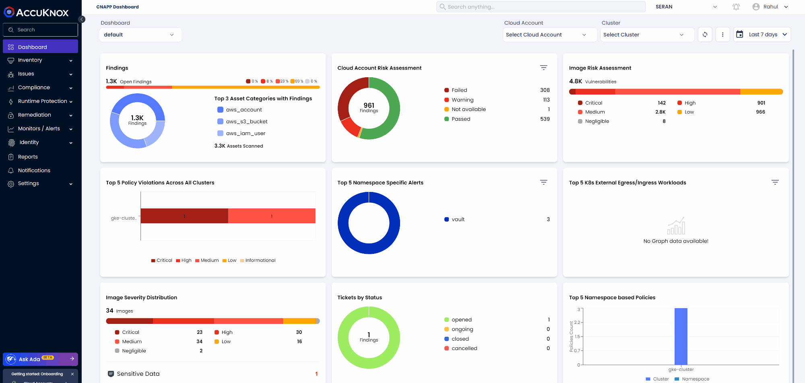

---
hide:
  - toc
---

# Knoxctl Configuration Setup

### Step 1: Create an Access Key

1. Log in to AccuKnox Control Plane.
2. Go to **Settings → User-Management**.
3. Click the three-dot menu next to your username.
4. Select **Get Access Key**.
5. Fill in name, role (preferably *Viewer*), and expiry. Click **Generate**.
6. Copy the **Token** and **Tenant ID**.



### Step 2: Create `.accuknox.cfg` File

Create the config file at this location:

```bash
$HOME/.accuknox.cfg
```

With the following content:

```ini
[default]
access_token = <YOUR_ACCESS_TOKEN>
tenant_id = <YOUR_TENANT_ID>
```

Replace `<YOUR_ACCESS_TOKEN>` and `<YOUR_TENANT_ID>` with the values you copied.

!!! success "You're done!✅"
    Your AccuKnox CLI configuration is now set up.

    You can verify it by running:

    ```bash
    knoxctl api cluster list
    ```

    If everything is configured correctly, you should see a list of your clusters.
    `knoxctl` will now use this config automatically for CLI operations.
