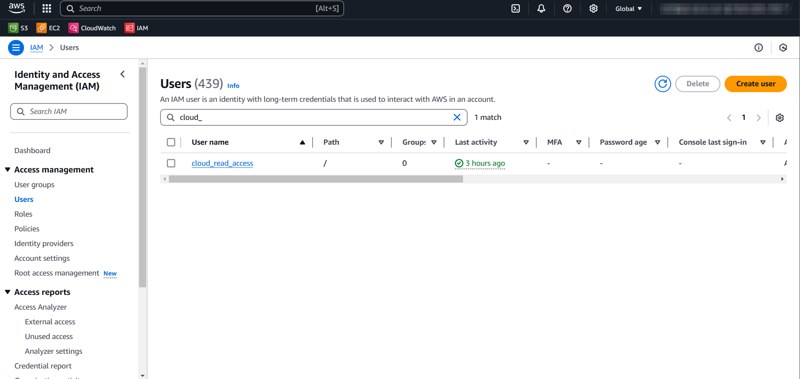
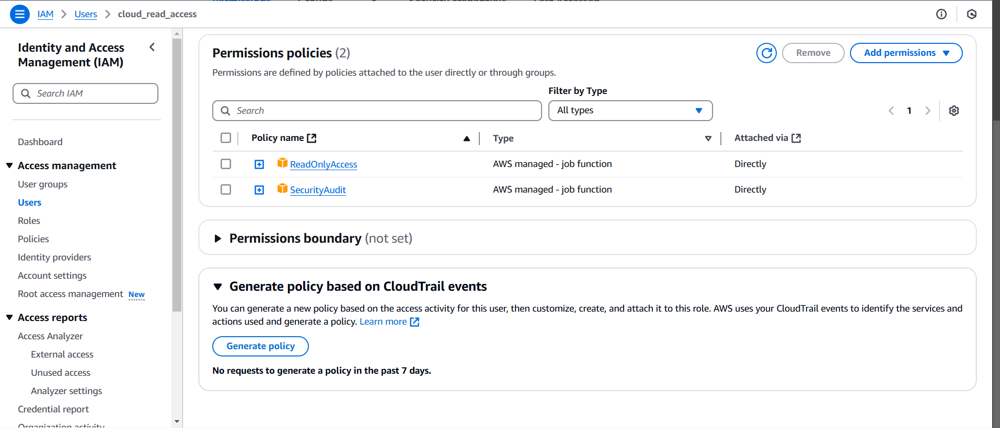
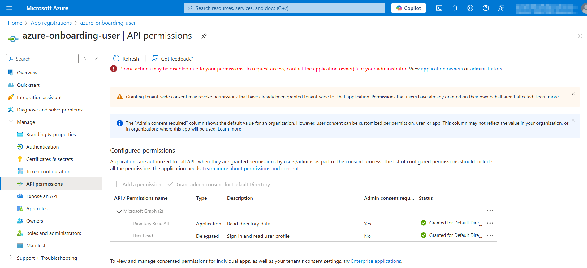
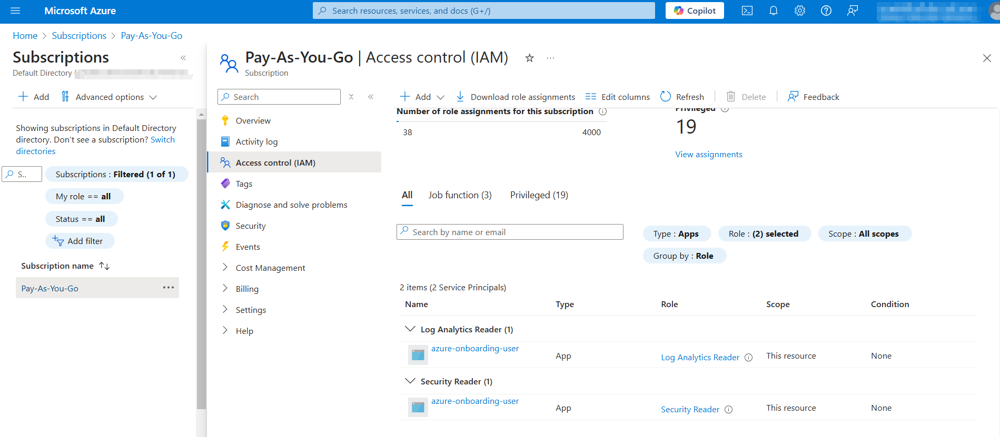
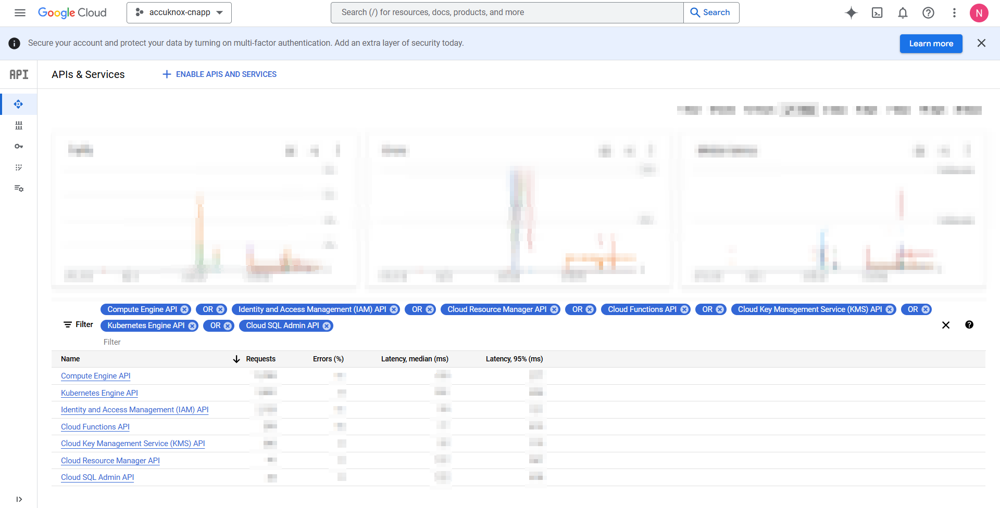
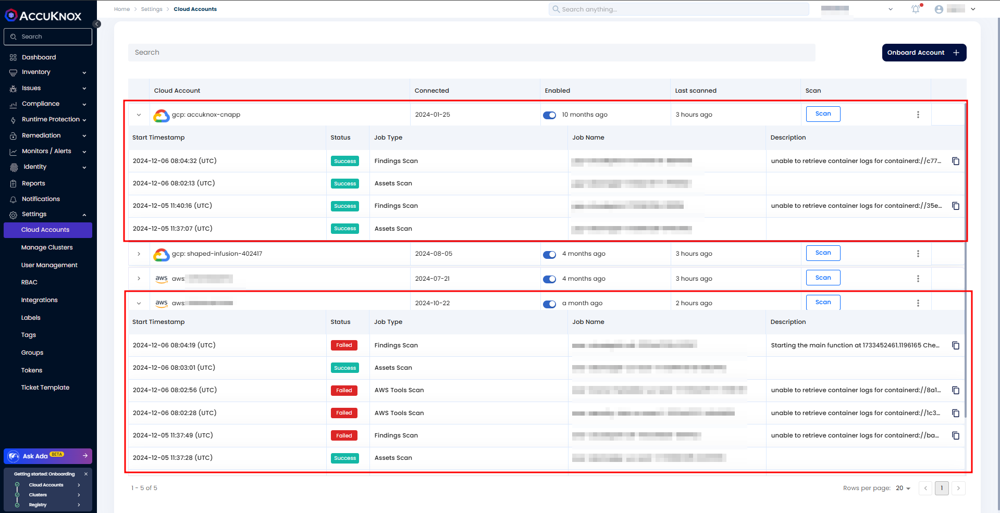

# CSPM Troubleshooting Guide

This guide helps troubleshoot onboarding and scanning issues for the Accuknox CNAPP SaaS deployment across AWS, Azure, and GCP.

## **Step 1: Validate Prerequisites**

Ensure the required permissions are granted to the user or application for the respective cloud account.

### **AWS Permissions**

1. **Login to AWS Console**.

2. Navigate to **IAM > Users**.

3. Select the user created for AccuKnox onboarding.

1. Go to the **Permissions** tab:

    - Confirm the following policies are attached:

        - `ReadOnlyAccess` (AWS Managed - Job Function)

        - `SecurityAudit` (AWS Managed - Job Function)

### **Azure Permissions**

1. **Login to Azure Portal**.

2. Navigate to **App Registrations**:

    - Select the application registered for onboarding.

    - Go to the **API Permissions** tab and verify:

        - `Directory.Read.All` is listed under **Application Permissions**.

1. Navigate to **Subscriptions**:

    - Select the relevant subscription.

    - Go to **Manage > Access control (IAM)**.

    - Verify the registered application has the following roles assigned:

        - `Security Reader` (Job Function Role for subscriptions)

        - `Log Analytics Reader` (Job Function Role for subscriptions)

### **GCP Permissions**

1. **Login to Google Cloud Console**.

2. Navigate to **IAM & Admin > IAM**:

    - Find the service account created for onboarding.

    - Verify the following roles are assigned:

        - `roles/viewer` (Viewer Role)

        - `roles/iam.securityReviewer` (Security Reviewer Role)

        - `roles/logging.viewer` (Log Viewer Role)

3. Navigate to **APIs & Services > Library**:

    - Ensure the following APIs are enabled:

        1. Compute Engine API

        2. Identity and Access Management (IAM) API

        3. Cloud Resource Manager API

        4. Cloud Functions API

        5. KMS API

        6. Kubernetes API

        7. Cloud SQL Admin API

If permissions and APIs are configured correctly, proceed to the next step.

**Refer to the prerequisites for more info:**

- [AWS Onboarding Prerequisites](https://help.accuknox.com/how-to/cspm-prereq-aws/ "https://help.accuknox.com/how-to/cspm-prereq-aws/")

- [Azure Onboarding Prerequisites](https://help.accuknox.com/how-to/cspm-prereq-azure/ "https://help.accuknox.com/how-to/cspm-prereq-azure/")

- [GCP Onboarding Prerequisites](https://help.accuknox.com/how-to/cspm-prereq-gcp/ "https://help.accuknox.com/how-to/cspm-prereq-gcp/")

## **Step 2: Verify Cloud Scan Status**

1. Log in to the **AccuKnox SaaS platform**.

2. Navigate to **Settings > Cloud Account**.

3. Select the **specific cloud account** in question.

4. Review the **status of the cloud scan**:

