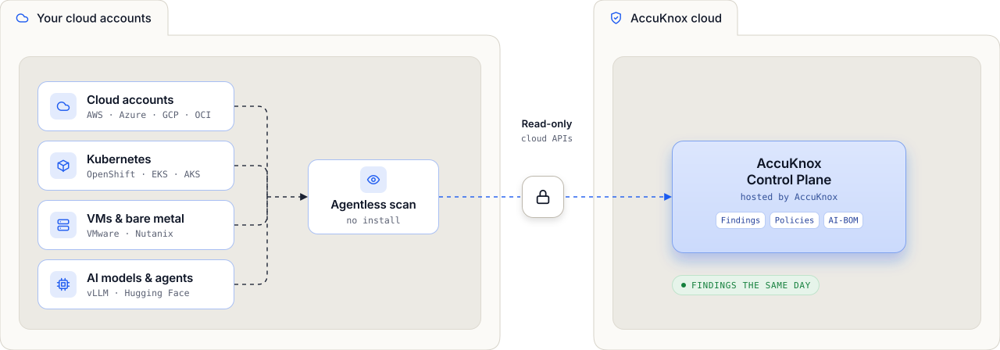
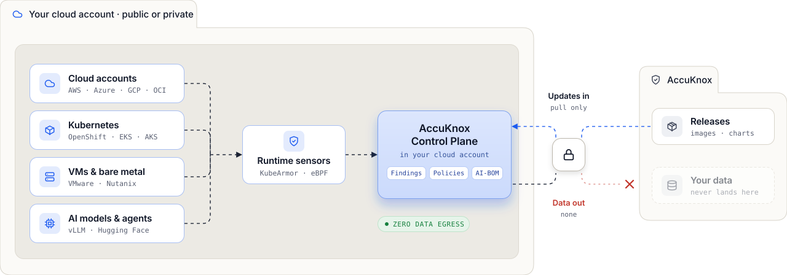
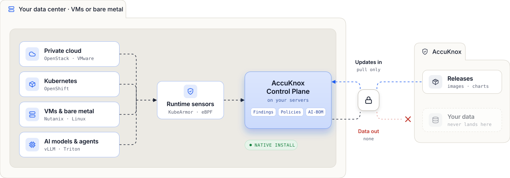
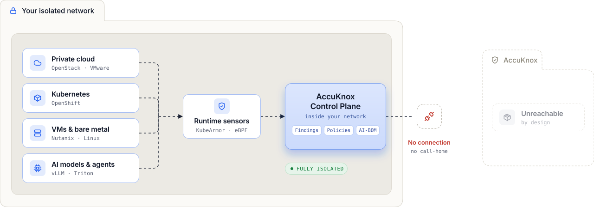
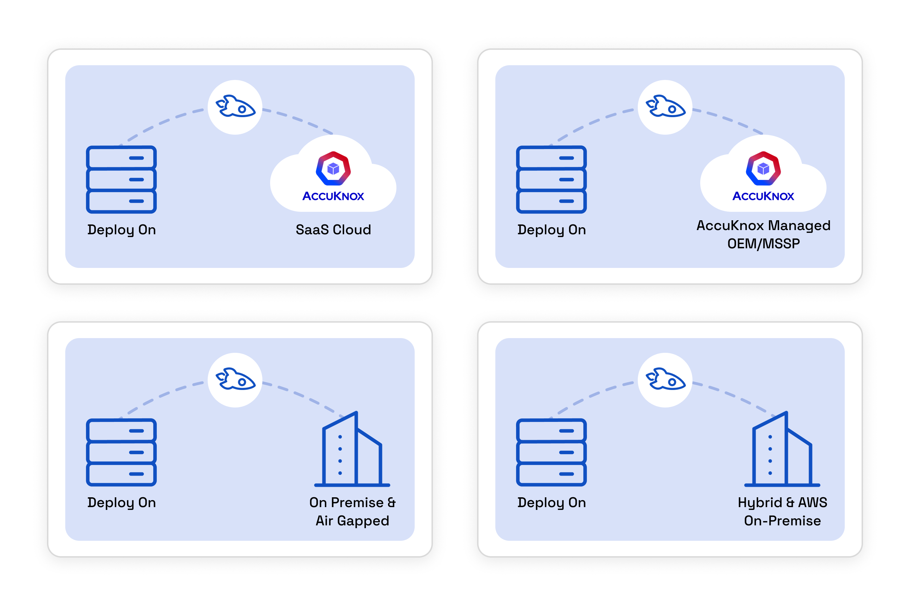

# Deployment

Run AccuKnox as SaaS, in your own cloud account, on premises, or in an air-gapped network. The platform and the policies stay the same in every model. The model decides where the AccuKnox Control Plane runs and whether any data leaves your network. Pick the model that fits your operational needs and security requirements.

| Model | Control plane runs in | Data path | Best for |
| --- | --- | --- | --- |
| [SaaS](#saas) | AccuKnox cloud | Read-only cloud APIs. Same-day setup, no install | Fast proof of concept |
| [Your Cloud](#your-cloud) | Your cloud account | No data egress | Data residency |
| [On-Premises](#on-premises) | Your servers | Native install, not a SaaS agent. No data out | Banking, healthcare, telecom |
| [Air-Gapped](#air-gapped) | Your isolated network | No outbound traffic | Federal, defense, ITAR |

## SaaS

AccuKnox hosts the control plane, so you install nothing. An agentless scan reads your environment over read-only cloud APIs and sends the results to the AccuKnox Control Plane. The control plane returns findings, policies and an AI-BOM, and the first findings arrive the same day.

The agentless scan covers four source types.

- **Cloud accounts.** AWS, Azure, GCP and OCI.
- **Kubernetes.** OpenShift, EKS and AKS.
- **VMs and bare metal.** VMware and Nutanix.
- **AI models and agents.** vLLM and Hugging Face.

| Control plane | Setup | Best for |
| --- | --- | --- |
| AccuKnox cloud | Same day, no install | Fast proof of concept |

## Your Cloud

The AccuKnox Control Plane runs inside your own cloud account, public or private. KubeArmor runtime sensors, built on eBPF, report to that control plane. The sources are the same as in SaaS: cloud accounts on AWS, Azure, GCP and OCI, Kubernetes on OpenShift, EKS and AKS, VMs and bare metal on VMware and Nutanix, and AI models and agents on vLLM and Hugging Face.

Traffic to AccuKnox runs one way. The control plane pulls updates, as images and charts, from AccuKnox releases. No data goes out, so your data never lands at AccuKnox.

| Control plane | Data egress | Best for |
| --- | --- | --- |
| Your cloud account | None | Data residency |

## On-Premises

The AccuKnox Control Plane installs natively on your own servers, VMs or bare metal, in your data center. It is a native install, not a SaaS agent. KubeArmor runtime sensors, built on eBPF, report to the control plane.

The on-premises model covers four source types.

- **Private cloud.** OpenStack and VMware.
- **Kubernetes.** OpenShift.
- **VMs and bare metal.** Nutanix and Linux.
- **AI models and agents.** vLLM and Triton.

As in the Your Cloud model, the control plane pulls updates as images and charts from AccuKnox releases. No data goes out, and your data never lands at AccuKnox. To install, follow the [On-Premise Installation Guide](../getting-started/on-prem-installation-guide.md).

| Control plane | Install | Best for |
| --- | --- | --- |
| Your servers | Native, not a SaaS agent | Banking, healthcare, telecom |

## Air-Gapped

The AccuKnox Control Plane runs inside your isolated network and has no connection to AccuKnox. It makes no call-home, and AccuKnox cannot reach it by design. KubeArmor runtime sensors, built on eBPF, report to the control plane.

The sources are the same as in the on-premises model: private cloud on OpenStack and VMware, Kubernetes on OpenShift, VMs and bare metal on Nutanix and Linux, and AI models and agents on vLLM and Triton.

| Control plane | Outbound traffic | Best for |
| --- | --- | --- |
| Your isolated network | None | Federal, defense, ITAR |

## Four Commercial Offerings Map to These Models

AccuKnox sells the platform in four offerings.

1. **AccuKnox SaaS.** The mainstream offering, built for production environments. AccuKnox delivers security through a SaaS model that scales, is easy to use, and deploys quickly.
2. **AccuKnox Managed OEM/MSSP.** A managed deployment. AccuKnox runs upgrades and maintenance and keeps the OEM or MSSP informed. Partners such as Xcitium rely on AccuKnox for smooth operations and continuous improvements, and they keep control over the deployment.
3. **AWS On-prem.** A hybrid of cloud and on-premises deployment. AccuKnox uses AWS managed services such as S3 and RDS for performance and scalability.
4. **Full On-prem/Air-Gapped.** For environments that need maximum security and isolation. All data and operations stay on the customer's premises. This offering gives the customer the highest level of control and security, and it suits sensitive and regulated industries.

## SaaS and On-Prem Differ in Who Runs the Control Plane

In SaaS, AccuKnox runs the control plane. In an on-prem deployment, your team runs it with AccuKnox support.

| Topic | SaaS | On-Prem |
| --- | --- | --- |
| **Upgrades and maintenance of the AccuKnox Control Plane** | AccuKnox manages them. | The customer manages them, with AccuKnox support. |
| **Technical support** | You choose the support level. | AccuKnox Premium support is required. |
| **Air-gapped** | No. | Optional. |
| **Raw data retention period** | AccuKnox manages it. The default is 60 days. | The customer manages it. |
| **Speed of feature updates** | Fast. New features arrive much sooner. | The customer decides when to upgrade. For security updates, AccuKnox provides upgrade patches, and the customer DevOps team applies them with AccuKnox support. The typical release cadence is once per month. |
| **Security and isolation** | Resources are shared with other customers. | No resources are shared. Only the customer DevOps team has direct access to the deployment. |
| **Supported features** | All features. | All features except AI CoPilot (AskADA). |

For the components inside the control plane, see [Control Plane Architecture](control-plane-architecture.md).

[DOWNLOAD CONTROL PLANE ARCHITECTURE](/resources/assets/AccuKnox%20Control%20Plane%20Architecture%20Technical%20v3.4.pdf){ .md-button .md-button--primary download }
