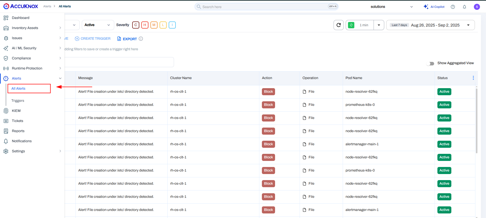
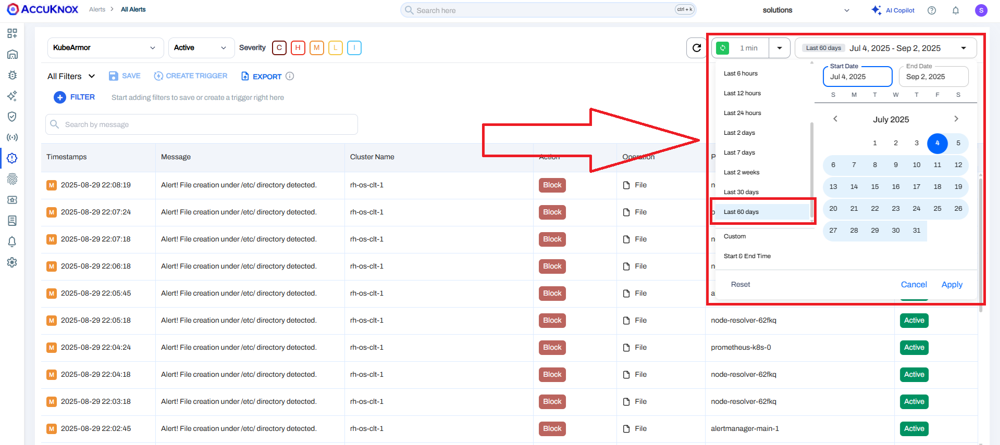
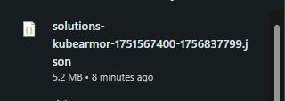

# Customer Data Backup Guide

Accuknox, as a CNAPP, conducts vulnerability scans across Cloud environments, software development lifecycles, and runtime security assessments. These scans are securely saved through AccuKnox as an integral part of their SAAS package. The data is stored via AccuKnox-managed S3 buckets, which have a predefined retention policy of one month.

However, users have the option to opt for an alternative storage solution by transferring the data to their own S3 buckets and configuring their own data retention policies. To facilitate this, users can follow the steps below:

## **1.Backup scan results**

Change the S3 bucket that is integrated with your tenant to your own S3 bucket

**Step 1.1** Access the Integration section within the Settings menu.

**Step 1.2** Proceed to the Data Source settings.

**Step 1.3** Select the current integration, and modify the associated S3 bucket by updating the name, access ID, and access key.

From this point forward, all scan files generated by the security scanning tools will be directed to the S3 bucket that the user has integrated. Consequently, the static scan data is now securely backed up and stored by the user.

## **2.Backup Logs and Alerts**

Next, we will explore how users can back up runtime alerts and logs:

**Step 2.1** Access the "Monitor and Logging → Logs" section.

**Step 2.2** Choose the desired timeframe for data backup.

**Step 2.3** Specify the preferred format, and the download process will commence automatically.

**Step 2.4** You can now store and backup the data in the manner that suits your preferences.

By following the above steps, the user is capable of backing up their own data from the AccuKnox SaaS platform.

- - -
[SCHEDULE DEMO](https://www.accuknox.com/contact-us){ .md-button .md-button--primary }