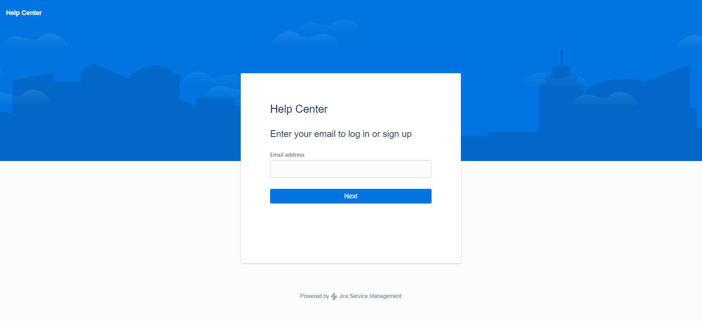
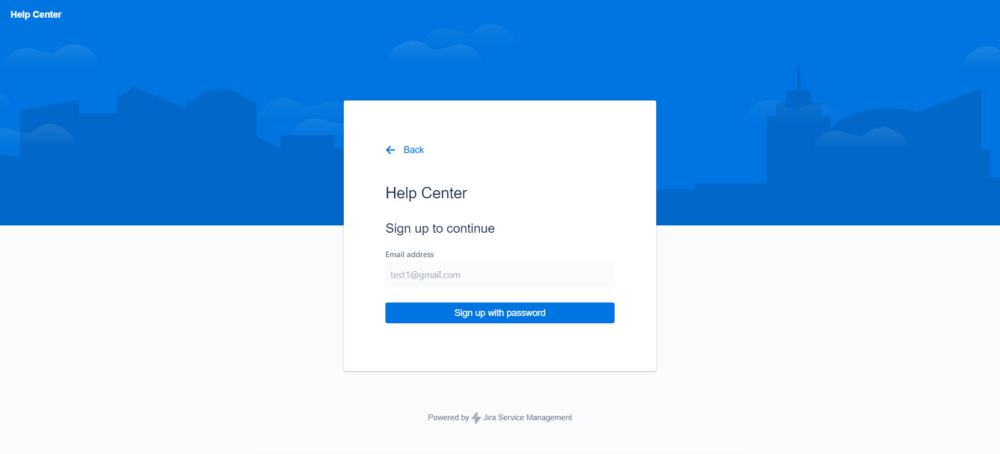
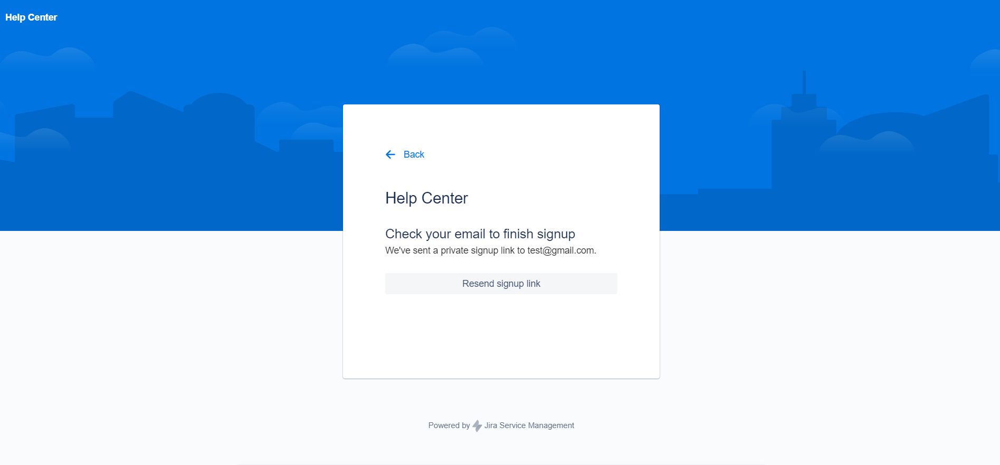
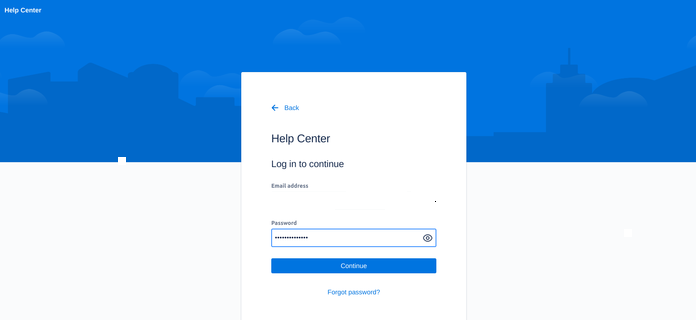
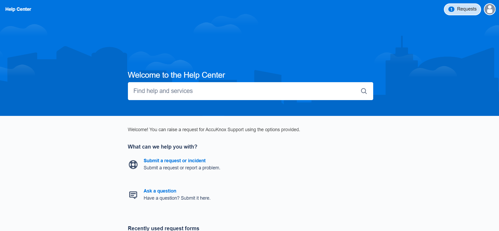
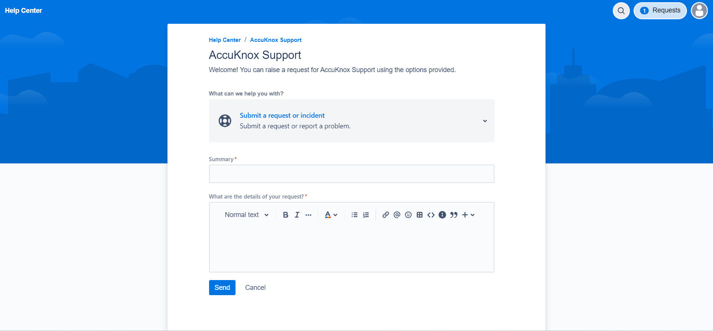
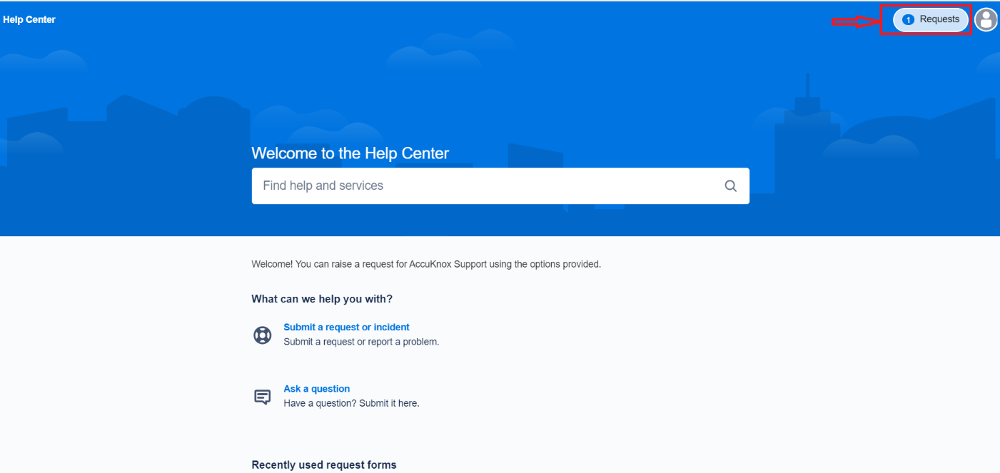
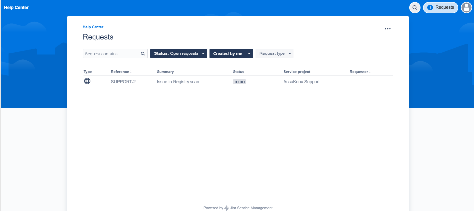

By following these steps, you can quickly and effectively raise a Jira ITSM support ticket for major platform issues, ensuring that your problem is addressed promptly and efficiently.

## How to raise an AccuKnox support ticket?

**Step 1:** Please click the following URL for raising the ticket: <https://accu-knox.atlassian.net/servicedesk/customer/portal/1>

**Step 2:** The page will ask for you to input the mail ID for signup

**Step 3:** After giving the email ID and selecting next will ask the user to sign in with a password

**Step 4:** Once users click the sign up with password, they will get an email for setting the password to the registered email id.

**Step 5:** After clicking the link and setting up the password and username login into the customer portal again <https://accu-knox.atlassian.net/servicedesk/customer/portal/1>

**Step 6:** Click on the Submit a request or incident option to create the issue

**Step 7:** To create an issue fill out this form and click send. Once it is clicked, the issue is created, and you will get a confirmation email to your registered email ID.

## How to track the issue resolution status?

To track the issue raised by the user they can log into the customer service portal using the link <https://accu-knox.atlassian.net/servicedesk/customer/portal/1>

**Step 1:** Click on the requests section in the top left corner of the screen

**Step 2:** Here you will find the list of issues created by the user and their status

- - -
[SCHEDULE DEMO](https://www.accuknox.com/contact-us){ .md-button .md-button--primary }
