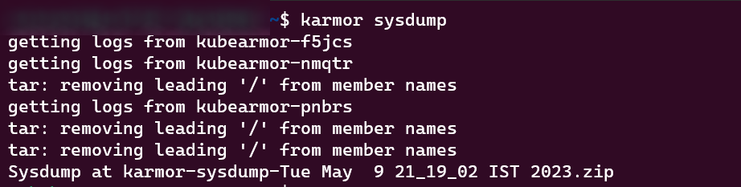

If the user faces any issue related to clusters, then they should provide the logs information of their clusters by following the below steps:

**Step 1: Getting Kubearmor Sysdump**

Users can get the kubeArmor sysdump by using the following command: 

```sh
>> karmor sysdump 
```



**Step 2: Getting logs from AccuKnox Agents**

Along with KubeArmor Sysdump users will be required to send the logs of AccuKnox Agents running inside their cluster. To get the logs of each agent use the following commands:

```sh
kubectl logs -n accuknox-agents discovery-engine-xxxx-xxxx > discovery-engine-logs.txt
kubectl logs -n accuknox-agents feeder-service-xxxx-xxx > feeder-service-logs.txt
kubectl logs -n accuknox-agents policy-enforcement-agent-xxxx-xxx > PEA-logs.txt
kubectl logs -n accuknox-agents shared-informer-agent-XXX-XXx > SIA-logs.txt
```
**Note:** In the above command replace the xxx-xxxx with your respective pod name that is running in accuknox-agents namespace.

 

The users will have to send this Karmor sysdump file and AccuKnox Agents logs to AccuKnox Solutions team for debugging the issue. 

- - - 
[SCHEDULE DEMO](https://www.accuknox.com/contact-us){ .md-button .md-button--primary }