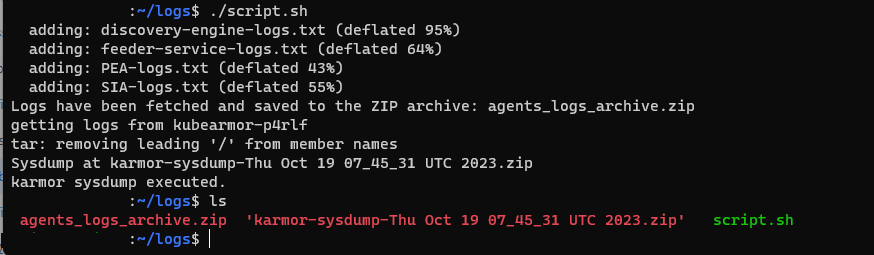

# CWPP Troubleshooting

If the user faces any issue related to clusters, then they should provide the logs information of their clusters for troubleshooting purposes.

## Requirements

### Getting Kubearmor Sysdump

Users can get the kubeArmor sysdump by using the following command:

```sh
karmor sysdump
```

### Getting logs from AccuKnox Agents

Along with KubeArmor Sysdump users will be required to send the logs of AccuKnox Agents running inside their cluster. To get the logs of each agent use the following commands:

```sh
kubectl logs -n accuknox-agents discovery-engine-xxxx-xxxx > discovery-engine-logs.txt
kubectl logs -n accuknox-agents feeder-service-xxxx-xxx > feeder-service-logs.txt
kubectl logs -n accuknox-agents policy-enforcement-agent-xxxx-xxx > PEA-logs.txt
kubectl logs -n accuknox-agents shared-informer-agent-XXX-XXx > SIA-logs.txt
```

**Note:** In the above command replace the xxx-xxxx with your respective pod name that is running in accuknox-agents namespace.

The users will have to send this Karmor sysdump file and AccuKnox Agents logs to AccuKnox Solutions team for debugging the issue.

## Script To automate this process

- This script will save all the output Txt files in a single zip file
- karmor sysdump will run independently as it creates a separate zip file on it’s own

```sh
#!/bin/bash

# Function to get the pod name for a given deployment
get_pod_name() {
    local namespace=$1
    local deployment=$2
    kubectl get po -n "$namespace" -o=name | grep "$deployment" | awk -F/ '{print $2}'
}

# Function to fetch logs for a given pod and save them to a file
fetch_and_save_logs() {
    local namespace=$1
    local pod=$2
    local output_file=$3
    kubectl logs -n "$namespace" "$pod" > "$output_file"
}

# Main script starts here

# Set your desired namespace here
namespace="accuknox-agents"

# Get the pod names and store them in variables
discovery_engine_pod=$(get_pod_name "$namespace" "discovery-engine")
feeder_service_pod=$(get_pod_name "$namespace" "feeder-service")
pea_pod=$(get_pod_name "$namespace" "policy-enforcement-agent")
sia_pod=$(get_pod_name "$namespace" "shared-informer-agent")

# Create a temporary directory to store the log files
temp_dir=$(mktemp -d 2>/dev/null || mktemp -d -t 'mytmpdir')

# Fetch and save the logs to separate files in the temporary directory
fetch_and_save_logs "$namespace" "$discovery_engine_pod" "$temp_dir/discovery-engine-logs.txt"
fetch_and_save_logs "$namespace" "$feeder_service_pod" "$temp_dir/feeder-service-logs.txt"
fetch_and_save_logs "$namespace" "$pea_pod" "$temp_dir/PEA-logs.txt"
fetch_and_save_logs "$namespace" "$sia_pod" "$temp_dir/SIA-logs.txt"

# Create a ZIP archive of all the log files
zip_file="agents_logs_archive.zip"
zip -j "$zip_file" "$temp_dir"/*.txt

# Clean up the temporary directory
rm -rf "$temp_dir"

echo "Logs have been fetched and saved to the ZIP archive: $zip_file"

# Execute 'karmor sysdump'
karmor sysdump

echo "karmor sysdump executed."
```

Users can now send the zip files generated for troubleshooting.

**Note:** Need to install zip as a pre-requisite in linux before running the above script.

```sh
sudo apt install zip
```

### Output



- - -
[SCHEDULE DEMO](https://www.accuknox.com/contact-us){ .md-button .md-button--primary }