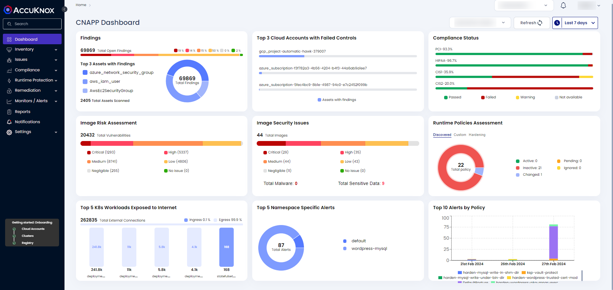

---
hide:
  - toc
---

## **CNAPP Dashboard**

 

With CNAPP Dashboard, AccuKnox provides you a comprehensive view of the security posture from cloud native applications to the infrastructure where its hosted. We cover application or infrastructure inventory to have the visibility, Threat Intelligence using Vulnerability/Findings by Severity, Compliance Monitoring against standard frameworks (technical or legal), Risk Assessment with respect to Image/Repo scan and security issues, Pods exposed to Internet,  critical Runtime Events and policies assessment and Remediations to track for fixing/patching solution to known issues.

 

+ **Image Risk Assessment** is very crucial widget which show you the count of images by severity per assessment. It will inform you about the status of overall Images security posture and guide you to take necessary steps on the Images with high severity first. The total Images count can be clicked if you want to see the overall status of the Image scans as it  will send you to the Scan Queue in Registry Scan 

+ **Image Security Issues** is critical to identify issues such as vulnerabilities, malware or sensitive data from the scan assorted by severity to detect early issues in our application security landscape. 

+ **Runtime Policies Assessment** will provide you a view of overall policies status that are governing your runtime protection aspect of your application. You should be able to see following details regarding Policies -

  + Total Applied Policies across entire organization

  + Discovered Policies based on your cluster/environment

  + Changed Policies based on detection of config change in the application at runtime

  + Active Policies which are actively governing the security posture of your infrastructure

  + Pending Policies which are subjected to Admin Approval and could be originated from discovered policies, custom created policies or duplicated altered with minor changes policies

  + Inactive Policies which are not governing your application behavior and are inactivated by Admin

+ **Namespace Specific Alerts** is to solve a concern that is pertinent to many customers where they specifically would want to ensure security coverage from the distinction at namespace-level in a cluster. It will also show namespace specific alerts from all clusters for that tenant. On clicking widgets title, it will redirect you to the log screen with appropriate filter

+ **Top 5 Pods with Egress/Ingress exposed to Internet** will show you the PODs with configuration exposed to Internet and upon clicking any of teh reflected pod-name, it will take you to the detailed App Behavior in the Pod Observability for taking any remedial action by creating policies there itself.

+ **Remediations** will cover the tracking of all the actionable items related to findings/vulnerabilities. It will be crucial to maintain a desired SLA a company has decided to comply against by isolating false positives, exception, findings with no fix, duplicate from the Active findings/vulnerabilities.

+ **Runtime Alerts: Network, Process, File** will provide a visibility into workload behavior and their runtime events over a period of time. It is a net sum of overall alerts generated from all clusters for that tenant.

+ **Top 10 Alerts by Policy** will be critical to inform user about any violation in the Policies governing the runtime security of the application over a period of time. It will be helpful to look back on the top events with high severity for user to take action on it, if necessary.

+ **Compliance Alerts** will inform user of standard compliance framework related violation alert. AccuKnox helps you to identify violation with respect to technical compliance such as CIS, STIG etc. and governance compliance such as NIST, MITRE, HIPAA etc. This widget will give you compliance conformance assessed from all the clusters for that tenant.

- - - 
[SCHEDULE DEMO](https://www.accuknox.com/contact-us){ .md-button .md-button--primary }