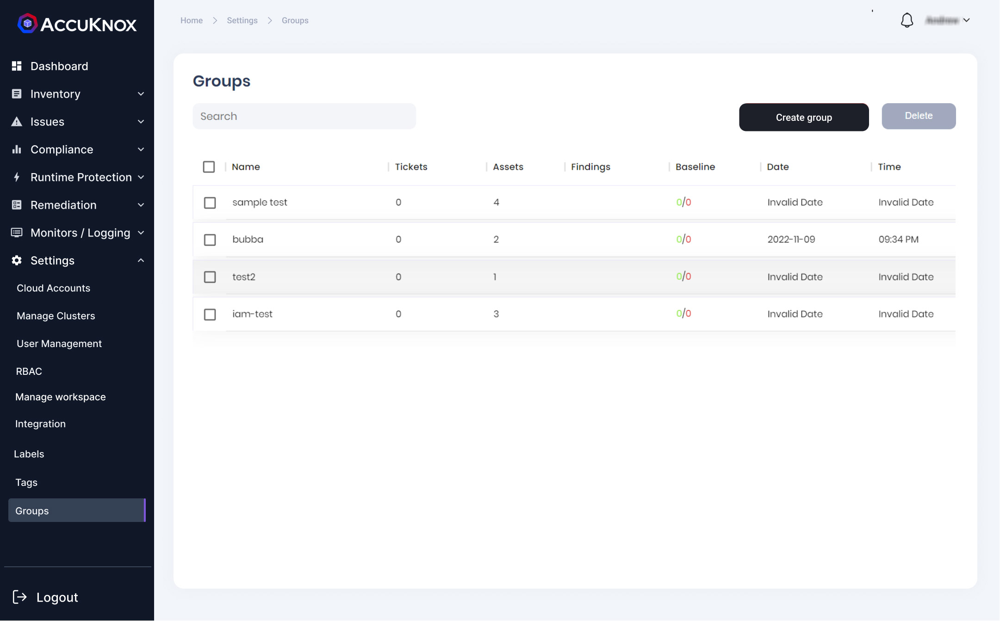
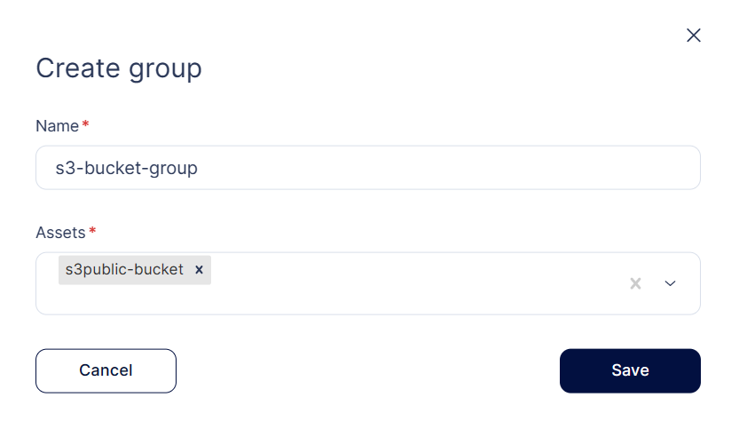
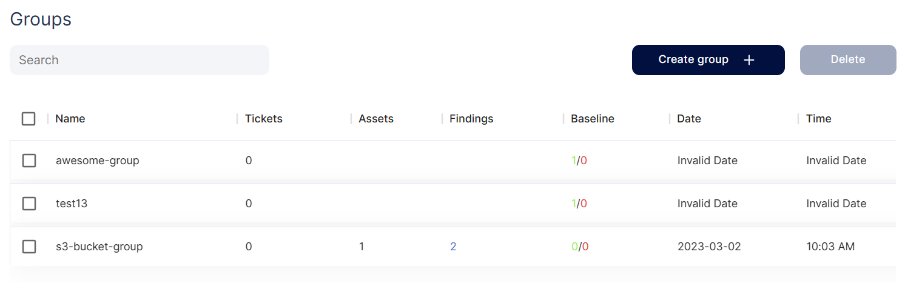

In the Groups section, users can group the assets and it findings by providing a unique group name. This grouping can be used for creating baselines and seeing other findings related to these grouped assets. 

**Creating groups:** 

**Step 1:** The users can create a group by clicking on the create group option on the screen. In the create group screen user needs to give group name and select the assets to be grouped.

**Step 2:**  When the user saves the group, the new group with selected assets and it findings are created. 

- - - 
[SCHEDULE DEMO](https://www.accuknox.com/contact-us){ .md-button .md-button--primary }