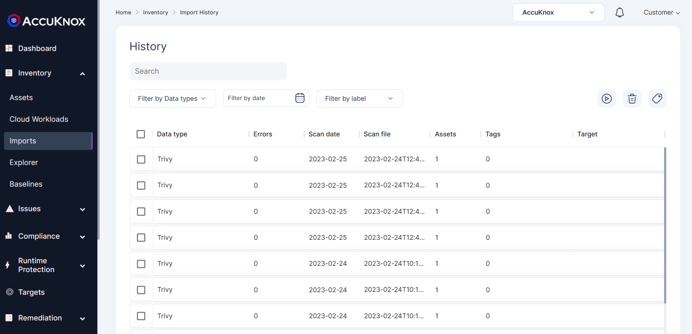

## **Imports**

AccuKnox provides you flexibility to help you onboard security scanning tool of your choice and scan your cloud infra against the onboarded security tool. There is numerous security scanning tool almost all the time for specific Asset type scan and hence to address this issue, we let user onboard security tool of their choice.

Import scans should have a mention of ‘data type’ to specify the security scanning tool we would like to leverage and can assign it to target, asset and mention lables, Tags to it as well. Your specific scan will run then for your infra and it will appear in ‘Import History’

 - - -
[SCHEDULE DEMO](https://www.accuknox.com/contact-us){ .md-button .md-button--primary }