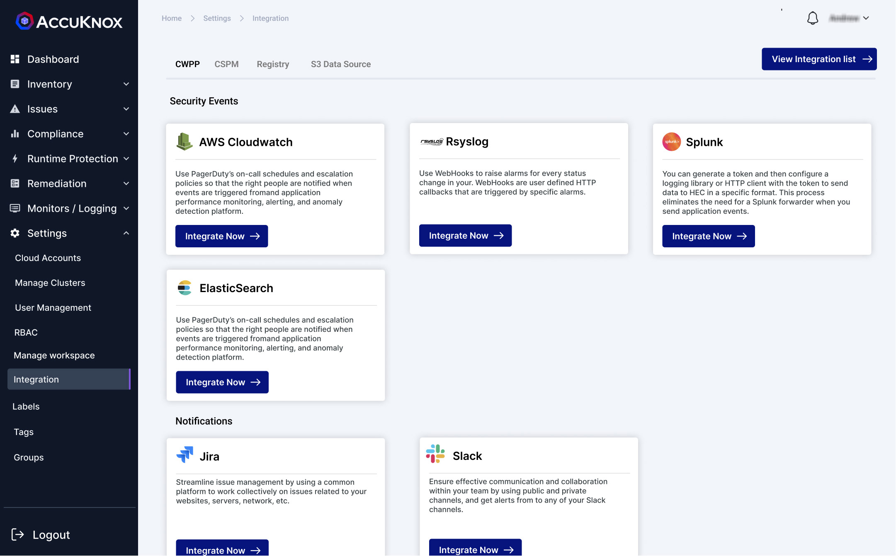
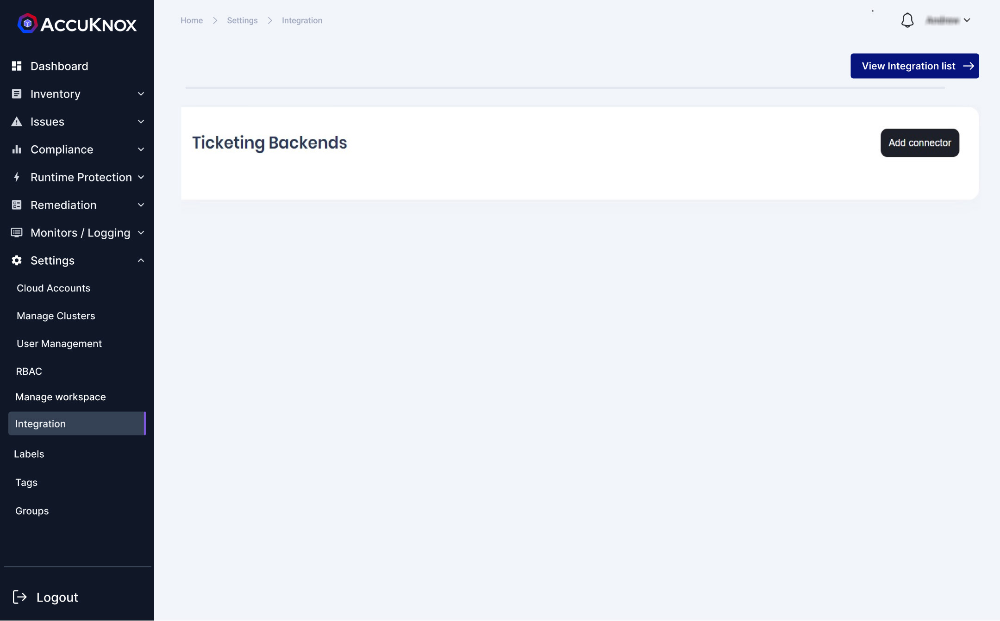
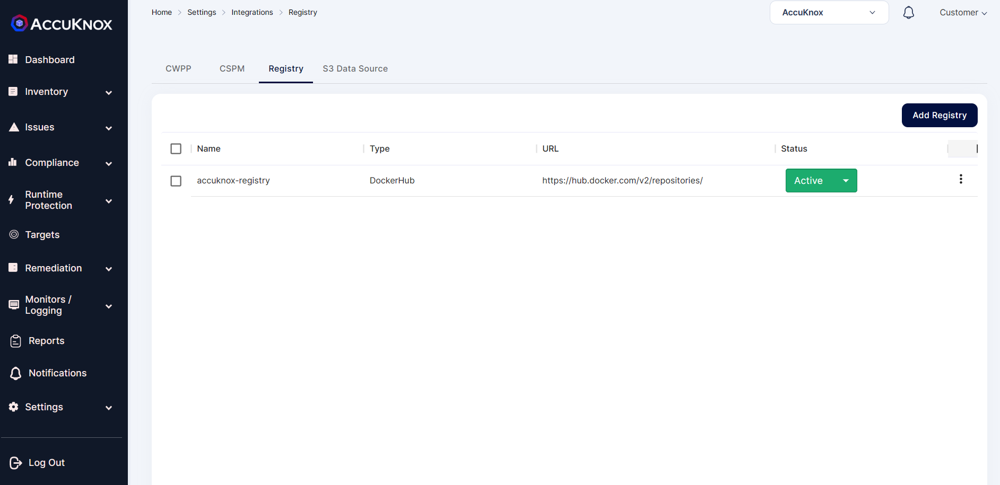

---
hide:
  - toc
---

This section is used to integrate external services with AccuKnox which allows these services to receive logs and metrics from our Saas platform. 

Under the CWPP subsection user can integrate with various SIEM and ticketing tools like

   + [Splunk](./../integrations/splunk.md)

   + [Rsyslog](./../integrations/rsyslog.md)

   + [AWS CloudWatch](./../integrations/aws-cloudwatch.md)

   + Elastic Search

   + [Slack](./../saas/slack.md)

   + [Jira](./../integrations/jira-cloud-cwpp.md)

   + [Email](./../integrations/email.md)
   
   

Under the CSPM subsection users can integrate the [Jira server](./../integrations/jira-server-cspm.md), [Jira cloud](./../integrations/jira-cloud-cwpp.md), [FreshService](./../integrations/freshservice-cspm.md), [ConnectWise](./../integrations/connectwise-cspm.md), [ServiceNow](./../integrations/servicenow.md) and Email Backend. 

Under Registry, the user can add a container registry from Nexus, [ECR](./../getting-started/ecr.md), GCR, ACR, Quay, JFrog Artifactory, [GAR](./../getting-started/gar.md), Harbor and DockerHub that stores private container images.

- - - 
[SCHEDULE DEMO](https://www.accuknox.com/contact-us){ .md-button .md-button--primary }