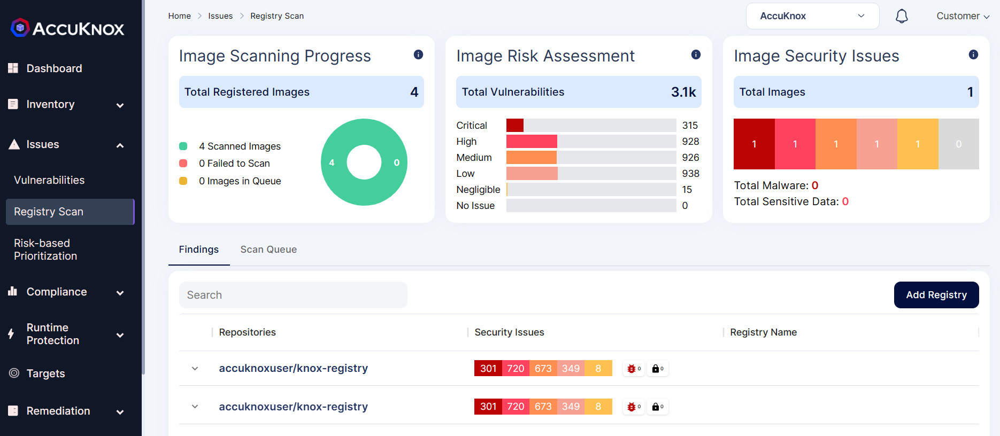
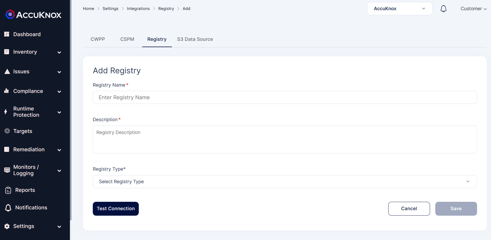
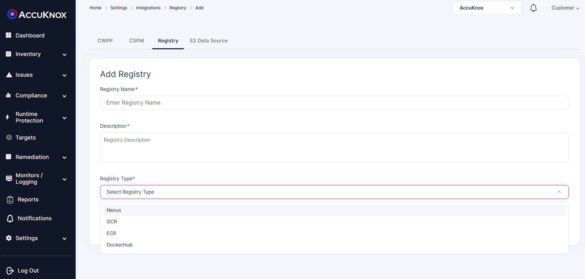
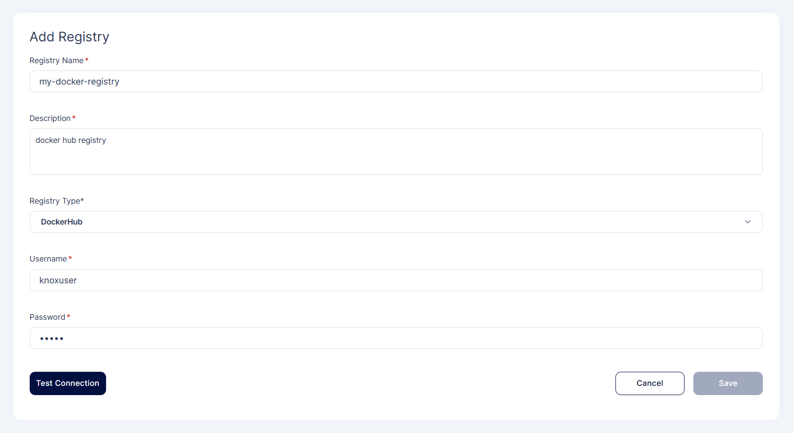
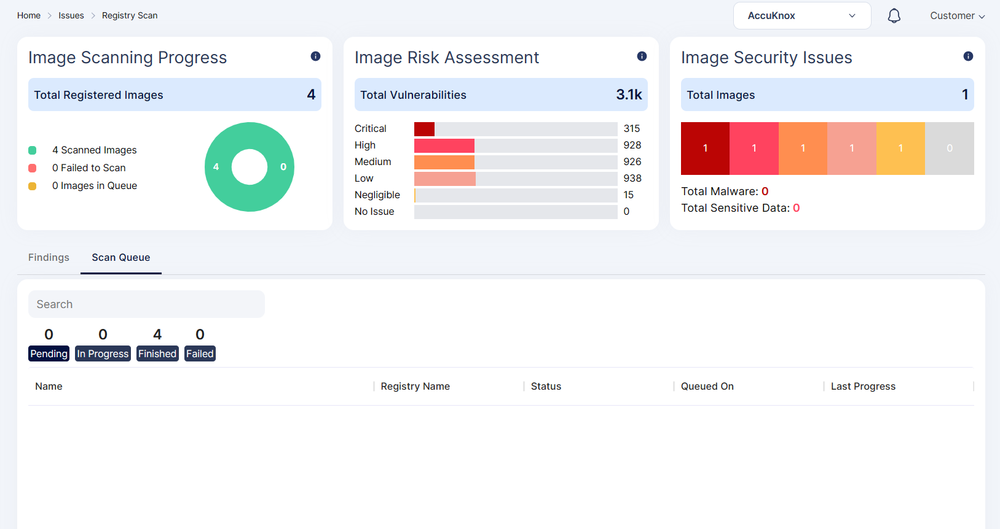
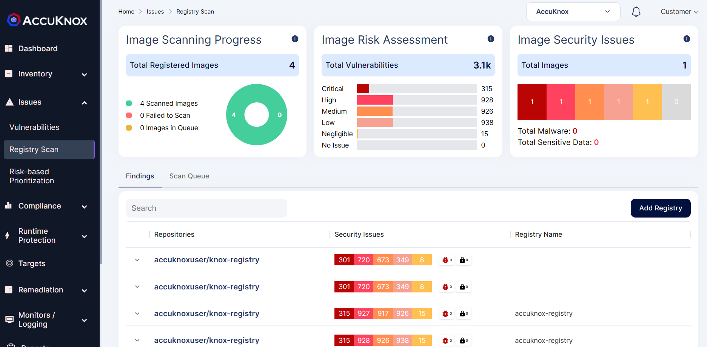

AccuKnox CSPM tool provides with registry scan where the user can onboard their Docker Hub, Nexus, GCR, and ECR registries. Once the registry is onboarded, the scanning of the registry starts automatically in the background. After the scanning is completed, the findings will be populated in the registry scan dashboard.

**Registry Onboarding:**

**Step 1:** To onboard a registry user needs to navigate to Issues->Registry Scan.

**Step 2:** The user needs to select Add Registry option from the above screen. When a user clicks Add Registry, they will be directed to a new screen to add registry details.

**Step 3:** User can onboard Nexus, GCR,ECR, DockerHub Registry by giving necessary details. 

**Step 4:** After giving necessary details, the user needs to test connection and save the registry

**Step 5:** Once the user clicks the save option registry will be added and scanning will be done in the background. After the scan is complete the findings data will be populated. 

**Registry scan findings:**

After the scan is complete, the scan data and findings will be populated into the screen. In this screen user will be getting information like no images scanned and risk associated with the images. Risks are classified as Critical, High, Medium, Low.

- - - 
[SCHEDULE DEMO](https://www.accuknox.com/contact-us){ .md-button .md-button--primary }
