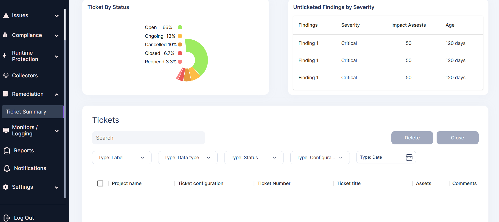

---
hide:
  - toc
---

## **Remediation**

AccuKnox’s Cloud Native Application Protection Platform (CNAPP) detects known vulnerabilities and security findings from infrastructure and application security posture assessment. Usually, once you onboard the infrastructure or workloads, we will run a scan that will identifies, prioritizes and remediate security and compliance flaws. 

We enable customers to handle these vulnerabilities/findings through auto-creation of ticket on bulk of security findings of similar kind. We also enable customers to provide comments to the tickets which through regression helps to auto-update ticket for closure. With every findings, you should be able to see 'Solution’ and standard reference to learn more about the vulnerability/findings. 

 

## **Ticket Summary** 

We integrate with several Ticketing Tools to track vulnerability/findings post security posture assessment such as - Jira, FreshService, Connectwise, Zendesk etc. We support various Status of Tickets to track its progress such as - Open, Ongoing, Cancelled, Closed or Re-opened. We provide you a composite view of Top findings which have higher severity or related to an important/sensitive assets and where ticket is not associated. 

- - - 
[SCHEDULE DEMO](https://www.accuknox.com/contact-us){ .md-button .md-button--primary }
