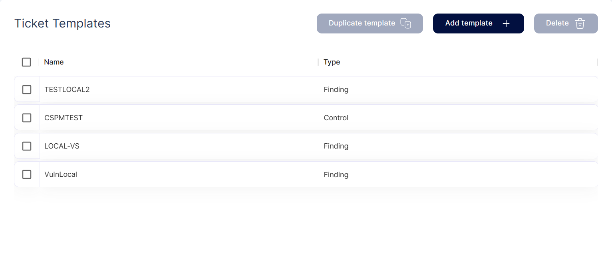
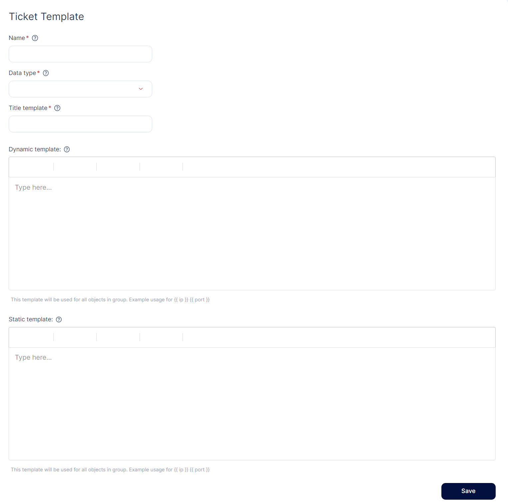
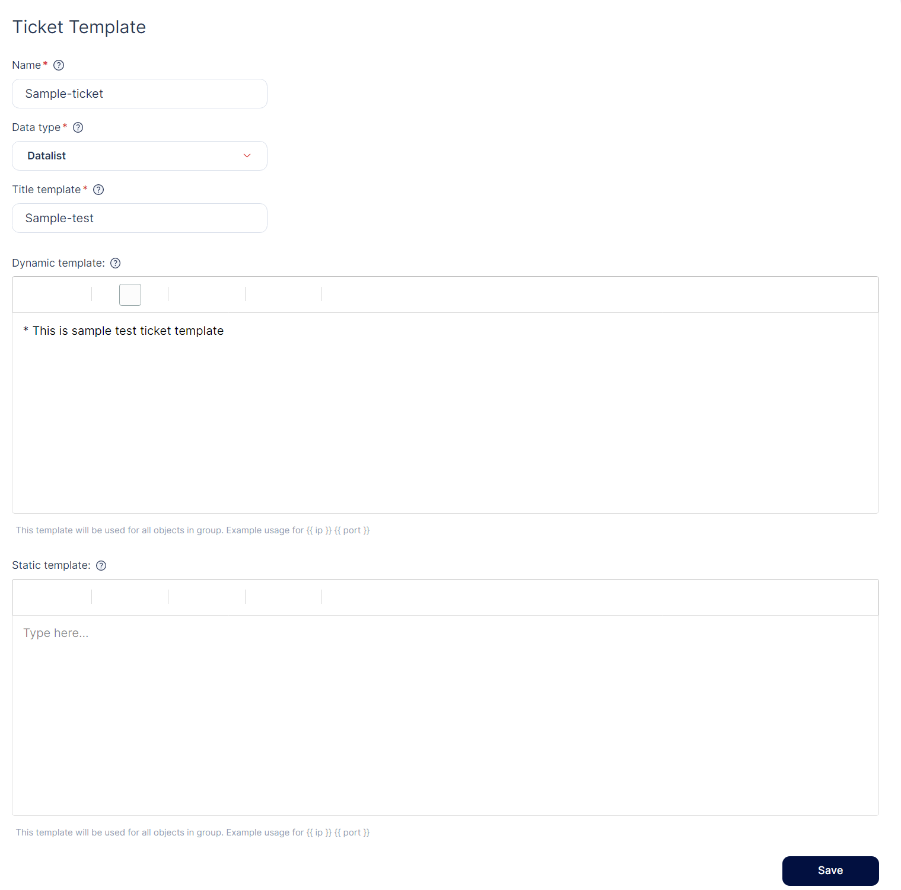
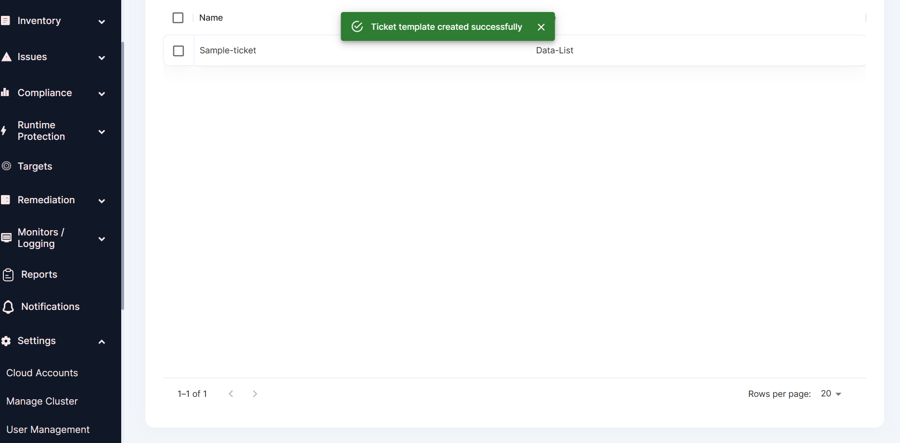

---
hide:
  - toc
---

In the Ticket Template section users can create Jira ticket templates related to vulnerability findings, particular assets, and particular scan results. 

**Creating Ticket Template:**

**Step 1:** We can create a new ticket template by clicking on the Add template option. 

**Step 2:** The user needs to fill in the necessary details and click save to create a new ticket template. 

**Step 3:** After we click save option Ticket Template is created successfully. 

- - - 
[SCHEDULE DEMO](https://www.accuknox.com/contact-us){ .md-button .md-button--primary }
