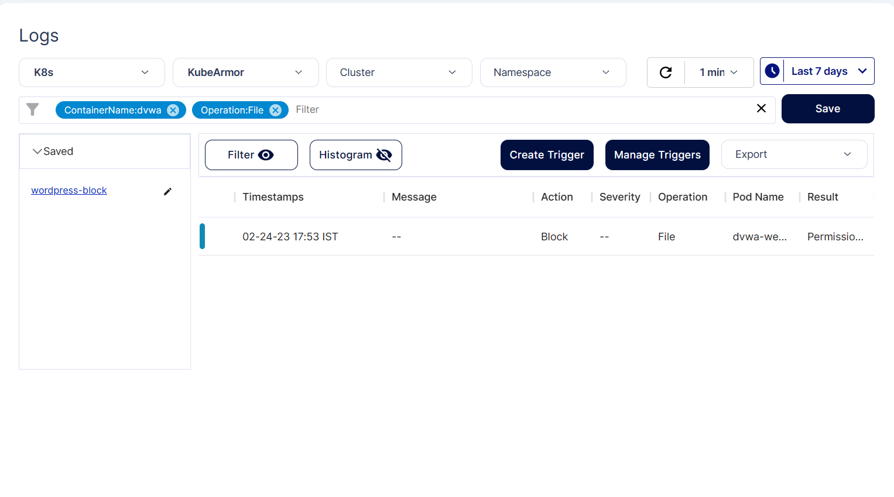
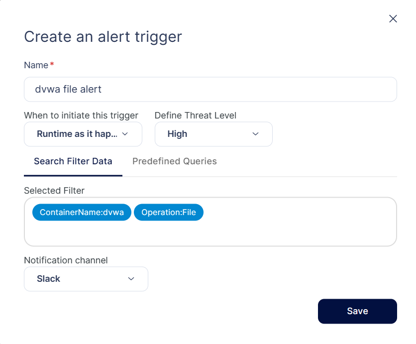
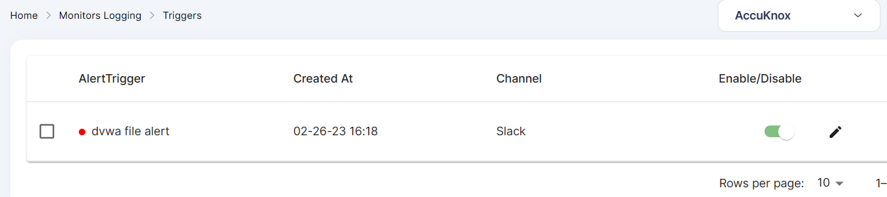
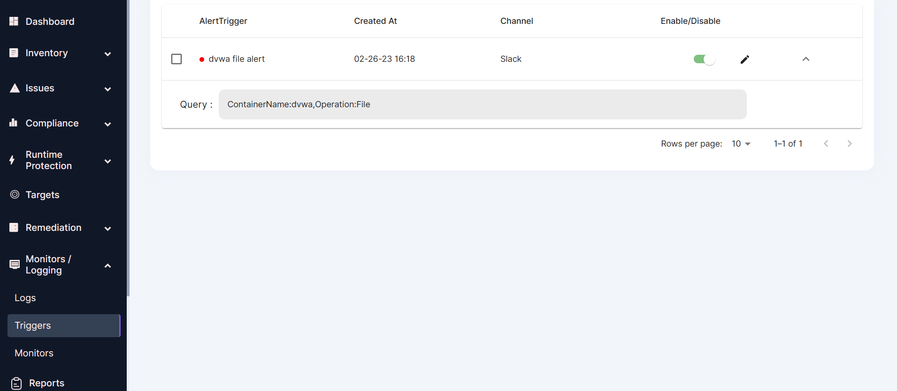
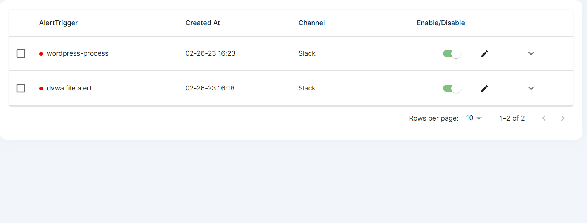
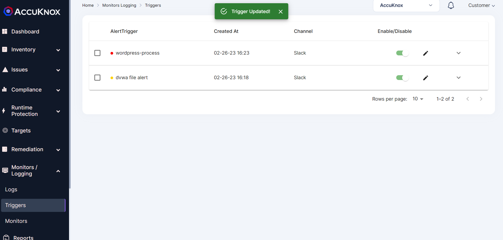
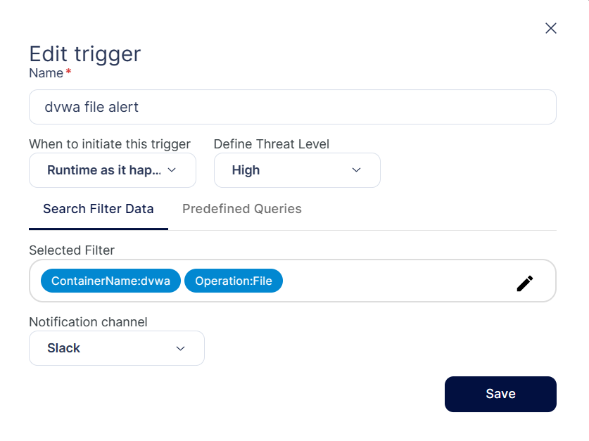
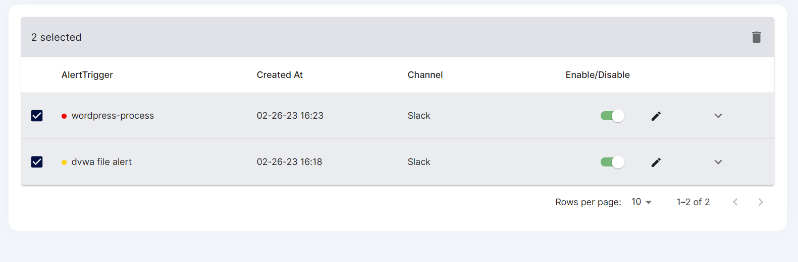
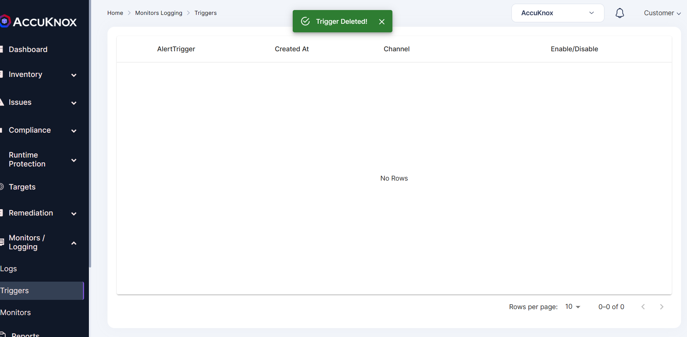

## **Triggers:**

With the use of triggers, AccuKnox can send alerts to third-party SIEM (security information and event management) platforms and logging tools like Slack, Splunk, Elastic Search, Cloud Watch, and Jira.

**How to create a new trigger?**

**Step 1:**  After choosing specific log filter from the Logs Screen, You can either click elements directly from the log events list, search for elements directly in the filter, or use Search Filters to choose a specific log filter. Then click on Create Trigger button.

**Step 2:** Configure the required options:

+ **Name:** Define an alert trigger name.

When to initiate this trigger: Set the frequency of the trigger. You have four options to select, (1) Runtime as it happens (2) Once a day (3) Once a week (4) Once a month

+ **Define Threat Level:** Define the threat level for the trigger. You have three options (1) High (2) Medium (3) Low

+ **Selected Filter:** The chosen log filter from step 1 is populated here. You can shift to predefined filters from here also.

+ **Notification channel:** Choose the notification channel that should receive the alerts.

**Note:** Before selecting the notification channel, you should complete the channel integration for this channel. Review the Channel Integration for more context.

**Step 3:**  After giving necessary details the user can click Save option to save the trigger. Trigger will be saved.

 

## **Manage Triggers**
Triggers can be managed individually, or as a group, by using the checkboxes on the left side of the Trigger UI. Select individual/group of triggers and perform actions, such as enabling, disabling, or deleting.

**View Trigger Details**
Users need to navigate to Monitors/logging-> select Triggers to view the saved triggers

To view Trigger alert details, click the Details of corresponding Tigger alert row. This will give query info of the selected trigger additionally.

**Enable/Disable Triggers**

Alerts can be enabled or disabled using the slider or the actions drop-down menu.

**Edit an Existing Trigger**

To edit an existing Tigger alert:

**Step 1:** click Edit Symbol from the right corner More options icon of the corresponding trigger alert

**Step 2:** Edit the trigger, and click Save to confirm the changes. Trigger will be updated.

**Delete Trigger**

Open the Triggers page and use one of the following methods to delete triggers:

You can perform delete operation on a single trigger or on multiple triggers

**Step 1:** From the Triggers UI, check the boxes beside the relevant triggers.

**Step 2:** Click Delete icon from the right corner in the screen to delete the selected triggers. Triggers will be deleted.

- - -
[SCHEDULE DEMO](https://www.accuknox.com/contact-us){ .md-button .md-button--primary }
