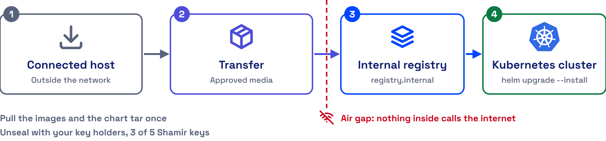

# Air-Gapped Deployment

AccuKnox Secrets Manager installs and runs with no internet access. You move the Helm chart and its images inside your network once. After that, nothing in the cluster calls out, and your own key holders unseal the server.



## 1. Bring the Chart Inside

The chart ships as one tar file, `accuknoxsecretmanager.tar`, from your AccuKnox point of contact. Copy it to a host inside your network. No Helm repository is needed.

## 2. Mirror the Images Into Your Registry

On a host with internet access, pull each image, then move it inside on approved media and push it to your internal registry.

| Image | Source named in the chart | Needed |
| --- | --- | --- |
| Secrets Manager server | `harbor.do.accuknox.com/secrets-manager/ak-secrets-mgr:v2.5.4-amd64` | Yes |
| Snapshot agent | `ghcr.io/accuknoxsecretmanager/accuknoxsecretmanager-snapshot-agent:0.3.0` | When snapshots are on |
| External Secrets Operator | The images its own Helm chart names | When you use the operator |

[Confirm the External Secrets Operator version to mirror.]

```bash
docker pull harbor.do.accuknox.com/secrets-manager/ak-secrets-mgr:v2.5.4-amd64
docker save harbor.do.accuknox.com/secrets-manager/ak-secrets-mgr:v2.5.4-amd64 -o ak-secrets-mgr.tar
```

Inside the network, load the archive, tag it for your registry and push it.

```bash
docker load -i ak-secrets-mgr.tar
docker tag harbor.do.accuknox.com/secrets-manager/ak-secrets-mgr:v2.5.4-amd64 <your-registry>/secrets-manager/ak-secrets-mgr:v2.5.4-amd64
docker push <your-registry>/secrets-manager/ak-secrets-mgr:v2.5.4-amd64
```

## 3. Point the Chart at Your Registry

Write a values file that names your registry and its pull secret.

```yaml
global:
  imagePullSecrets:
    - name: <registry-pull-secret>
server:
  image:
    registry: "<your-registry>"
injector:
  enabled: false
```

The injector stays off, because neither integration method uses it, so its images need no mirroring.

## 4. Install From Inside the Network

```bash
helm upgrade --install vault . -n accuknox -f airgap-values.yaml
```

Then initialize and unseal the server as the [Deployment Guide](deployment.md) shows.

## 5. Unseal With Your Own Key Holders

The default seal splits the root key into 5 Shamir key shares, and any 3 unseal the server. No cloud key service is involved, so the unseal works fully offline. Give the shares to different people inside your organisation.

[Confirm whether the AccuKnox build supports auto-unseal through an on-premises HSM or a Transit seal.] The auto-unseal example in `values.yaml` uses Google Cloud KMS, which needs internet access.

## Sign-In Methods Behave Differently Offline

LDAP sign-in works fully offline. OIDC with a cloud identity provider, such as Microsoft Entra ID, needs a network path from Secrets Manager to that provider.

- - -
[SCHEDULE DEMO](https://www.accuknox.com/contact-us){ .md-button .md-button--primary }
