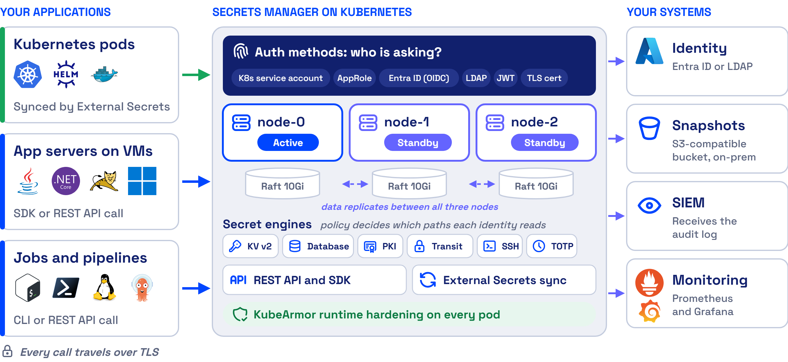

# Secrets Manager Architecture

AccuKnox Secrets Manager runs as its own control plane on Kubernetes. Applications reach it over TLS from anywhere: pods in the same cluster, pods in other clusters, applications on virtual machines, and CI/CD jobs. Each one proves its identity, gets a short-lived token tied to a policy, and reads only the paths that policy allows.

## Three Nodes Share One Encrypted Store

In high-availability mode, three Secrets Manager pods run as a StatefulSet. One pod is active and the other two stand by. Each pod keeps its own copy of the data on a Raft integrated storage disk, 10Gi by default, and the copies replicate between the pods.

There is no separate database to run or back up. Secrets Manager encrypts data before it reaches disk. See [High Availability and Backup](high-availability.md) for how failover works.

## Every Request Takes Four Steps

| Who is asking | Auth method |
| --- | --- |
| A pod | Kubernetes service account |
| An application on a virtual machine, a job, a script | AppRole, or a TLS certificate |
| A person | OIDC (for example Microsoft Entra ID), LDAP, or username and password |

JWT, Okta and token auth are also supported. A token that existed before a policy change keeps its old policies, so the holder must log in again to pick up the change.

## Secret Engines Hold Different Kinds of Secrets

| Engine | Holds |
| --- | --- |
| KV, version 1 and 2 | Static secrets, with versions and rollback in version 2 |
| Database | Short-lived database credentials |
| PKI | Certificates |
| Transit | Encryption keys, for encryption as a service |
| SSH | One-time SSH passwords |
| TOTP | Time-based one-time passwords |

See [Storing Secrets in the KV Engine](kv-secrets.md), [Encryption as a Service](transit.md) and [TOTP Authenticator](totp.md).

## The Helm Chart Deploys These Components

| Component | Kubernetes object | Needed |
| --- | --- | --- |
| Secrets Manager server, UI and API on port 8200 | StatefulSet, 3 pods in HA mode | Yes |
| Raft storage | One PersistentVolumeClaim per pod, 10Gi default | Yes |
| Services | Active, standby and headless. Pods talk to each other on port 8201 | Yes |
| Snapshot agent | CronJob, every 15 minutes by default | Recommended |
| Audit storage | A separate PersistentVolumeClaim, 10Gi default | Recommended |
| Monitoring | ServiceMonitor, alert rules and a Grafana dashboard | Optional |
| Ingress or OpenShift Route, NetworkPolicy, PodDisruptionBudget | Standard Kubernetes objects | Optional |

Applications in other clusters also need the [External Secrets Operator](external-secrets.md) when they use that method. The [Deployment Guide](deployment.md) lists the prerequisites.

## AccuKnox Hardens the Secrets Manager Pods

A secrets manager is a high-value target, because it holds the credentials for many applications. AccuKnox CWPP, built on KubeArmor, hardens every Secrets Manager instance at runtime. It limits what processes in the pods can read and run, which protects environment variables, secrets and volume mounts and reduces the blast radius of a compromise.

- - -
[SCHEDULE DEMO](https://www.accuknox.com/contact-us){ .md-button .md-button--primary }
