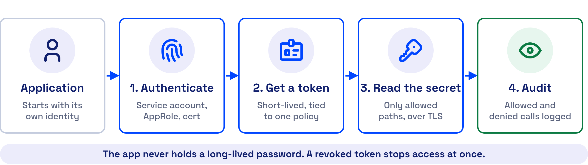
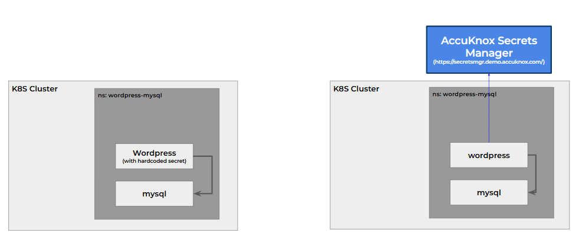
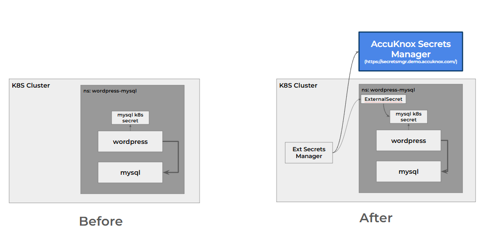
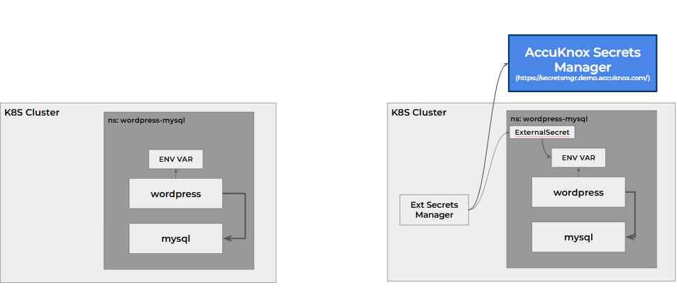

# Connect Applications to Secrets Manager

An application gets its secrets from AccuKnox Secrets Manager in one of two ways. Pick per application, and run both side by side in the same cluster if you need to.

-   :material-code-braces:{ .lg .middle } **Direct SDK or REST API**

    ---

    The application asks Secrets Manager for the secret and keeps it in memory.

    - :material-check: Most secure, nothing left in the namespace
    - :material-check: Works on Kubernetes and virtual machines
    - :material-pencil: A few lines of code

    [:octicons-arrow-right-24: Use the SDK](sdk-integration.md)

-   :simple-kubernetes:{ .lg .middle } **External Secrets Operator**

    ---

    The operator syncs the secret into a Kubernetes secret the application already reads.

    - :material-check: No application code change
    - :material-alert-outline: A copy sits in the namespace
    - :material-restart: The app restarts to load a new value

    [:octicons-arrow-right-24: Use the operator](external-secrets.md)

## Samples Cover Python, Java, .NET and Node.js

Any language that can make an HTTPS call can read a secret. These have ready-made samples.

-   :fontawesome-brands-python:{ .lg .middle } **[Python](sdk-integration.md#read-the-secret-in-python)**

    ---

    `hvac`, logging in as the pod's service account.

-   :fontawesome-brands-java:{ .lg .middle } **[Java](sdk-integration.md#use-the-client-for-your-language)**

    ---

    `vault-java-driver`, or Spring Cloud Vault with config only.

-   :simple-dotnet:{ .lg .middle } **[.NET](sdk-integration.md#use-the-client-for-your-language)**

    ---

    `VaultSharp`, for IIS sites, Windows services and jobs.

-   :fontawesome-brands-node-js:{ .lg .middle } **[Node.js](sdk-integration.md#use-the-client-for-your-language)**

    ---

    `node-vault`, with an AppRole login.

-   :material-console:{ .lg .middle } **[REST API and scripts](sdk-integration.md#use-the-client-for-your-language)**

    ---

    `curl` from a shell script, a batch job or a pipeline.

-   :simple-kubernetes:{ .lg .middle } **[Any Kubernetes app, no code](external-secrets.md)**

    ---

    Keep reading the Kubernetes secret you read today.

## The Two Methods Side by Side

| | Direct SDK or REST API | External Secrets Operator |
| --- | --- | --- |
| Application code change | Small, a few lines | None |
| Where the secret lives | In application memory only | In a Kubernetes secret, or an environment variable |
| Who else can read it | Only the application | Anyone with read access to that namespace or workload |
| Picks up a new value | On the next read | After the application restarts |
| Runs on | Kubernetes and virtual machines | Kubernetes |

## Both Methods Follow the Same Four Steps

The application, or the operator acting for it, proves its identity and gets a short-lived token tied to a policy. The token reads only the paths that policy allows, over TLS, and Secrets Manager logs every request.

## See the Difference in the Diagrams

=== "Direct SDK"

    

    No Kubernetes secret or environment variable holds a copy, so a user who can read the namespace cannot read the secret.

=== "External Secrets, Kubernetes secret"

    

    The application keeps reading its Kubernetes secret, and the operator keeps that secret equal to the value in Secrets Manager.

=== "External Secrets, environment variable"

    

    The operator can feed an environment variable instead. The same namespace exposure applies.

!!! info "A running application does not reload the secret"
    The operator updates the Kubernetes secret within its refresh interval. An application that reads the secret at startup sees the new value only after it restarts. The [WordPress and MySQL walkthrough](use-case-wordpress-mysql.md) shows this on a live cluster.

- - -
[SCHEDULE DEMO](https://www.accuknox.com/contact-us){ .md-button .md-button--primary }
