# Deployment Guide

This guide installs AccuKnox Secrets Manager on Kubernetes. It uses the Helm chart in `accuknoxsecretmanager.tar`, which your AccuKnox point of contact gives you.

Secrets Manager stores encrypted secrets, issues short-lived dynamic secrets, and applies identity-based access control with full audit logs.

## Prerequisites

=== "System requirements"

    | Requirement | Details |
    | --- | --- |
    | CPU and memory | 1 vCPU and 512Mi memory minimum, single node |
    | Storage | 10Gi of persistent storage |

=== "Kubernetes requirements"

    | Requirement | Details |
    | --- | --- |
    | Kubernetes version | 1.30 or later, with a default StorageClass |
    | Helm version | Helm 3 |
    | kubectl | Configured to talk to your cluster |

### Pre-installation Checks

Run these three commands before you start:

```sh
kubectl version --client
helm version
kubectl get storageclass
```

The third command must list at least one StorageClass marked `(default)`. Without it, the server pod stays in `Pending`. See [Troubleshooting](#troubleshooting).

## Architecture

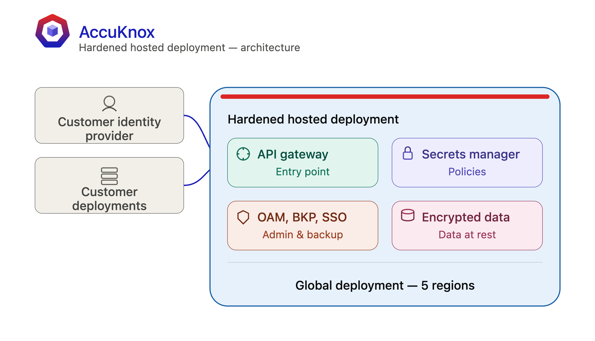

## Install with Helm

### 1. Extract the Chart

```sh
tar xf accuknoxsecretmanager.tar
cd accuknoxsecretmanager
```

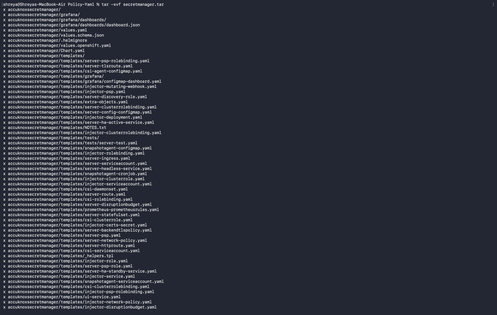

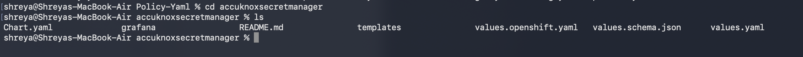

### 2. Install the Chart

```sh
helm upgrade --install vault .
```

This installs the Secrets Manager server and the Agent Injector into the `default` namespace. It uses the settings in `values.yaml`.

To install into your own namespace instead:

```sh
kubectl create namespace accuknox
helm upgrade --install vault . -n accuknox
```

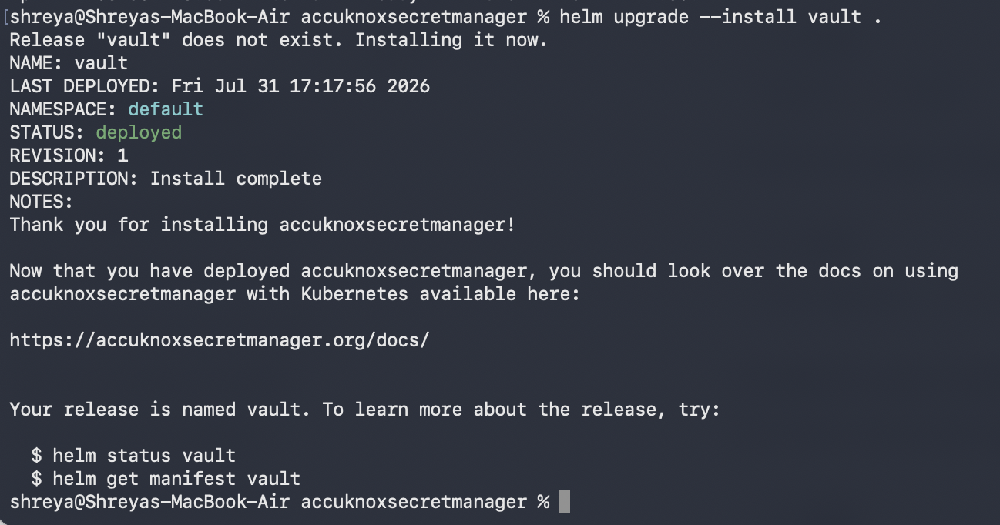

Check the pod status:

```sh
kubectl get po -n accuknox
```

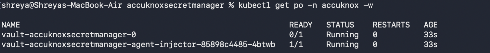

The server pod shows `0/1` until you unseal it in the next step. That is expected.

### 3. Initialize the Server

The server starts sealed and uninitialized. Initialize it once:

```sh
kubectl exec vault-accuknoxsecretmanager-0 -n accuknox -- vault operator init
```

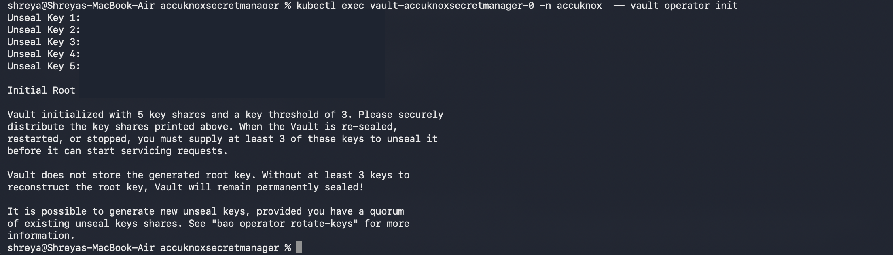

The command prints 5 unseal keys and an initial root token:

```text
Unseal Key 1: <unseal-key-1>
Unseal Key 2: <unseal-key-2>
Unseal Key 3: <unseal-key-3>
Unseal Key 4: <unseal-key-4>
Unseal Key 5: <unseal-key-5>

Initial Root Token: <root-token>
```

!!! danger "Save these values now"
    Secrets Manager shows the unseal keys and the root token one time only. Store them in a safe place and distribute the key shares to different people.

    Secrets Manager does not store the root key. Without at least 3 of the 5 keys, the server stays sealed forever and the data is unrecoverable.

### 4. Unseal the Server

The default configuration uses 5 key shares with a threshold of 3. Run the unseal command three times, with a different key each time.

**Key 1:**

```sh
kubectl exec vault-accuknoxsecretmanager-0 -n accuknox -- vault operator unseal <unseal-key-1>
```

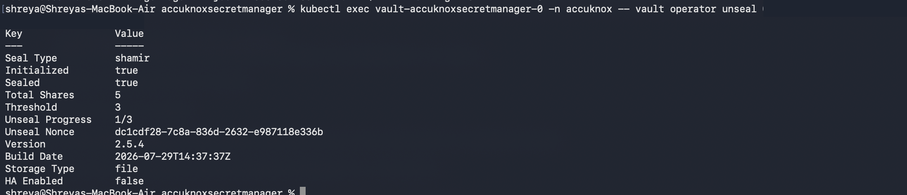

**Key 2:**

```sh
kubectl exec vault-accuknoxsecretmanager-0 -n accuknox -- vault operator unseal <unseal-key-2>
```

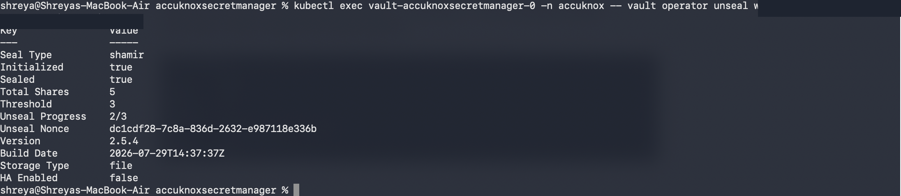

**Key 3:**

```sh
kubectl exec vault-accuknoxsecretmanager-0 -n accuknox -- vault operator unseal <unseal-key-3>
```

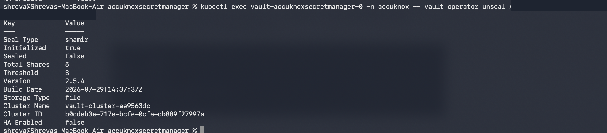

After the third key, `Sealed` reads `false` and the pod becomes `1/1` Ready.

!!! warning "A restart re-seals the server"
    If the pod restarts, Secrets Manager seals itself again. Unseal it with any 3 of your 5 saved keys.

## Sign In

### 1. Log In with the Root Token

```sh
kubectl exec -n accuknox vault-accuknoxsecretmanager-0 -- vault login <root-token>
```

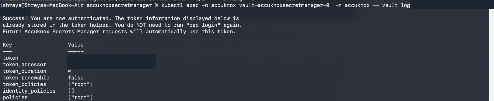

### 2. Reach the UI

Port-forward the service, or expose it through a NodePort or an Ingress.

```sh
kubectl port-forward -n accuknox svc/vault-accuknoxsecretmanager 8200:8200
```

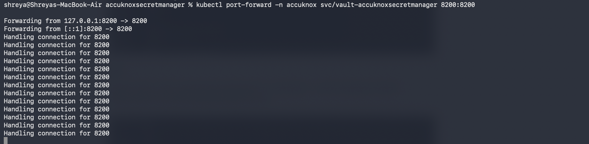

Open [http://localhost:8200/ui/vault/auth?with=token](http://localhost:8200/ui/vault/auth?with=token).

Sign in with these values:

| Field | Value |
| --- | --- |
| Namespace | `/` |
| Method | Token |
| Token | Your root token |


!!! tip "Replace the root token early"
    Use the root token to create your first admin user and policy. Then stop using it for day-to-day work. See [Sharing Secrets in an Organisation](sharing-secrets.md).

## Other Installation Options

The chart ships alternate setups. Pick the one that matches your environment.

=== "OpenShift"

    The chart includes a separate values file for security context constraints and routes.

    ```sh
    helm upgrade --install vault . -f values.openshift.yaml
    ```

=== "CSI provider mode"

    This mode mounts secrets into pods as volumes. Install the [Secrets Store CSI Driver](https://secrets-store-csi-driver.sigs.k8s.io/getting-started/installation) first.

    ```sh
    helm upgrade --install vault . --set csi.enabled=true
    ```

=== "Custom configuration"

    Override any setting in `values.yaml` with `--set` or with your own values file.

    ```sh
    helm upgrade --install vault . -f my-values.yaml
    ```

## Verify the Installation

```sh
kubectl get pods -n accuknox
kubectl exec vault-accuknoxsecretmanager-0 -n accuknox -- vault status
kubectl get pvc -n accuknox
```

## Troubleshooting

### The Server Pod Stays in Pending

```sh
kubectl get po -n accuknox
```

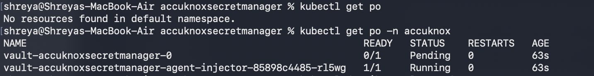

Describe the pod to read its events:

```sh
kubectl describe po vault-accuknoxsecretmanager-0 -n accuknox
```

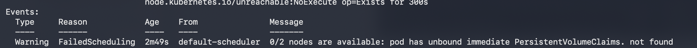

The event reads `pod has unbound immediate PersistentVolumeClaims`. The StatefulSet asks for a 10Gi volume through the PVC `data-vault-accuknoxsecretmanager-0`, and no StorageClass can provision it.

Check what storage the cluster offers:

```sh
kubectl get storageclass -n accuknox
kubectl get pvc -n accuknox
kubectl get pv -n accuknox
```

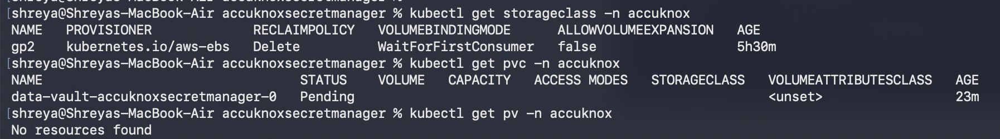

The `STORAGECLASS` column on the PVC is empty. The chart did not set `storageClassName`, so Kubernetes fell back to the default StorageClass. None of the classes in this cluster carries the `(default)` marker, so the PVC never binds and the pod stays `Pending`.

Fix it in one of two ways:

=== "Mark a StorageClass as default (recommended)"

    ```sh
    kubectl patch storageclass <your-storage-class> \
      -p '{"metadata":{"annotations":{"storageclass.kubernetes.io/is-default-class":"true"}}}'
    ```

    Then reinstall the chart. The PVC binds and the pod reaches `Running`.

=== "Name the StorageClass explicitly"

    ```sh
    helm upgrade --install vault . -n accuknox \
      --set server.dataStorage.storageClass=<your-storage-class>
    ```

=== "Run without persistence (test only)"

    ```sh
    helm upgrade --install vault . -n accuknox \
      --set server.dataStorage.enabled=false
    ```

    The pod goes `Pending → ContainerCreating → Running` with no storage attached. Secrets do not survive a pod restart, so use this to confirm the install and nothing else.

Watch the pod come up:

```sh
kubectl get po -n accuknox -w
```

### Other Common Errors

| Symptom | Cause | Fix |
| --- | --- | --- |
| `Vault is sealed` on every request | The pod restarted | Unseal with 3 of your 5 saved keys |
| `permission denied` on a path | The policy does not grant it, or the token predates the policy | Edit the policy, then sign out and sign in again |
| `connection refused` on port 8200 | The port-forward stopped | Run the `kubectl port-forward` command again |
| `localhost:8080` kubectl error | `KUBECONFIG` is not set in your shell | Export `KUBECONFIG` with the path to your kubeconfig file |

## Next Steps

<div class="grid cards" markdown>

-   :material-key-variant: **[Store your first secret](kv-secrets.md)**

    Enable the KV engine and save a credential.

-   :material-account-multiple: **[Onboard your team](sharing-secrets.md)**

    Create scoped users and attach least-privilege policies.

</div>

- - -
[SCHEDULE DEMO](https://www.accuknox.com/contact-us){ .md-button .md-button--primary }
