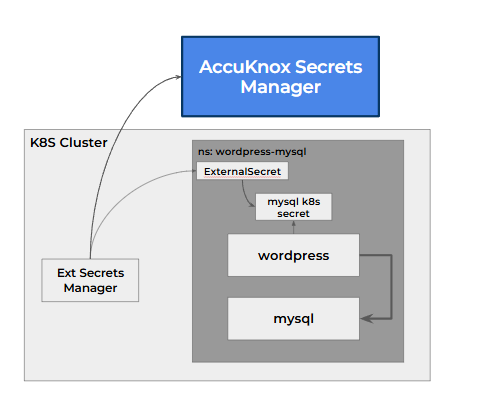
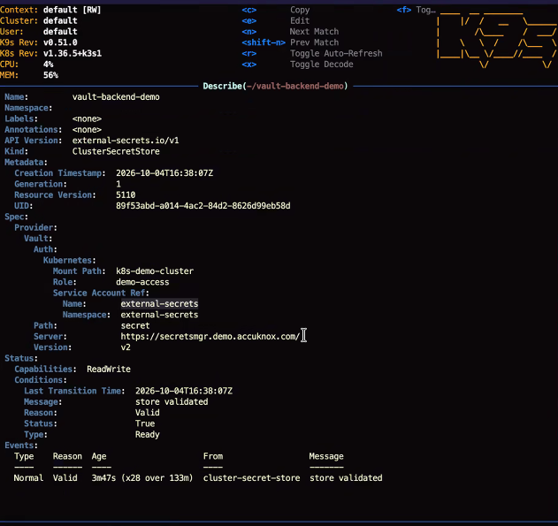

# External Secrets Operator Integration

The [External Secrets Operator](https://external-secrets.io/) is an open-source Kubernetes operator. It reads a value from AccuKnox Secrets Manager and writes it into a Kubernetes secret, then keeps the two in step on a schedule. Your application reads the Kubernetes secret it already uses, so its code does not change.



The setup works on any Kubernetes cluster. Secrets Manager runs as its own control plane, and the operator runs in the application cluster.

## Three Objects Do the Work

| Object | Scope | Job |
| --- | --- | --- |
| `ClusterSecretStore` | The whole cluster | Tells the operator where Secrets Manager is and how to log in |
| `SecretStore` | One namespace | Does the same job for one namespace, with its own role |
| `ExternalSecret` | One namespace | Names the secret to fetch, the Kubernetes secret to write, and how often to refresh |

## 1. Install the Operator

Install the operator with Helm, following the [External Secrets installation guide](https://external-secrets.io/latest/introduction/getting-started/).

```bash
helm repo add external-secrets https://charts.external-secrets.io
helm install external-secrets external-secrets/external-secrets \
  -n external-secrets --create-namespace
```

[Confirm the operator version tested with Secrets Manager v2.5.4.]

## 2. Give the Operator Its Own Login

The operator logs in through the Kubernetes auth method, as its own service account. In Secrets Manager, set up three things:

1. A Kubernetes auth method that trusts your application cluster. The examples use the mount path `k8s-demo-cluster`. [Add the steps to configure the Kubernetes auth method for a remote cluster.]
2. A policy that reads only the paths the operator needs.
3. A role that binds the operator's service account to that policy.

This policy lets the role read one secret, `demo/mysql`, and nothing else.

```hcl
path "secret/data/demo/mysql" {
  capabilities = ["read"]
}
```

The role `demo-access` binds the service account `external-secrets` in namespace `external-secrets` to that policy. See [Sharing Secrets Within an Organisation](sharing-secrets.md) for how policies work.

## 3. Point the Cluster at Secrets Manager

A `ClusterSecretStore` holds the connection: the server address, the KV path and version, and the login.

```yaml
apiVersion: external-secrets.io/v1
kind: ClusterSecretStore
metadata:
  name: vault-backend-demo
spec:
  provider:
    vault:
      server: "https://<your-secrets-manager-address>"
      path: "secret"
      version: "v2"
      auth:
        kubernetes:
          mountPath: "k8s-demo-cluster"
          role: "demo-access"
          serviceAccountRef:
            name: "external-secrets"
            namespace: "external-secrets"
```

Check that the store is ready with `kubectl describe clustersecretstore vault-backend-demo`. A working store reports `store validated` and `Ready`.



!!! info "ReadWrite in the status is a label"
    The store reports `Capabilities: ReadWrite` by default. That label grants nothing. The role's policy decides what the operator can read or write.

## 4. Ask for the Secret

An `ExternalSecret` names the secret in Secrets Manager and the Kubernetes secret to create.

```yaml
apiVersion: external-secrets.io/v1
kind: ExternalSecret
metadata:
  name: mysql-pass
spec:
  refreshInterval: "10s"
  secretStoreRef:
    name: vault-backend-demo
    kind: ClusterSecretStore
  target:
    name: mysql-pass
  data:
  - secretKey: password
    remoteRef:
      key: demo/mysql
      property: password
```

Apply it, and the operator creates the Kubernetes secret `mysql-pass` with the key `password`. Every 10 seconds it checks Secrets Manager and updates `mysql-pass` when the value changes.

## 5. Read the Secret in the Application

The application reads the Kubernetes secret through `secretKeyRef`, exactly as it would read any other secret.

```yaml
env:
  - name: WORDPRESS_DB_PASSWORD
    valueFrom:
      secretKeyRef:
        name: mysql-pass
        key: password
```

!!! warning "Restart the application to load a new value"
    The operator updates the Kubernetes secret, but a running pod keeps the value it read at startup. Restart the deployment after a change, for example with `kubectl rollout restart deployment/<name>`.

## One Role per Store

A `ClusterSecretStore` uses one role for the whole cluster. When a second application needs a different role or a narrower scope, give it a namespace-scoped `SecretStore` with its own role instead. Each team then reads only its own paths.

## What This Method Does Not Do

- It leaves a copy of the secret in the Kubernetes secret. Anyone with read access to that namespace can read it. Use the [SDK](sdk-integration.md) for a secret that must stay out of the namespace.
- It does not reload a running application.
- It works on Kubernetes only. For an application on a virtual machine, use the [SDK](sdk-integration.md).

See the full flow on a live cluster in the [WordPress and MySQL walkthrough](use-case-wordpress-mysql.md).

- - -
[SCHEDULE DEMO](https://www.accuknox.com/contact-us){ .md-button .md-button--primary }
