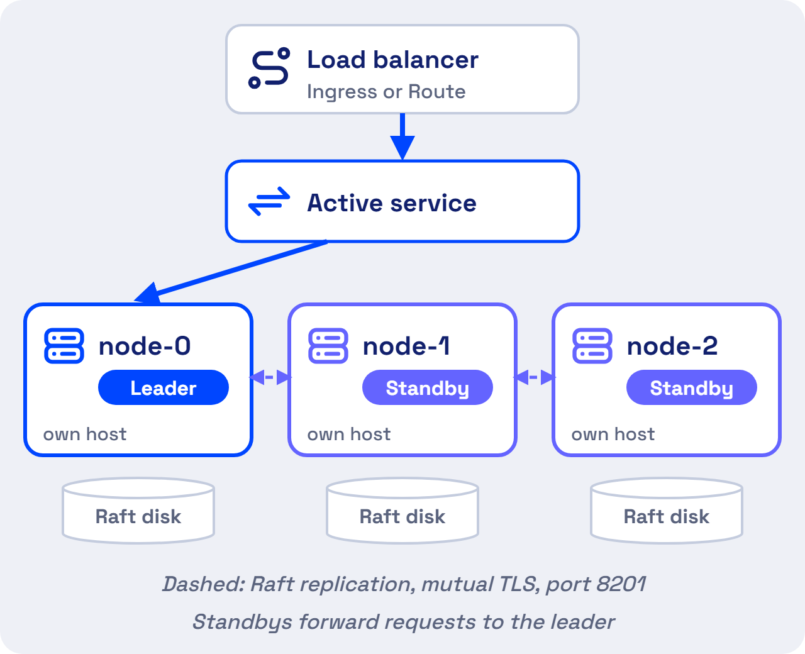

# High Availability, Backup and Day 2 Operations

Three Secrets Manager nodes keep serving secrets when any one of them fails. A snapshot agent copies the data to object storage every 15 minutes, so you can rebuild the cluster from a known point. Both features ship in the Helm chart and are off by default.

## Three Nodes Survive One Failure



- **One leader writes.** Standby nodes forward requests to the leader over mutual TLS, on the cluster port 8201.
- **A majority keeps the cluster up.** Three nodes survive the loss of one. Five nodes survive the loss of two.
- **Leader election is automatic.** When the leader fails, a standby takes over.
- **Applications keep working through a short outage.** A Kubernetes secret synced by the External Secrets Operator stays in place, and an SDK application keeps the value it already read. New logins wait until a leader is back.

!!! warning "A restarted node comes back sealed"
    A node that restarts rejoins only after you unseal it with 3 of the 5 unseal keys. Keep the key holders reachable. Without 3 keys the data cannot be recovered.

High availability protects against outages. It does not add throughput, because every write goes through the leader.

## Enable HA Mode With Three Replicas

Install the chart with HA and Raft storage turned on.

```bash
helm upgrade --install vault . -n accuknox \
  --set server.ha.enabled=true \
  --set server.ha.raft.enabled=true \
  --set server.ha.replicas=3
```

Initialize and unseal the first node, `vault-accuknoxsecretmanager-0`, as the [Deployment Guide](deployment.md) shows. Then join each other node to it and unseal that node too.

```bash
kubectl exec vault-accuknoxsecretmanager-1 -n accuknox -- \
  vault operator raft join http://vault-accuknoxsecretmanager-0.vault-accuknoxsecretmanager-internal:8200
```

[Confirm the join and unseal sequence for HA on v2.5.4.]

Run each pod on its own host. The chart leaves `server.affinity` empty, so set a pod anti-affinity rule on the hostname. The PodDisruptionBudget, on by default in HA mode, stops node maintenance from taking down a majority.

## Snapshots Save the Cluster Every 15 Minutes

The snapshot agent is a CronJob. It logs in with the Kubernetes auth method, takes a Raft snapshot from the leader, and uploads it to an S3-compatible bucket, which can run on-premises.

| Setting in `values.yaml` | Default | Meaning |
| --- | --- | --- |
| `snapshotAgent.enabled` | `false` | Turns the agent on |
| `snapshotAgent.schedule` | `*/15 * * * *` | Runs every 15 minutes |
| `snapshotAgent.config.s3ExpireDays` | `14` | Deletes snapshots after 14 days |
| `snapshotAgent.config.baoRole` | `snapshot` | The role the agent logs in with |
| `snapshotAgent.s3CredentialsSecret` | `my-s3-credentials` | The Kubernetes secret holding `AWS_ACCESS_KEY_ID` and `AWS_SECRET_ACCESS_KEY` |

Set `s3Host`, `s3Bucket` and `s3Uri` under `snapshotAgent.config` to point at your bucket. With the default schedule, a restore loses at most 15 minutes of secret changes.

## Restore From a Snapshot

Load the snapshot into a running cluster, then unseal it with the original unseal keys.

```bash
kubectl exec vault-accuknoxsecretmanager-0 -n accuknox -- vault operator raft snapshot restore <snapshot-file>
```

A snapshot holds encrypted data. The file alone exposes no secrets, and a restore needs the unseal keys.

[Add the disaster recovery design across data centers, with RTO and RPO targets and the failover and failback runbook.]

## Six Routine Jobs After Go-Live

| Job | What to do |
| --- | --- |
| Unseal after a restart | Any 3 of the 5 key holders unseal the node |
| Check backups | Confirm the snapshot CronJob succeeds and the bucket holds 14 days of files |
| Watch health | Turn on `serverTelemetry.serviceMonitor`, `prometheusRules` and `grafanaDashboard` for seal and HA status |
| Keep the audit log | Turn on `server.auditStorage` and forward the log to your SIEM. [Confirm the SIEM forwarding method.] |
| Upgrade one pod at a time | The StatefulSet uses the `OnDelete` update strategy. Delete the standby pods first, then the leader |
| Keep access tight | Retire the root token after you create the first admin. Revoke a token under **Access → Tokens** |

Two Raft commands help with node problems. `vault operator raft list-peers` shows the cluster members, and `vault operator raft remove-peer <node-id>` drops a dead node.

- - -
[SCHEDULE DEMO](https://www.accuknox.com/contact-us){ .md-button .md-button--primary }
