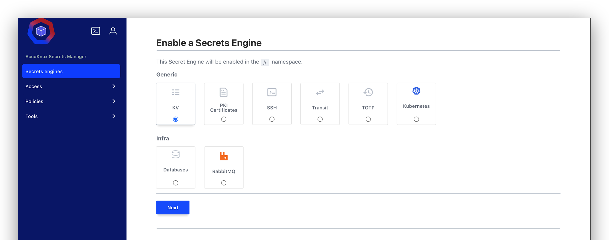

# AccuKnox Secrets Manager

AccuKnox Secrets Manager gives you one secure place to store, manage, and read sensitive data. It holds passwords, API keys, tokens, certificates, and other credentials.

It stops hardcoded secrets and secret sprawl. You get central storage, controlled access, encryption, authentication, and full audit logs.

!!! info "A separate product from the AccuKnox CNAPP platform"
    Secrets Manager ships and installs on its own. You do not need an AccuKnox CNAPP subscription to run it. Contact your AccuKnox point of contact for the Helm chart.

## Where to Go Next

-   :material-rocket-launch: **[Deployment Guide](deployment.md)**

    Install Secrets Manager on Kubernetes with Helm, then initialize and unseal it.

-   :material-key-variant: **[Storing Secrets in the KV Engine](kv-secrets.md)**

    Create, read, version, and delete a secret in the UI.

-   :material-shield-lock: **[Encryption as a Service](transit.md)**

    Encrypt and decrypt values with the Transit engine.

-   :material-cellphone-key: **[TOTP Authenticator](totp.md)**

    Generate and validate 6-digit MFA codes under policy control.

-   :material-account-multiple: **[Sharing Secrets in an Organisation](sharing-secrets.md)**

    Give each teammate a scoped account that reads only what they need.

-   :material-help-circle: **[Secrets Management FAQs](../faqs/secrets-manager.md)**

    Answers to the questions customers ask most often.

## Deployment Notes

- Runs in high-availability mode.
- Supports cloud, on-premises, and air-gapped deployments.
- AccuKnox CWPP hardens every instance.
- Supports regional deployments where data residency rules apply.

- - -
[SCHEDULE DEMO](https://www.accuknox.com/contact-us){ .md-button .md-button--primary }
