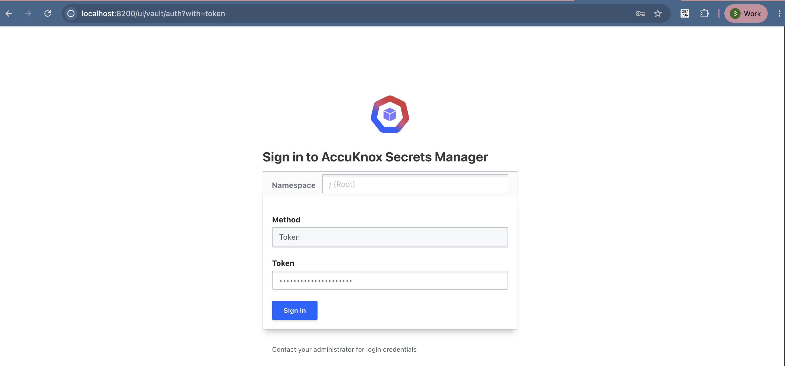
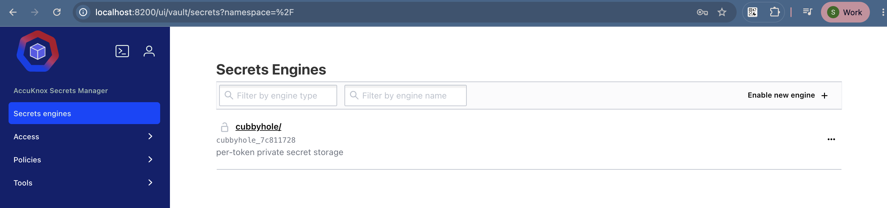
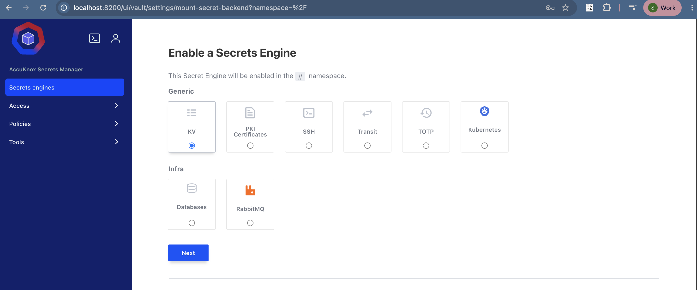
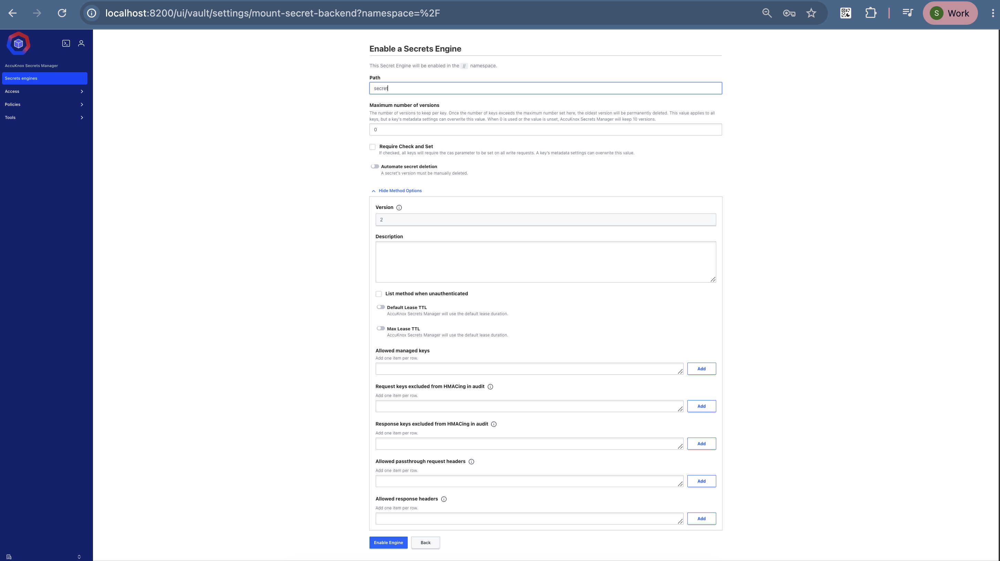
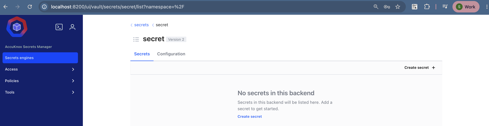
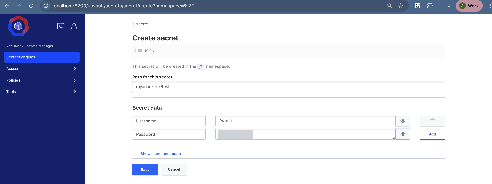
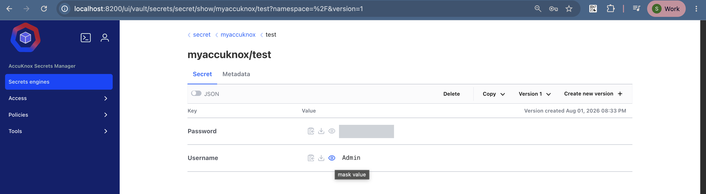
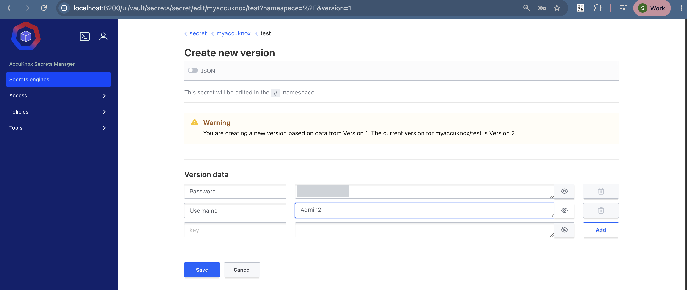
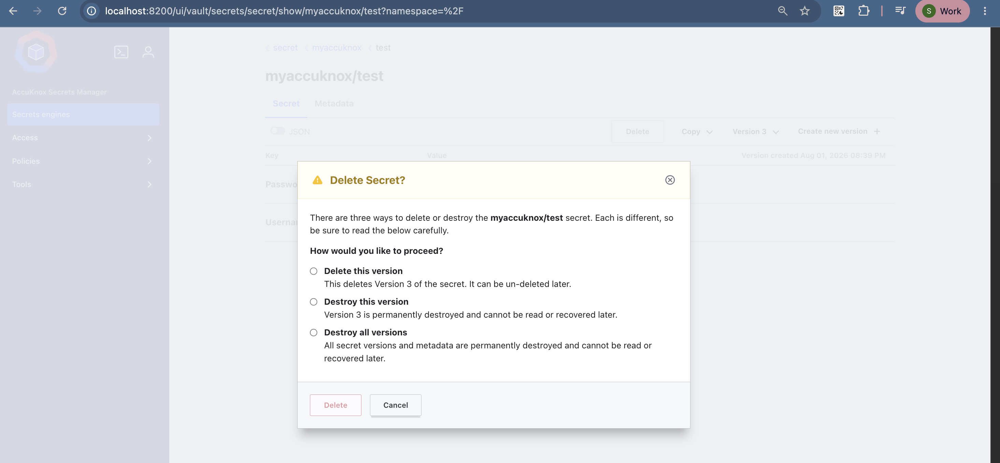
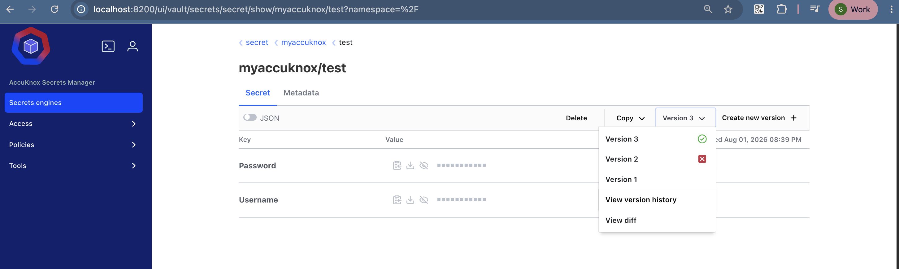

# Storing Secrets in Secrets Manager

The **KV (Key/Value)** secret engine stores static secrets. It is an encrypted, versioned store for passwords, API tokens, and configuration keys.

## What the KV Engine Gives You

| Feature | Description |
| --- | --- |
| Encrypted storage | Keeps sensitive text safe at rest and in transit. |
| Version control | Tracks every version of a secret, so you can roll back. |
| Drop-in compatibility | Matches standard Vault KV paths and commands. |

## Before You Start

You need a running Secrets Manager instance and a token that can enable engines. See the [Deployment Guide](deployment.md).

## Step 1: Sign In

Sign in to AccuKnox Secrets Manager.



You land on the **Secret Engines** dashboard.



Click **Enable new engine** to set up the engine you need.

## Step 2: Enable the KV Engine

Under **Secrets Engines**, select **KV (Key/Value)**.



Fill in these fields:

| Field | Value |
| --- | --- |
| Version | `2` |
| Path | `secret` |

Keep **Version** at `2`. Version 2 gives you versioning and rollback.

!!! tip "Choose a path that means something"
    The path can stand for a team, an environment, or a portal. To hold the credentials for your development environment and its backend, frontend, and database components, create a path such as `development-env`. Store all related secrets under it.

    This guide uses the path `secret`.

Click **Enable Engine**.



## Step 3: Create a Secret

You land on the `secret/` engine page. Click **Create secret**.



Fill in the secret:

1. Set **Path for this secret** to `myaccuknox/test`.
2. Add the key `username` with the value `Admin`.
3. Add the key `password` with your own value.
4. Click **Save**.

The secret path names the thing you are storing. Create one path per component, such as frontend, backend, or database, and store its credentials there.



## Step 4: Read the Secret Back

Go back to `secret/`. The path `myaccuknox/test` now appears in the list. Click it to see the keys.

The UI also gives you **Copy to clipboard** for the whole secret as JSON:

```json
{
  "username": "Admin",
  "password": "<your-password>"
}
```



## Step 5: Create a New Version

1. Click **Create new version**.
2. Change the username or the password.
3. Click **Save**.



Open the secret again. It now shows **Version 2** with your updated values.

## Step 6: Delete a Version

You can delete a single version without losing the rest of the history.

1. Click **Delete**.
2. Select the version to delete.
3. Confirm the deletion.



## Secret Versioning

Secrets Manager keeps the version history of every secret. A typical history reads:

1. **Version 1** is the original secret.
2. **Version 2** is a deleted version, marked with a red cross.
3. **Version 3** is the updated secret.

This gives you a clear record of every change to the secret.



!!! warning "Delete is not destroy"
    A deleted version stays recoverable until you destroy it. Use **Destroy** when you must remove the data for good.

## Next Steps

<div class="grid cards" markdown>

-   :material-account-multiple: **[Share this secret with your team](sharing-secrets.md)**

    Create a scoped user and an ACL policy that reads only this path.

-   :material-shield-lock: **[Encrypt data instead of storing it](transit.md)**

    Use the Transit engine when you want ciphertext in your own database.

</div>

- - -
[SCHEDULE DEMO](https://www.accuknox.com/contact-us){ .md-button .md-button--primary }
