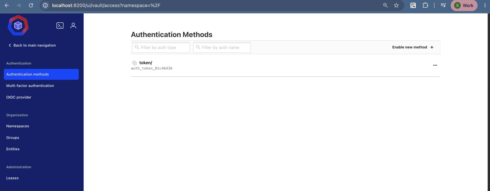
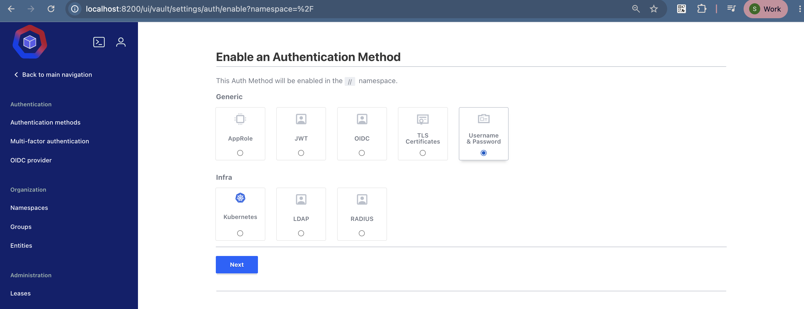
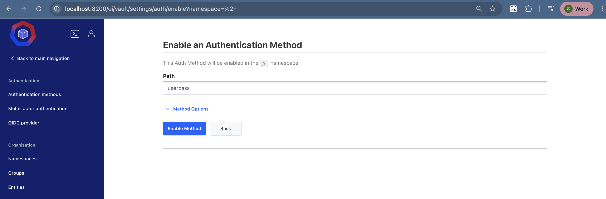
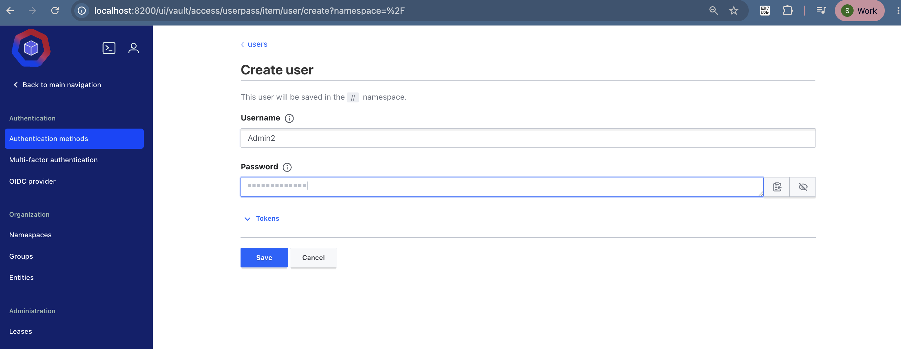
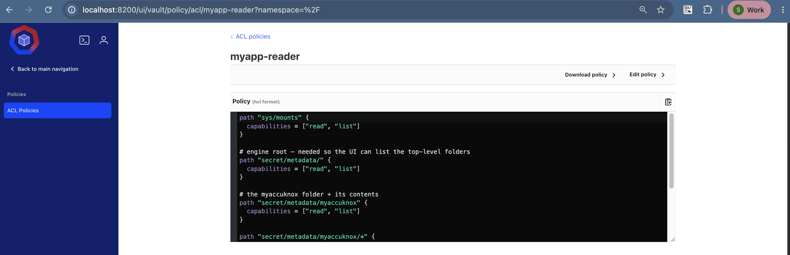
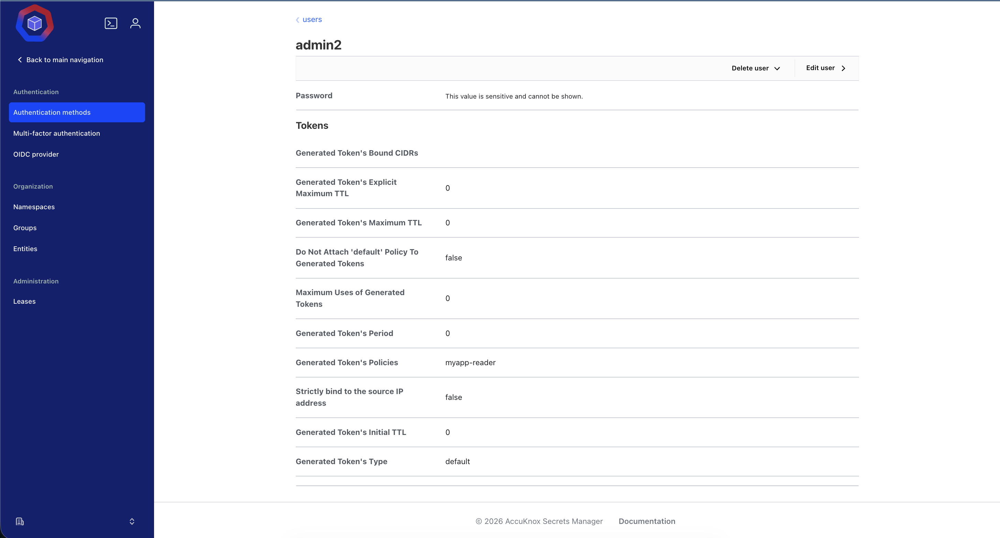
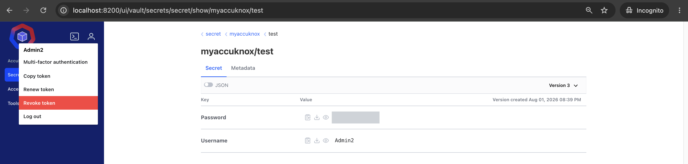

# Sharing Secrets Within an Organisation

Do not pass credentials around in chat messages, spreadsheets, or email. Give each person a scoped account in Secrets Manager instead. That account reads, or writes, only the secret paths its policy allows.

Every read leaves an audit record, and revoking access takes one change to a policy.

## What You Will Build

1. A `userpass` authentication method, so people sign in with a username and a password.
2. A user account for one teammate.
3. An ACL policy that grants read access to one secret path only.
4. A verification sign-in that proves the scope works.

This guide uses the secret path `myaccuknox/test` from [Storing Secrets in the KV Engine](kv-secrets.md).

## Step 1: Enable the Username and Password Method

Go to **Access → Auth Methods**.



Select **Generic and Infra** as the category, choose **Username & Password**, then click **Next**.



Click **Enable new method** to configure it.


Enter a name for the path, such as `userpass`, then click **Enable Method**.



## Step 2: Create the User

Go to **Users → Create user** and fill in these fields:

| Field | Value |
| --- | --- |
| Username | The teammate's username, such as `admin2` |
| Password | A strong password you share once, through a safe channel |

Click **Save** to create the user.



!!! tip "Make the user change the password"
    Send the first password through a channel you trust, then tell the person to change it after the first sign-in.

## Step 3: Write the ACL Policy

Go to **Policies → Create ACL policy**, name it `myapp-reader`, and paste this policy:

```hcl
path "sys/mounts" {
  capabilities = ["read", "list"]
}

# engine root, so the UI can list the top-level folders
path "secret/metadata/" {
  capabilities = ["read", "list"]
}

# the myaccuknox folder and everything inside it
path "secret/metadata/myaccuknox" {
  capabilities = ["read", "list"]
}

path "secret/metadata/myaccuknox/*" {
  capabilities = ["read", "list"]
}

path "secret/data/myaccuknox" {
  capabilities = ["read", "list"]
}

path "secret/data/myaccuknox/*" {
  capabilities = ["read", "list"]
}
```

Click **Save**.



### How the Policy Works

The KV v2 engine splits each secret into two paths, so a read-only policy needs both.

| Path prefix | What it holds |
| --- | --- |
| `secret/metadata/...` | Version history and the folder listing the UI shows |
| `secret/data/...` | The secret values themselves |
| `sys/mounts` | The list of enabled engines, which the UI reads on load |

To let the person write secrets as well, add `create`, `update`, and `delete` to the `secret/data/myaccuknox/*` block.

!!! warning "Grant the narrowest path that works"
    A policy on `secret/data/*` opens every secret in the engine. Name the folder, as this policy does, so the account cannot read another team's credentials.

## Step 4: Attach the Policy to the User

Open the user you created. Under **Generated Token Policies**, select and attach `myapp-reader`.



A token that already exists does not pick up a new policy. The person must sign out and sign in again.

## Step 5: Verify the Scope

1. Sign in as the new user, for example `admin2`.
2. Go to **Secrets → myaccuknox → test**.
3. Confirm that the secret is visible and readable.
4. Try a path outside the policy and confirm that Secrets Manager denies it.



Both results together prove the account works: it reads what it should, and nothing else.

## Sharing One-Off Sensitive Text

Sometimes you need to send a value to one person rather than grant standing access. Use the [Transit engine](transit.md) for that.

1. You encrypt the text with a Transit key and get a ciphertext back.
2. You send the ciphertext through any channel, because the plaintext is not in it.
3. The other person signs in to Secrets Manager and decrypts it.

The plaintext never travels, and the audit log records who decrypted it.

## Revoking Access

| Goal | Action |
| --- | --- |
| Remove one person's access | Delete the user under the `userpass` method |
| Narrow what a group can read | Edit the ACL policy and have the members sign in again |
| Cut off an active session now | Revoke the token under **Access → Tokens** |
| Retire a shared credential | Rotate the secret value, then create a new version |

## Next Steps

<div class="grid cards" markdown>

-   :material-cellphone-key: **[Share an MFA account safely](totp.md)**

    Hold the TOTP secret centrally instead of on one person's phone.

-   :material-key-variant: **[Store more secrets](kv-secrets.md)**

    Add one path per component and version each change.

</div>

- - -
[SCHEDULE DEMO](https://www.accuknox.com/contact-us){ .md-button .md-button--primary }
