# TOTP Authenticator

The TOTP secret engine generates time-based credentials that follow the TOTP standard. It also creates new keys and validates the codes those keys produce.

TOTP works in two modes:

- **As a generator**, it replaces an app such as Google Authenticator. Secrets Manager holds the shared secret and produces the rolling 6-digit codes.
- **As a provider**, it validates codes that a user submits, the same way a sign-in service does.

The generator mode adds security that a phone app cannot give you. Policies guard who may produce a code, and Secrets Manager audits every request. That makes it a good fit for shared team accounts, such as a cloud root account or a shared CI account.

## The Access Model

TOTP has three privileged operations. Keep them separate.

| Operation | Path | Capability |
| --- | --- | --- |
| Manage keys (create, rotate, delete) | `totp/keys/*` | `create`, `read`, `update`, `delete`, `list` |
| Generate a code | `totp/code/*` (read) | `read` |
| Validate a submitted code | `totp/code/<name>` (write) | `create`, `update` |

!!! danger "`read` on `totp/code/*` can fabricate codes"
    Anyone who can read that path can produce a valid one-time password for the account. That defeats the point of MFA. Grant `read` on `totp/code/*` only to the identities that must generate codes, and audit it.

## Before You Start

You need a running Secrets Manager instance. See the [Deployment Guide](deployment.md).

Run every command in this guide inside the server pod:

```sh
kubectl exec -n accuknox vault-accuknoxsecretmanager-0 -- vault <command...>
```

## Step 1: Enable the TOTP Engine

1. Open the Secrets Manager UI at `http://localhost:8200/ui/vault/`.
2. Under **Secrets Engines**, select **TOTP**.
3. Set **Path** to `totp`.
4. Click **Enable Engine**.

`totp/` now appears in your Secrets list. Clicking it shows an empty engine, because the TOTP engine has no UI forms. The next steps use the CLI.

## Step 2: Create the Portal User

This example manages the MFA secret for an AccuKnox portal user.

In the AccuKnox portal, go to **Settings → User Management** and click **+ Add user**.

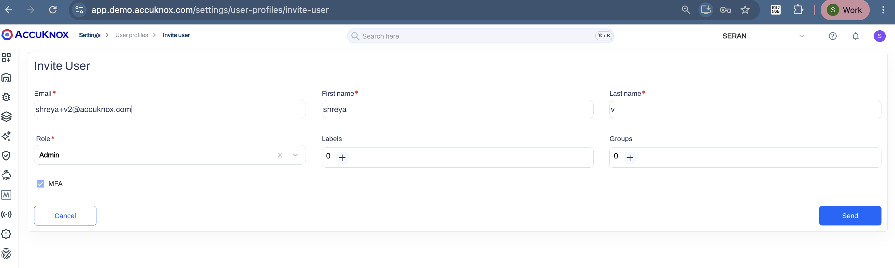

Sign in as that user with the username and password, then click **Sign in** to generate the MFA secret key.

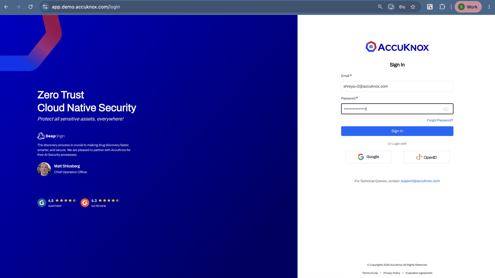

The portal shows a QR code and a manual-entry secret key. Copy the secret key now. The portal shows it one time only.

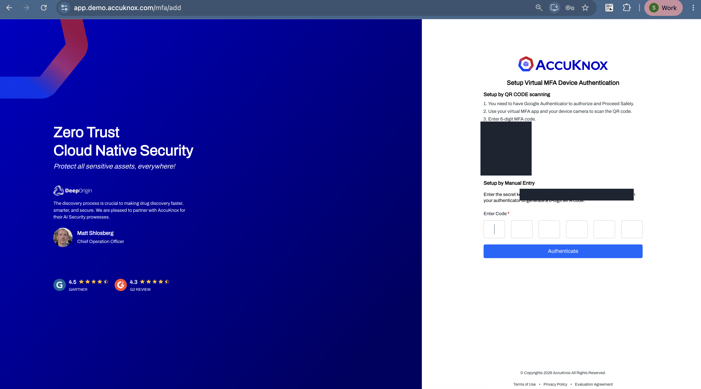

!!! warning "Treat the MFA secret key as a credential"
    Anyone who holds this key can generate valid codes for the account. Move it into Secrets Manager and delete every other copy.

## Step 3: Store the Key in Secrets Manager

Write the key as an `otpauth://` URL:

```sh
kubectl exec -n accuknox vault-accuknoxsecretmanager-0 -- \
  vault write totp/keys/accuknox-demo \
  url="otpauth://totp/Accuknox-Demo:you@demo.com?secret=<mfa-secret-key>&issuer=Accuknox-Demo"
```

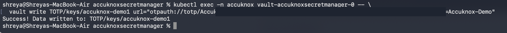

Repeat the command with a different key name for each account you manage.

List the keys to confirm the write:

```sh
kubectl exec -n accuknox vault-accuknoxsecretmanager-0 -- vault list totp/keys
```

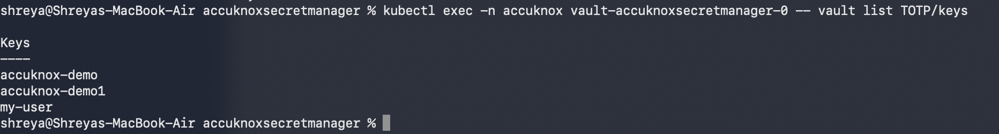

## Step 4: Generate a Code

```sh
kubectl exec -n accuknox vault-accuknoxsecretmanager-0 -- vault read totp/code/accuknox-demo
```

```text
Key     Value
---     -----
code    523844
```

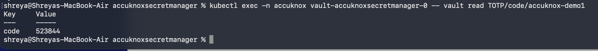

The code rotates every 30 seconds. Use it right away.

## Step 5: Sign In with the Code

Type the 6-digit code into the portal and click **Authenticate**.

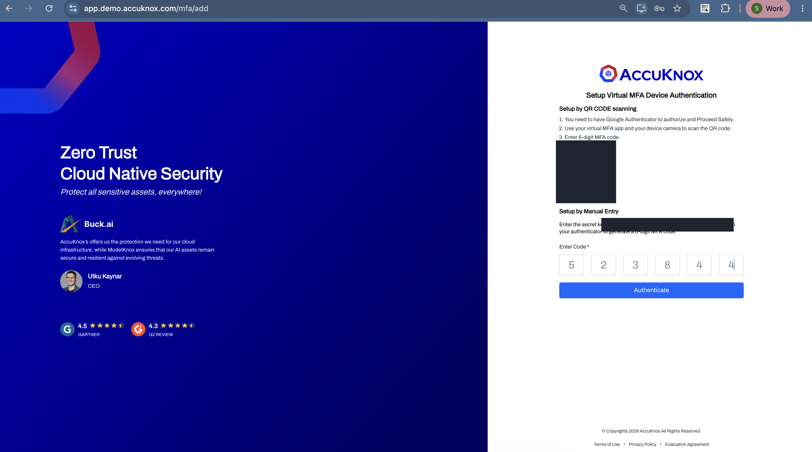

The portal accepts the code and asks the new user to set a password.

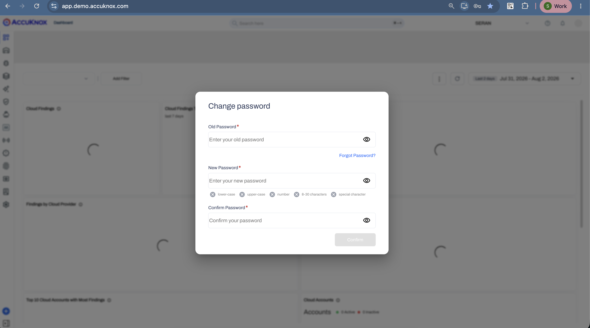

This proves the flow end to end. Secrets Manager holds the shared secret, generates the code, and the portal accepts it.

## Step 6: Validate a Code

Secrets Manager can also act as the validator. Write the code back to the same path:

```sh
kubectl exec -n accuknox vault-accuknoxsecretmanager-0 -- \
  vault write totp/code/accuknox-demo code=523844
```

The output reads `valid true`.

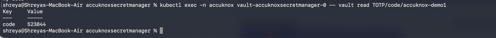

If it reads `valid false`, the 30-second window closed. Read a fresh code and validate it at once.

## Step 7: Write the Access Policies

Create one policy per role. Go to **Policies → Create ACL policy**, name the policy, paste the rules, and click **Save policy**.

=== "`totp-key-admin`"

    Full management of keys and codes. Give this to your platform team only.

    ```hcl
    # manage keys (create, rotate, delete)
    path "totp/keys/*" {
      capabilities = ["create", "read", "update", "delete", "list"]
    }

    path "totp/keys/" {
      capabilities = ["list"]
    }

    # generate and validate codes
    path "totp/code/*" {
      capabilities = ["create", "read", "update", "list"]
    }
    ```

=== "`totp-code-reader`"

    Generates codes but cannot change keys. Give this to the people who sign in to the shared account.

    ```hcl
    path "totp/keys/" {
      capabilities = ["list"]
    }

    path "totp/code/*" {
      capabilities = ["read"]
    }
    ```

=== "`totp-validator`"

    Validates submitted codes but cannot generate them. Give this to your sign-in service.

    ```hcl
    path "totp/code/*" {
      capabilities = ["create", "update"]
    }
    ```

## Step 8: Create Users and Attach the Policies

1. Go to **Access → Auth Methods → Enable new method**.
2. Select **Username & Password** and set the path to `userpass`.
3. Click **Enable Method**.
4. Open the **Username & Password** row and click **Create user**.
5. Under **Generated Token Policies**, attach the policy for that person's role.

The [Sharing Secrets](sharing-secrets.md) guide covers this flow with screenshots.

## Step 9: Verify the Policy

Sign in as the new user and read its token policies:

```sh
kubectl exec -n accuknox vault-accuknoxsecretmanager-0 -- \
  vault login -method=userpass username=admin2 password=<password>
```

Confirm that `token_policies` lists the policy you attached.

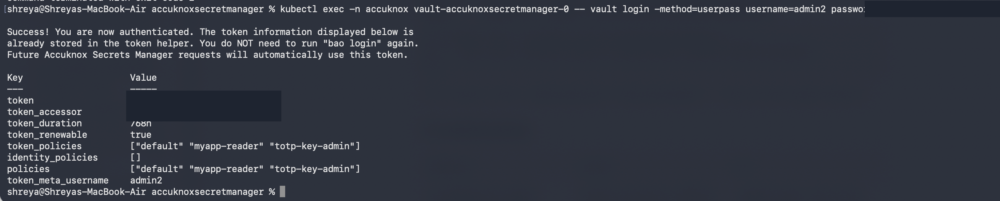

Then confirm what the policy allows. Create a key with `generate=true`, which needs the key-admin capability:

```sh
kubectl exec -n accuknox vault-accuknoxsecretmanager-0 -- \
  vault write totp/keys/verify-key generate=true issuer=test account_name=verify@test.com
```

Secrets Manager returns a barcode and an `otpauth://` URL for the new key. Both are key material, so handle them the same way you handle a password.

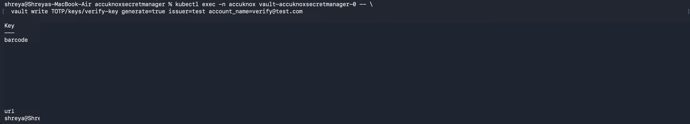

List the keys to see the new one:

```sh
kubectl exec -n accuknox vault-accuknoxsecretmanager-0 -- vault list totp/keys
```

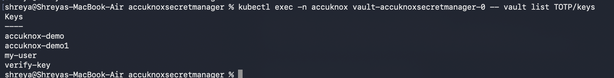

## Troubleshooting

| Symptom | Cause | Fix |
| --- | --- | --- |
| `no handler for route "totp/keys/..."` | The engine sits at a different path, such as `TOTP/` | Run `vault secrets list` and use the real path |
| `permission denied` on a path | The policy does not grant it, or the token predates the policy | Edit the policy, then sign out and sign in again |
| `valid false` on a fresh code | The code rotated past its 30-second window | Read the code again and validate it at once |
| `localhost:8080` kubectl error | `KUBECONFIG` is not set in your shell | Export `KUBECONFIG` with the path to your kubeconfig file |

!!! note "Paths are case-sensitive"
    `totp/` and `TOTP/` are two different mounts. Pick one spelling and use it in every command and every policy.

## Next Steps

<div class="grid cards" markdown>

-   :material-account-multiple: **[Share secrets with your team](sharing-secrets.md)**

    Create scoped users and attach least-privilege policies.

-   :material-shield-lock: **[Encryption as a service](transit.md)**

    Encrypt and decrypt values with the Transit engine.

</div>

- - -
[SCHEDULE DEMO](https://www.accuknox.com/contact-us){ .md-button .md-button--primary }
