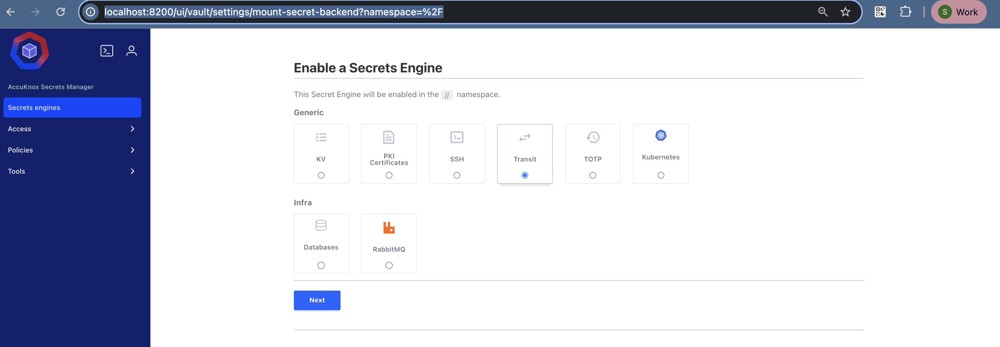
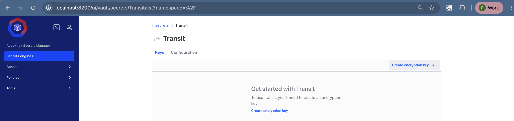
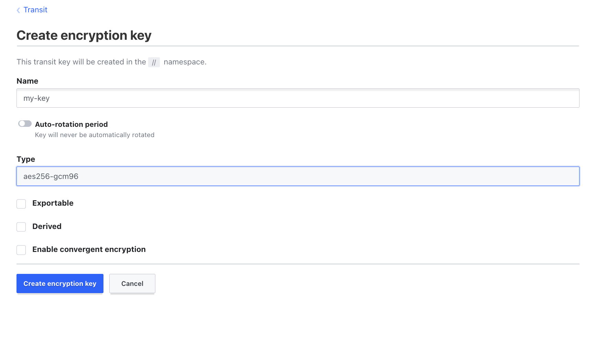
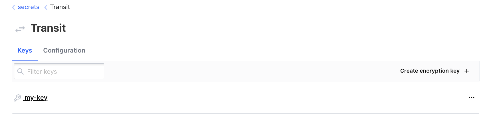
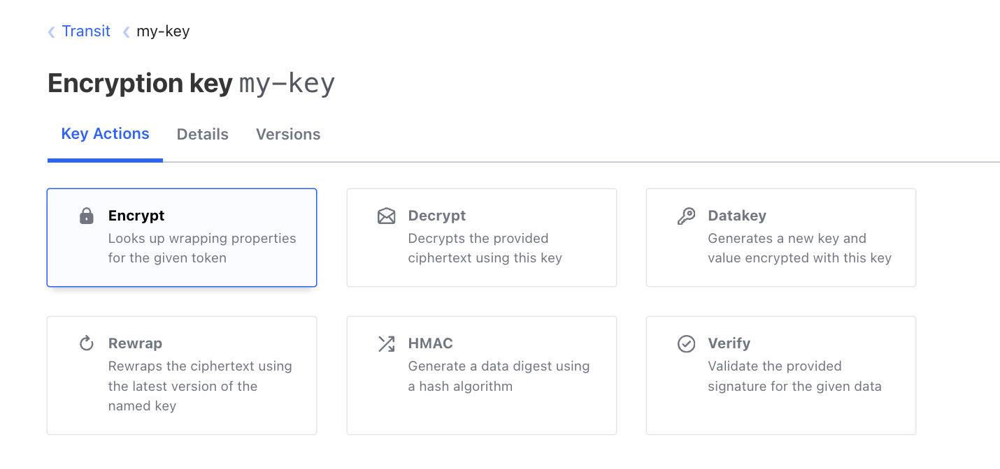
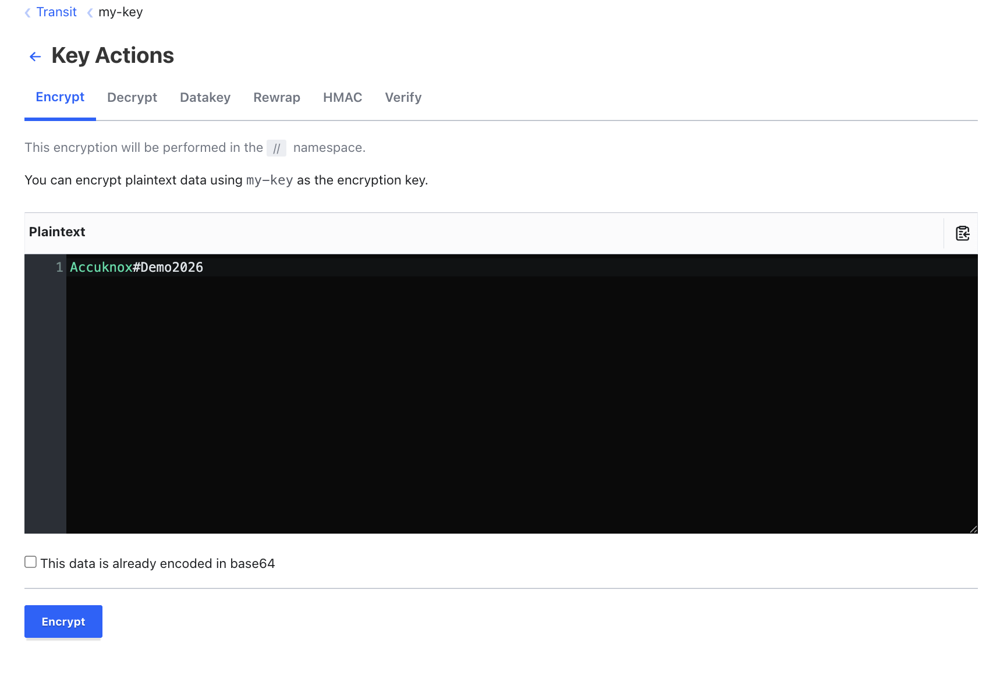
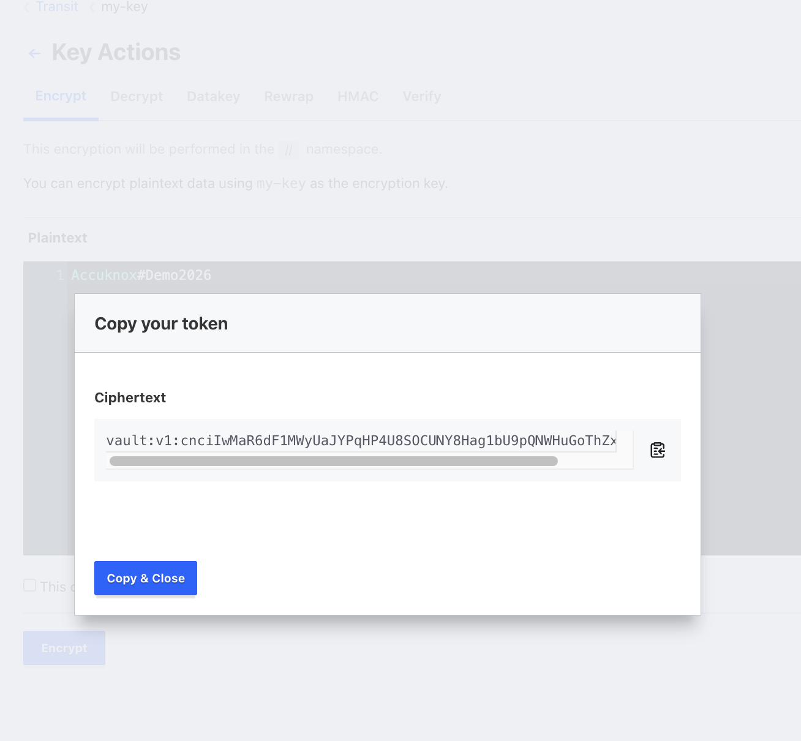
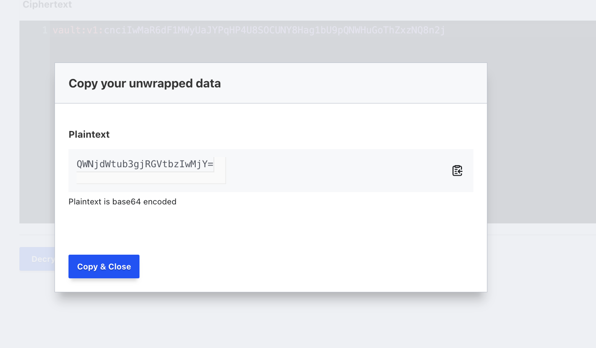
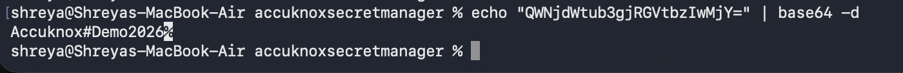

# Encryption as a Service: Transit Secret Engine

The Transit secret engine runs cryptographic operations on data in transit. Secrets Manager never stores the data you send it. Think of Transit as cryptography as a service.

Transit signs and verifies data, generates hashes and HMACs, and returns random bytes.

The main use case is application data. Your application sends plaintext, gets ciphertext back, and stores the ciphertext in its own database. This moves the job of correct encryption away from application developers and onto the Secrets Manager operators.

Transit also protects credentials and sensitive text that people share inside an organisation. Person A encrypts the text in Secrets Manager and sends the ciphertext to Person B. Person B signs in to Secrets Manager and decrypts it.

## What Transit Is For

| Task | Example |
| --- | --- |
| Encrypt data at rest | A database password, an API key, or a config value. Store the ciphertext, never the plaintext. |
| Sign and verify | Detect tampering on a payload. |
| HMAC | Run integrity checks and message authentication. |
| Key rotation | Rotate a key without re-encrypting old data. Old ciphertext still decrypts. |

!!! info "Transit stores keys, not data"
    Secrets Manager holds the encryption key and throws the plaintext away. Your application keeps the ciphertext. Losing the Transit key means losing access to every value it encrypted.

## Step 1: Enable the Transit Engine

1. Under **Secrets Engines**, select **Transit**.
2. Set **Path** to `transit`.
3. Click **Enable Engine**.



## Step 2: Create an Encryption Key

Click `transit/` in your Secrets list, then click **Create encryption key**.



Fill in these fields:

| Field | Value |
| --- | --- |
| Name | `my-key` |
| Type | `aes256-gcm96` |

`aes256-gcm96` is the default symmetric type. Use it unless you need signing, in which case pick an asymmetric type such as `ed25519`.

Click **Create key**.



The key now appears with its version and its supported operations.



## Step 3: Encrypt a Value

On the `transit/my-key` page, open the **Encrypt** tab.



Type your value into **Plaintext**. This example uses `Accuknox@Demo#2026`.



Click **Encrypt**. Transit returns a ciphertext that starts with a key version prefix:

```text
vault:v1:cnciIwMaR6dF1MWyUaJYPqHP4U8SOCUNY8Hag1bU9pQNWHuGoThZxzNQ8n2j
```



Copy the ciphertext. This is the value you store in your config file or your database. The plaintext is gone, and only Secrets Manager can decrypt it.

The `v1` prefix records which key version encrypted the value. After you rotate the key, new values carry `v2`, and Transit still decrypts the `v1` values.

## Step 4: Decrypt the Value

1. Open the **Decrypt** tab on the same key.
2. Paste the ciphertext.
3. Click **Decrypt**.

Transit returns the plaintext base64-encoded:

```text
QWNjdWtub3gjRGVtbzIwMjY=
```



!!! note "Transit always returns base64"
    Transit encodes plaintext as base64 on the way out. Decode it once to read the real value.

## Step 5: Decode the Plaintext

```shell
echo "QWNjdWtub3gjRGVtbzIwMjY=" | base64 -d
```



The command prints your original value.

## Next Steps

<div class="grid cards" markdown>

-   :material-account-multiple: **[Share encrypted text with a colleague](sharing-secrets.md)**

    Give the other person read access to the same Transit key.

-   :material-cellphone-key: **[Set up TOTP codes](totp.md)**

    Generate and validate 6-digit MFA codes under policy control.

</div>

- - -
[SCHEDULE DEMO](https://www.accuknox.com/contact-us){ .md-button .md-button--primary }
