# Sync a Database Password Into a Kubernetes App

WordPress needs a MySQL password, and most clusters keep that password in a Kubernetes secret that somebody created by hand. This walkthrough moves the password into AccuKnox Secrets Manager. The External Secrets Operator keeps the Kubernetes secret in step with it, and WordPress keeps reading the same Kubernetes secret with no code change.

The walkthrough runs on any Kubernetes cluster with one namespace and two deployments, WordPress and MySQL.

## Watch the Two-Minute Demo

[YouTube video: replace this line with the embed for the WordPress and MySQL demo.]

<!-- Embed template. Swap VIDEO_ID, then delete the bracket line above.
<iframe width="560" height="315" src="https://www.youtube.com/embed/VIDEO_ID" frameborder="0" allow="accelerometer; autoplay; clipboard-write; encrypted-media; gyroscope; picture-in-picture; web-share" referrerpolicy="strict-origin-when-cross-origin" allowfullscreen></iframe>
-->

## What You Need

| Requirement | Details |
| --- | --- |
| Secrets Manager | Running, with a KV version 2 engine at `secret`. See the [Deployment Guide](deployment.md) |
| External Secrets Operator | Installed in the cluster, with a ready `ClusterSecretStore`. See [External Secrets Operator](external-secrets.md) |
| A role and a policy | Role `demo-access`, which reads `demo/mysql` only |
| `kubectl` | Pointed at the cluster |

## 1. Store the Password and Write the Sync Rule

The password lives in Secrets Manager under the path `demo/mysql`, with the key `password`.

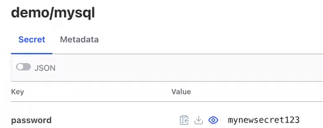

The `ExternalSecret` tells the operator to copy that value into a Kubernetes secret named `mysql-pass`, and to check for changes every 10 seconds.

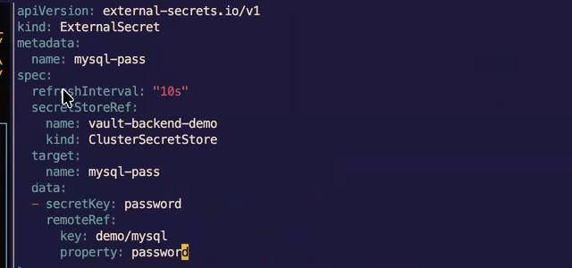

## 2. Apply It and Watch Kubernetes Follow Secrets Manager

Apply the `ExternalSecret`.

```bash
kubectl apply -f demo-access-mysql.yaml
```

The operator creates `mysql-pass` straight away, holding the value from Secrets Manager.

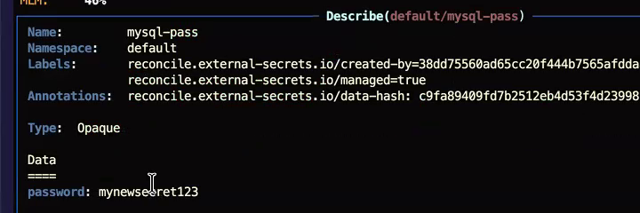

Now change the value in Secrets Manager. Open `demo/mysql`, click **Create new version**, enter a new password and click **Save**.

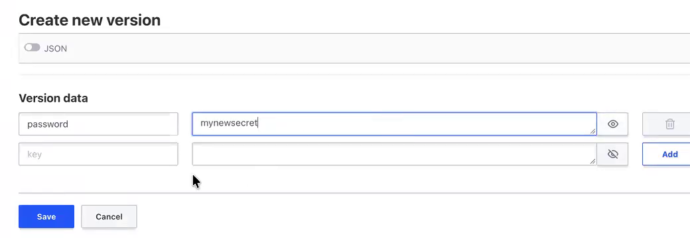

Within about 10 seconds, `mysql-pass` holds the new value. Nobody touched Kubernetes.

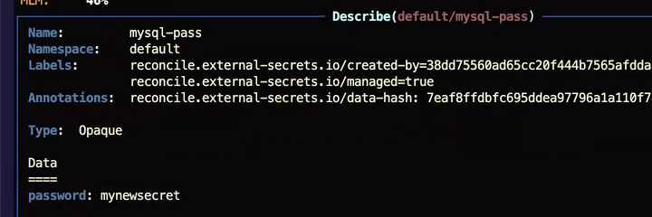

## 3. Deploy WordPress and MySQL Unchanged

The demo uses the standard WordPress and MySQL example from the Kubernetes documentation.

```bash
kubectl apply -f https://k8s.io/examples/application/wordpress/mysql-deployment.yaml
kubectl apply -f https://k8s.io/examples/application/wordpress/wordpress-deployment.yaml
```

WordPress reads its database password from `mysql-pass` through `secretKeyRef`. The deployment file is the stock one, and the application code does not change.

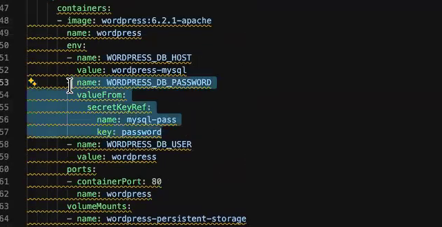

WordPress connects to MySQL and loads.

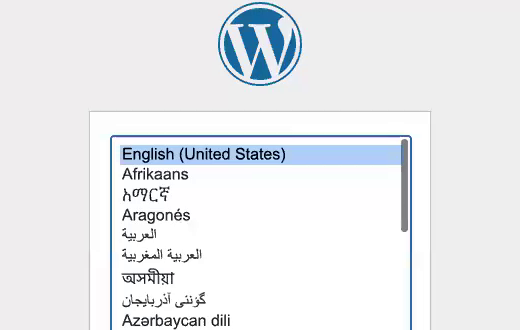

## 4. Break the Connection on Purpose

Change the MySQL password by hand, so the database no longer matches the Kubernetes secret. Open a shell in the MySQL pod, run `mysql -u root -p`, then run:

```sql
ALTER USER 'wordpress'@'%' IDENTIFIED WITH caching_sha2_password BY '<new-password>';
FLUSH PRIVILEGES;
```

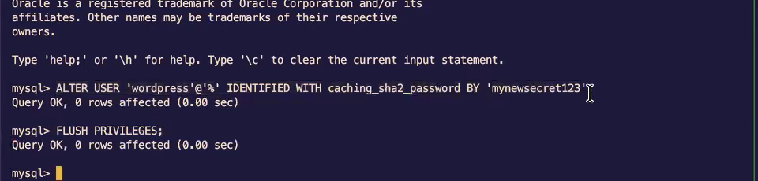

WordPress can no longer log in to MySQL.

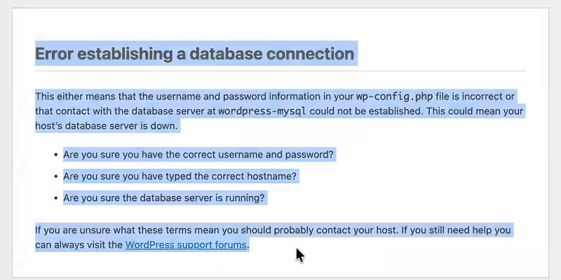

## 5. Update Secrets Manager, Then Restart WordPress

Save the new password in Secrets Manager as a new version of `demo/mysql`. The operator syncs it into `mysql-pass` within the refresh interval.

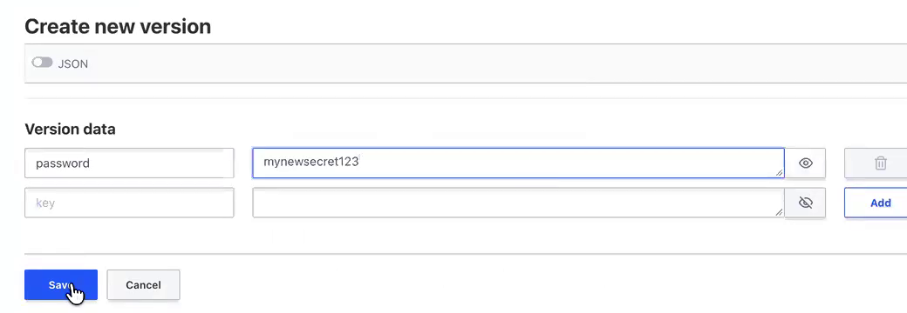

The running WordPress pod still holds the old password, because it read the secret when it started. Restart it.

```bash
kubectl rollout restart deployment/wordpress
```

The demo deletes the pod from k9s, which has the same effect: Kubernetes starts a new pod.

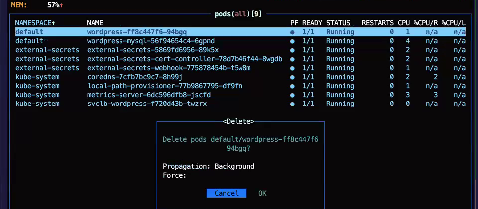

The new pod reads the updated `mysql-pass`.

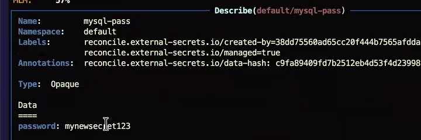

WordPress connects to MySQL again.

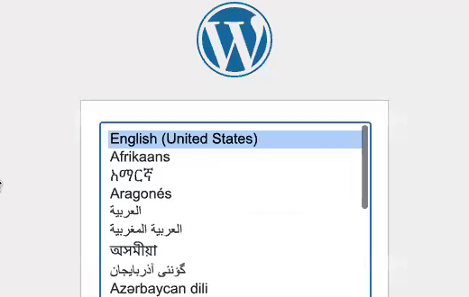

!!! warning "The sync alone does not fix a running application"
    The operator updated the Kubernetes secret, and the restart made WordPress use it. Plan a restart, or a rolling restart, after every password change.

## The Password Lives in One Place

- The password lives in one place, Secrets Manager, with versions and an audit log.
- WordPress code and its deployment file stay unchanged.
- A change in Secrets Manager reaches Kubernetes within the refresh interval you set.

## The Namespace Still Holds a Copy

- `mysql-pass` holds a copy of the password. Anyone with read access to the namespace can read it there. To keep the secret out of the namespace, call Secrets Manager from the application with the [SDK](sdk-integration.md).
- The demo changes the password by hand. In production, the application logic or a rotation job can write the new version.

- - -
[SCHEDULE DEMO](https://www.accuknox.com/contact-us){ .md-button .md-button--primary }
