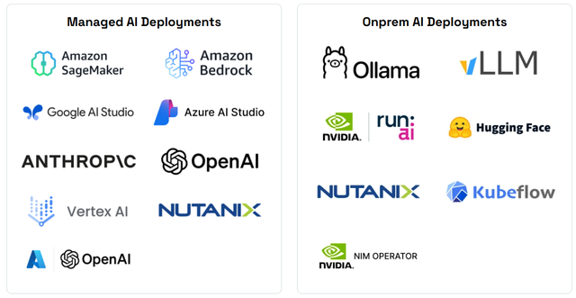
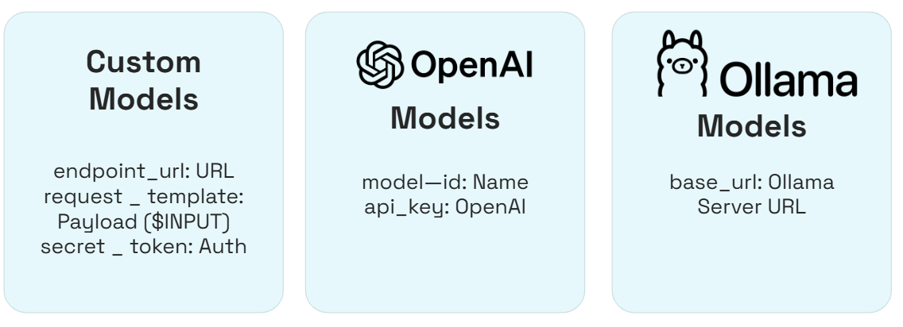
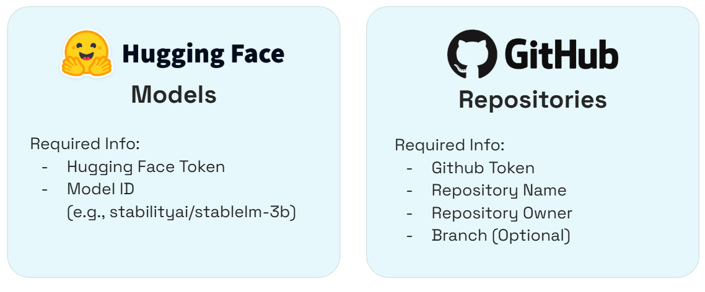
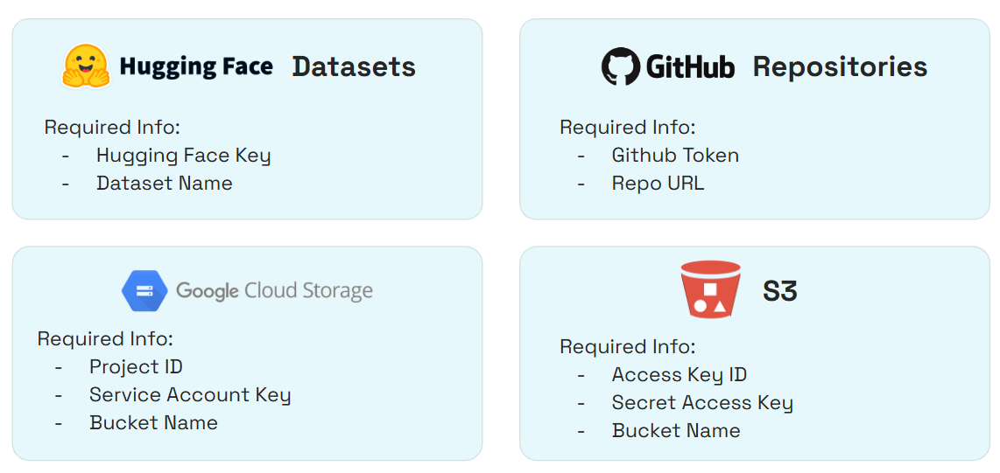

# AI/ML Security Support Matrix

Here's a list of of the AI/ML security features supported by AccuKnox. It outlines the various AI/ML frameworks, libraries, and tools that are compatible with AccuKnox's security solutions, ensuring that users can effectively secure their AI/ML workloads.

!!! note "Useful Links"
    - For onboarding refer to the [**AI/ML Onboarding Guide**](https://help.accuknox.com/how-to/aiml-overview/)
    - For use cases refer to the [**AI/ML Security Use Cases**](https://help.accuknox.com/use-cases/aiml-usecases/)

## On-Prem LLM Onboarding

## ML Static Scan / Model Scanning

## Model/Dataset Scan via Collectors

