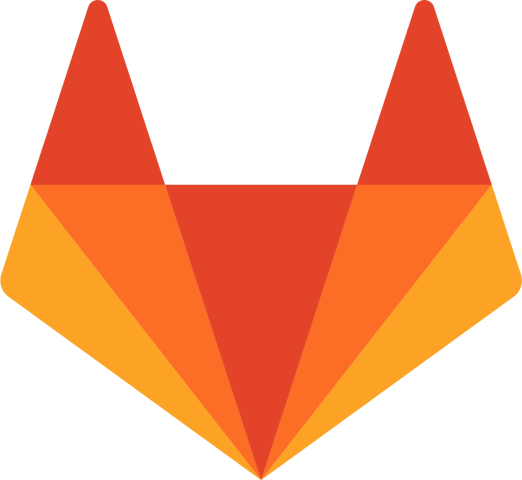
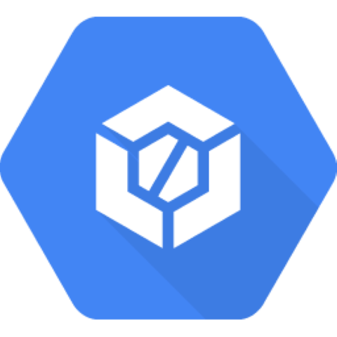
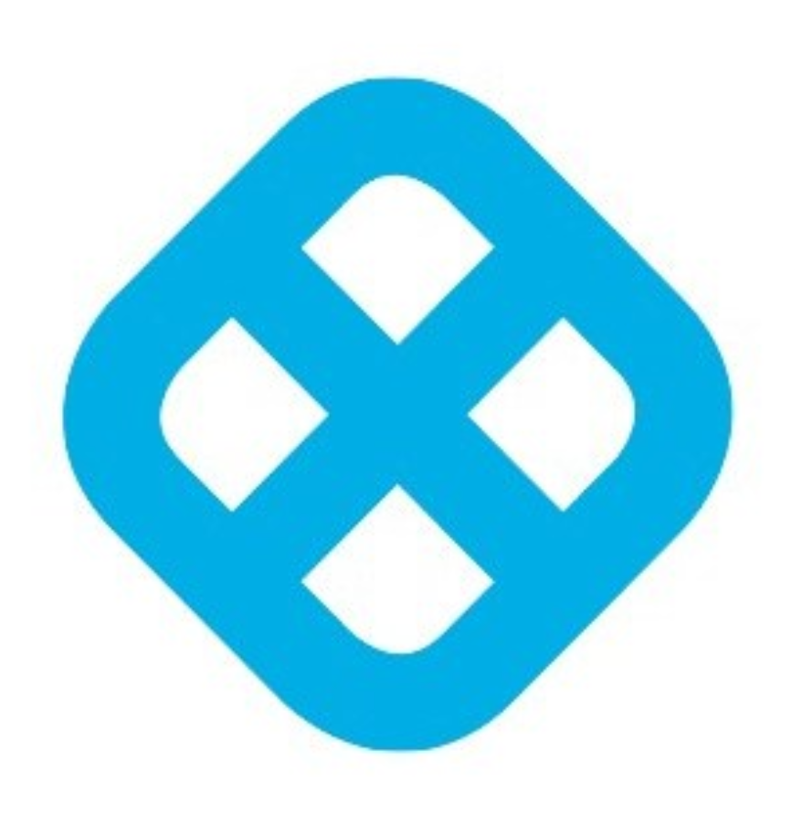

---
title:
description: Check out the integration mechanisms and feature availability for key DevOps and security functionalities across popular CI/CD platforms.
hide:
    - toc
---

# CI/CD Support Matrix

::cards:: cols=3

- title: Azure DevOps
  image: ./cicd-icons/azure.png
  url: /integrations/azure-dast/

- title: Google Cloud Build
  image: ./cicd-icons/gcp.png
  url: /integrations/google-dast/

- title: Harness
  image: ./cicd-icons/harness.png
  url: /integrations/harness-dast/

- title: Jenkins
  image: ./cicd-icons/jenkins.png
  url: /integrations/jenkins-dast/

- title: AWS Code Pipeline
  image: ./cicd-icons/aws.png
  url: /integrations/aws-dast/

- title: GitHub
  image: ./cicd-icons/github.png
  url: /how-to/private-github-repo-onboarding/

- title: Gitlab
  image: ./cicd-icons/gitlab.png
  url: /integrations/gitlab-dast/

- title: Bitbucket
  image: ./cicd-icons/bitbucket.png
  url: /integrations/bitbucket-dast/

::/cards::

**CI/CD Support Matrix** provides a structured overview of supported capabilities and integration types across popular CI/CD platforms. This helps teams align their DevOps processes with available tools and identify the best fit for their workflows.

This document outlines the integration mechanisms (workflow file, plugin, or native integration) and feature availability for key DevOps and security functionalities such as SAST, DAST, Infrastructure-as-Code (IaC) scanning, container security, secrets scanning, and pipeline monitoring.

By understanding the support landscape for each CI/CD tool, teams can streamline their pipelines while ensuring compliance, security, and efficiency.

---

## **Integration Types**

These are the three supported methods for integrating CI/CD tools with AccuKnox :-

1. **Workflow File**:

    - **Description**: A workflow file is a configuration file within the CI/CD tool where you define the steps of your build, test, and deploy pipeline. It allows you to automate tasks using specific syntax and structure (often YAML or JSON).

2. **Plugin Support**:

    - **Description**: This method refers to using external plugins to extend the functionality of the CI/CD tool. Plugins integrate the tool with third-party services or features, such as code scanning, security checks, or deployment to cloud platforms.

3. **Native Integration**:

    - **Description**: Native integration refers to the seamless, built-in capability of AccuKnox to directly connect with CI/CD tools and platforms, without the need for external plugins. This method utilizes the internal features of AccuKnox to interact with and manage security policies, scans, and assessments within the CI/CD pipeline.

---

| CI/CD Tool                                                     | Workflow file (Direct Steps) | Plugin Support | Native Integration (IaC) |
| -------------------------------------------------------------- | ------------- | -------------- | ------------------------ |
|  **GitHub Actions**  | Available     | Available      | Available                |
|  **GitLab CI/CD**      | Available     | Available      | Available                |
|  **Jenkins**               | Available     | Available      | Coming Soon                      |
|  **Azure DevOps**       | Available     | Available            | Coming Soon                      |
|  **AWS CodePipeline** | Available     | Coming Soon            | Coming Soon                      |
|  **Bitbucket**         | Available     | Available      | Available                |
|  **CircleCI**              | Available     | Coming Soon            | Coming Soon                      |
|  **GCP Cloud Build**   | Available     | Coming Soon            | Coming Soon                      |
|  **Harness**               | Available     | Coming Soon            | Coming Soon                      |

---

## Feature Support Table (Plugins)

| CI/CD Tool                                                     | SAST      | DAST      | IaC Scanning | Container Scanning | Secrets Scanning | CI/CD Pipeline Monitoring |
| -------------------------------------------------------------- | --------- | --------- | ------------ | ------------------ | ---------------- | ------------------------- |
|  **GitHub Actions**  | Available       | Available       | Available    | Available                    | Available        | Available                 |
|  **GitLab CI/CD**      | [Available](http://gitlab.com/accu-knox/scan) | [Available](http://gitlab.com/accu-knox/scan) | [Available](http://gitlab.com/accu-knox/scan)    | [Available](http://gitlab.com/accu-knox/scan)         | Coming Soon              | Coming Soon                       |
|  **Jenkins**               | Available       | Available       | Available    | Available          | Coming Soon              | Coming Soon                       |
|  **Azure DevOps**       | Available       | [Available](https://marketplace.visualstudio.com/items?itemName=AccuKnox.accuknox-dast&ssr=false#overview)       | Available          | Available                 | Coming Soon              | Coming Soon                       |
|  **AWS CodePipeline** | Coming Soon       | Coming Soon       | Coming Soon          | Coming Soon                | Coming Soon              | Coming Soon                       |
|  **Bitbucket**         | [Available](https://bitbucket.org/accu-knox/scan/) | Available | Available    | Available          | Coming Soon              | Coming Soon                       |
|  **CircleCI**              | Coming Soon       | Coming Soon       | Coming Soon          | Coming Soon                | Coming Soon              | Coming Soon                       |
|  **GCP Cloud Build**   | Coming Soon       | Coming Soon       | Coming Soon          | Coming Soon                | Coming Soon              | Coming Soon                       |
|  **Harness**               | Coming Soon       | Coming Soon       | Coming Soon          | Coming Soon                | Coming Soon              | Coming Soon                       |