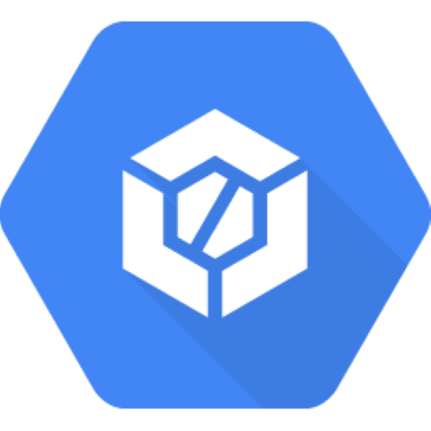
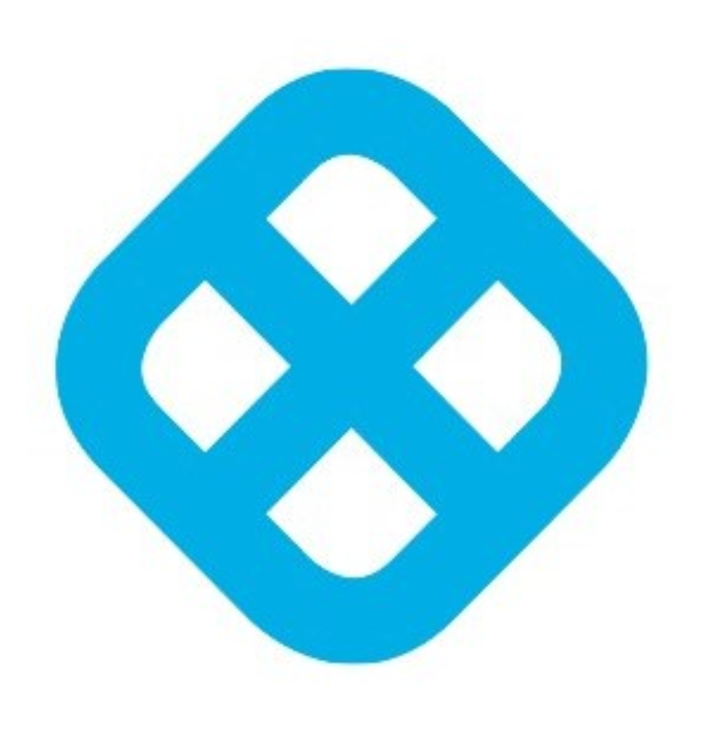

# CI/CD Security Support Matrix

Get a quick overview of integration types and security features supported across major CI/CD platforms. Use this matrix to pick the right tools for your DevOps workflows and to confirm the security coverage you need.

::cards:: cols=3

- title: Azure DevOps
  image: ./cicd-icons/azure.png
  url: /integrations/azure-overview/
- title: Bamboo CI
  image: https://encrypted-tbn0.gstatic.com/images?q=tbn:ANd9GcSQIU0fOwGQAo3Au8cCsOLeY18DOWWEdpj-1g&s
  url: /integrations/bamboo-overview/
- title: Google Cloud Build
  image: ./cicd-icons/gcp.png
  url: /integrations/google-overview/
- title: Harness
  image: ./cicd-icons/harness.png
  url: /integrations/harness-overview/
- title: Jenkins
  image: ./cicd-icons/jenkins.png
  url: /integrations/jenkins-overview/
- title: AWS Code Pipeline
  image: ./cicd-icons/aws.png
  url: /integrations/aws-overview/
- title: GitHub
  image: ./cicd-icons/github.png
  url: /integrations/github-overview/
- title: Gitlab
  image: ./cicd-icons/gitlab.png
  url: /integrations/gitlab-overview/
- title: Bitbucket
  image: ./cicd-icons/bitbucket.png
  url: /integrations/bitbucket-overview/
- title: Checkmarx
  image: ./cicd-icons/checkmarx.png
  url: /integrations/checkmarx/
  ::/cards::

## **Integration Types**

These are the three supported methods for integrating CI/CD tools with AccuKnox :-

=== "Workflow File"
    **Description**: A workflow file is a configuration file within the CI/CD tool where you define the steps of your build, test, and deploy pipeline. It allows you to automate tasks using specific syntax and structure (often YAML or JSON).

=== "Plugin Support"
    **Description**: This method refers to using external plugins to extend the functionality of the CI/CD tool. Plugins integrate the tool with third-party services or features, such as code scanning, security checks, or deployment to cloud platforms.

=== "Native Integration"
    **Description**: Native integration is the built-in capability of AccuKnox to connect directly with CI/CD tools and platforms, with no external plugin. This method utilizes the internal features of AccuKnox to interact with and manage security policies, scans, and assessments within the CI/CD pipeline.

| CI/CD Tool                                                                                                                                            | Workflow file (Direct Steps) | Plugin Support |
| ----------------------------------------------------------------------------------------------------------------------------------------------------- | ---------------------------- | -------------- |
|  **[GitHub Actions](https://github.com/marketplace?query=accuknox)**                                        | Available                    | Available      |
|  **[GitLab CI/CD](https://gitlab.com/accu-knox/scan)**                                                        | Available                    | Available      |
|  **Jenkins**                                                                                                      | Available                    | Available      |
|  **[Azure DevOps](https://marketplace.visualstudio.com/search?term=accuknox&target=AzureDevOps&category=All)** | Available                    | Available      |
|  **AWS CodePipeline**                                                                                        | Available                    | Coming Soon    |
|  **[Bitbucket](https://bitbucket.org/accu-knox/scan/)**                                                       | Available                    | Available      |
|  **[CircleCI](https://circleci.com/developer/orbs/orb/accuknox/scan)** | Available | Available |
|  **GCP Cloud Build**                                                                                          | Available                    | Coming Soon    |
|  **Harness**                                                                                                      | Available                    | Coming Soon    |

---

| Repository      | Native Integration (IaC) |
| --------------- | ------------------------ |
| **GitHub**      | Available                |
| **GitLab**      | Available                |
| **Bitbucket**   | Available                |
| **Azure Repos** | Coming Soon              |

## Feature Support Table (Plugins)

| CI/CD Tool                                                   | SAST                                                         | DAST                                                         | IaC Scanning                                                 | Container Scanning                                           | Secrets Scanning                                             | CI/CD Pipeline Monitoring                                    |
| ------------------------------------------------------------ | ------------------------------------------------------------ | ------------------------------------------------------------ | ------------------------------------------------------------ | ------------------------------------------------------------ | ------------------------------------------------------------ | ------------------------------------------------------------ |
|  **GitHub Actions** | [Available (v1.0.1)](https://github.com/marketplace/actions/accuknox-sast) | [Available (v1.0.0)](https://github.com/marketplace/actions/accuknox-dast) | [Available (v0.0.1)](https://github.com/marketplace/actions/accuknox-iac) | [Available (v0.0.1)](https://github.com/marketplace/actions/accuknox-container-scan) | [Available (v1.0.0)](https://github.com/marketplace/actions/accuknox-secret-scan) | [Available (v0.3.15)](https://github.com/marketplace/actions/accuknox-report) |
|  **GitLab CI/CD**    | [Available (v1.0.3)](https://gitlab.com/accu-knox/scan)      | [Available (v1.0.3)](https://gitlab.com/accu-knox/scan)      | [Available (v1.0.3)](https://gitlab.com/accu-knox/scan)      | [Available (v1.0.3)](https://gitlab.com/accu-knox/scan)      | [Available (v1.0.3)](https://gitlab.com/accu-knox/scan)      | Coming Soon                                                  |
|  **Jenkins**             | Available                                                    | Available (authenticated and unauthenticated)                | Available                                                    | Available                                                    | Available                                                    | Coming Soon                                                  |
|  **Azure DevOps**     | [Available ( (v1.0.4)](https://marketplace.visualstudio.com/items?itemName=AccuKnox.accuknox-SAST) | [Available (v1.0.0)](https://marketplace.visualstudio.com/items?itemName=AccuKnox.accuknox-dast&ssr=false#overview) | [Available (v1.0.7)](https://marketplace.visualstudio.com/items?itemName=AccuKnox.accuknox-iac) | [Available (v1.0.0)](https://marketplace.visualstudio.com/items?itemName=AccuKnox.accuknox-container-scan) | [Available (v1.0.5)](https://marketplace.visualstudio.com/items?itemName=AccuKnox.accuknox-secret-scan) | Coming Soon                                                  |
|  **Bitbucket**       | [Available (v1.0.5)](https://bitbucket.org/accu-knox/scan/)  | [Available (v1.0.5)](https://bitbucket.org/accu-knox/scan/)  | [Available (v1.0.5)](https://bitbucket.org/accu-knox/scan/)  | [Available (v1.0.5)](https://bitbucket.org/accu-knox/scan/)  | [Available (v1.0.5)](https://bitbucket.org/accu-knox/scan/)  | Coming Soon                                                  |
|  **[CircleCI](https://circleci.com/developer/orbs/orb/accuknox/scan)** | [Available](https://circleci.com/developer/orbs/orb/accuknox/scan) | [Available](https://circleci.com/developer/orbs/orb/accuknox/scan) | [Available](https://circleci.com/developer/orbs/orb/accuknox/scan) | [Available](https://circleci.com/developer/orbs/orb/accuknox/scan) | [Available](https://circleci.com/developer/orbs/orb/accuknox/scan) | Coming Soon |
|  **Harness**             | Coming Soon                                                  | Coming Soon                                                  | Coming Soon                                                  | Coming Soon                                                  | Coming Soon                                                  | Coming Soon                                                  |

## Every Scan Type Each CI/CD Platform Supports

This table lists each scan component against each supported CI/CD platform. A tick means the component ships today. N/A means it is not offered on that platform.

| Component | GitHub Actions | GitLab | BitBucket | Azure DevOps | Circle CI | AWS CodePipeline | Jenkins | Google Codebuild | Bamboo CI |
| --- | --- | --- | --- | --- | --- | --- | --- | --- | --- |
| SQ SAST | ✓ | ✓ | ✓ | ✓ | ✓ | N/A | N/A | ✓ | N/A |
| SAST | ✓ | ✓ | ✓ | ✓ | ✓ | ✓ | ✓ | ✓ | ✓ |
| DAST | ✓ | ✓ | ✓ | ✓ | ✓ | ✓ | ✓ authenticated and unauthenticated | ✓ | ✓ |
| IaC | ✓ | ✓ | ✓ | ✓ | ✓ | ✓ | ✓ | ✓ | ✓ |
| Container Scan | ✓ | ✓ | ✓ | ✓ | ✓ | ✓ | ✓ | ✓ | ✓ |
| Secret Scan | ✓ | ✓ | ✓ | ✓ | ✓ | ✓ | ✓ | ✓ | ✓ |
| xBOM | ✓ | ✓ | ✓ | ✓ | N/A | N/A | N/A | N/A | N/A |
| Unified Scan (SAST, IaC, Secrets, SCA, ML Scan, API Discovery, SBOM) | ✓ | ✓ | ✓ | ✓ | N/A | N/A | ✓ | N/A | N/A |
| CX Scan | ✓ | N/A | N/A | N/A | N/A | N/A | N/A | N/A | N/A |
| Pipeline Script | N/A | N/A | ✓ | ✓ | N/A | N/A | ✓ | N/A | N/A |
| App based | ✓ | ✓ | ✓ | N/A | N/A | N/A | N/A | N/A | N/A |

Jenkins DAST runs against a login-protected application as well as a public one. Set the credentials in the pipeline step to scan behind a login.

## The IDE Extension Runs in VS Code, Cursor, and IntelliJ

| Component | VS Code | Cursor | IntelliJ |
| --- | --- | --- | --- |
| IDE Extension | ✓ | ✓ | ✓ |

See [AccuKnox Code Security for the IDE](../integrations/vscode-code-security.md) for the install steps and the scan engines each editor runs.
